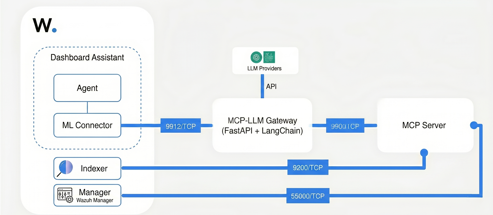

# AI Assistant-Wazuh Integration

## Table of Contents

* [Introduction](#introduction)
* [Prerequisites](#prerequisites)
* [Architecture](#architecture)
* [Installation and Configuration](#installation-and-configuration)
* [Samples questions & Actions](#samples-questions--actions)
* [Recommendations & next steps](#recommendations--next-steps)
* [Important notes](#important-notes)
* [Sources](#sources)

---

### Introduction

A real-time chatbot for Wazuh environment management and alert analysis. Ask natural-language questions to investigate threats (Threat Hunting & DQL), perform IT Hygiene checks, retrieve SCA and Vulnerability details, manage agents (restart, remove, group assignment), automatically generate Custom Dashboards, and create downloadable PDF Reports and send via email.

The AI Assistant runs queries against Wazuh indices (e.g., `wazuh-alerts`, `wazuh-states-vulnerabilities`, `wazuh-states-inventory-*`) through an MCP Server and a Gateway, translating natural-language requests into structured OpenSearch queries or API actions, and returning concise, actionable insights directly within the Wazuh Dashboard.

---

### Architecture



The integration uses OpenSearch ML Commons with an external MCP server. Instead of calling a traditional ML model endpoint, the ML Commons HTTP Connector points to the MCP-LLM Gateway. The Gateway orchestrates the LLM, applies the system prompt, and proxies tool calls to the MCP server.

#### Components
* **Wazuh environment (4.14.3, built on OpenSearch 2.19.4)**: Includes OpenSearch Dashboards with Dashboard Assistant. ML Commons (HTTP connector) forwards Assistant requests to the Gateway. The environment collects, analyzes, and stores normalized security data.
* **MCP-LLM Gateway (FastAPI + LangChain)**: Runs the agent logic (Claude on Bedrock, OpenAI, or Gemini), evaluates intent for data querying, agent management, dashboard creation, or PDF report generation, and proxies tool calls as the MCP client.
* **OpenSearch MCP server**: Hosts MCP tools that securely query Wazuh indices.


#### Connection flow
1. The user asks a natural-language question in OpenSearch Dashboards (Assistant UI).
2. ML Commons (HTTP connector) forwards the request to the MCP-LLM Gateway (`/analyze`).
3. The Gateway (FastAPI + LangChain) evaluates the user's intent:
    * **Analysis/DQL/Hygiene Intent:** If requesting data analysis (Threat Hunting, SCA, Vulnerabilities, IT Hygiene), the Gateway selects and proxies MCP tool calls to the OpenSearch server.
    * **Action/Dashboard/Report Intent:** If requesting agent management (restart/remove/groups), a custom dashboard, or an email PDF report, the Gateway triggers the specific operational workflow directly.
4. The MCP server executes any proxied tool(s) against the Wazuh indices and returns structured results.
5. The Gateway evaluates tool outputs, generates a concise summary, or returns a `Pending Action` awaiting user `CONFIRM` (e.g., executing agent removal, group assignment, or OpenSearch dashboard publishing).
6. The Gateway returns the final answer to ML Commons, detailing insights, downloadable PDF report links, direct Dashboard links, or execution logs to the Assistant UI for the analyst to view.

---

### Prerequisites

- Wazuh v4.13 (built on OpenSearch 2.9.2)
- Deployment: single-host or distributed setup. The MCP-LLM Gateway and MCP Server can run on the same host or on separate hosts.
- Resources: minimum 2 vCPU / 4 GB RAM, recommended 4 vCPU / 16 GB RAM.
- Active subscription to an external LLM service (OpenAI or AWS Bedrock or GeminiAI)
- Network connectivity between all components (see **Required Ports**)

> **Tested on Amazon Linux 2023**

#### Required Ports
The following table lists the default ports required for this proof of concept. You can change these values if needed, but the ports must remain open between the listed components for the system to work.

| Component         | Port | Protocol | Purpose |
|-------------------|------|-----------|----------|
| MCP-LLM Gateway   | 9912 | TCP       | Receives HTTP requests from ML Commons (/analyze), runs agent logic, communicates with the LLM and the MCP server |
| MCP Server        | 9900 | TCP       | Exposes the MCP Server. It receives tool calls from the Gateway. The MCP server performs the corresponding queries against the Wazuh Indexer, and returns structured results back to the Gateway. |
| Wazuh Indexer     | 9200 | TCP       | Wazuh Indexer REST API |
| Wazuh Manager     | 55000 | TCP       | Wazuh Manager API |


---

### Installation and Configuration

The installation and configuration of all components (System Preparation, OpenSearch MCP Server, MCP-LLM Gateway, Wazuh Dashboard Assistant plugins, and cluster/model/agent configuration) is fully automated.

#### Automated Setup

1. **Clone the repository** into `/opt/AI_assistant`:
   ```bash
   cd /opt
  
   # Remove old AI_assistant directory if it already exists
   rm -rf /opt/AI_assistant
  
   # Clone the full repository to a temporary directory
   git clone https://github.com/wazuh/integrations.git /tmp/integrations
  
   # Copy only the AI_assistant directory to /opt/AI_assistant
   cp -r /tmp/integrations/integrations/AI_assistant /opt/AI_assistant
  
   # Remove the temporary cloned repository
   rm -rf /tmp/integrations
   ```

2. **Prepare the configuration** in the environment file:
   ```bash
   cd /opt/AI_assistant
   cp mcp-llm-gateway/mcp-llm-gateway.env ./ai-assistant.env
   # Edit ./ai-assistant.env and fill in your keys, IP addresses, credentials, etc.
   nano ./ai-assistant.env
   ```
   
   **Important Environment File Variables:**
   - `DEPLOYMENT_TYPE`: Set to `"all-in-one"` (default), if it is distributed deployment then set `"indexer"`, or `"dashboard"` depending on the node you are installing on.
   - `WAZUH_INDEXER_IP`: Set to `127.0.0.1` if installing directly on the indexer, or its IP if distributed.
   - `WAZUH_INDEXER_PUBLIC_IP`: The IP of your indexer server (used for PDF generation links).
   - `WAZUH_MANAGER_IP` & `WAZUH_DASHBOARD_IP`: The IP addresses of your Wazuh Manager and Dashboard servers.
   - `OPENAI_API_KEY` / `GEMINI_API_KEY` / AWS Credentials: Add your preferred LLM provider credentials.
   - Update the respective `..._USER` and `..._PASS` fields with your actual Wazuh credentials.

3. **Run the installer script** as root:
   ```bash
   sudo bash install_ai_assistant.sh ./ai-assistant.env
   ```
   > **Note for Distributed Deployments:** If your Wazuh Indexer and Dashboard run on separate servers, you must run this installation process on **both** nodes. First run it on the Indexer with `DEPLOYMENT_TYPE="indexer"`, then copy the `/opt/AI_assistant` folder and your `.env` file to the Dashboard server, change the setting to `DEPLOYMENT_TYPE="dashboard"`, and run the script again.

The script will automatically perform:
- System package installations (supporting Amazon Linux, RHEL, CentOS, Ubuntu).
- Dynamic OpenSearch Dashboards version detection (parsing `/usr/share/wazuh-dashboard/package.json` to prevent incorrect plugin version installation).
- Installation and starting of the OpenSearch MCP Server service.
- Setup and starting of the LangChain MCP-LLM Gateway service.
- Automated extraction and deployment of Wazuh Dashboard Assistant plugins (`assistantDashboards` & `mlCommonsDashboards`).
- OpenSearch/Wazuh Indexer connector registration, model registration, deployment, agent registration, and setting the root chat agent.

---

## 5. Verification

1.  Open **Wazuh Dashboard**.
2.  Click the **Assistant** icon (bottom right).
3.  Ask: "Hi".
4.  Monitor logs on the gateway server: `tail -f /var/log/mcp_llm_gateway/mcp-llm-gateway.log`.

---
### Samples questions & Actions

Use these to validate end-to-end behavior and the reporting format:

**Threat Hunting:**
- Show me the alerts summary of agent 008 for the last 30 min
- Give me a summary of the critical alerts from the last 30 min
- Analyze the most important alerts in my environment
- Analyze brute force attack alerts from last 1 hour
<video src="images/alert-summary.mp4" controls="controls" width="800"></video>

**DQL:**
- Filter alerts from office365 that are from outside spain in last 2 hours
- filter all the critical virustotal alerts from agent 002 in last three hours
<video src="images/DQL.mp4" controls="controls" width="800"></video>

**Agent Management:**
*(Administrative actions generate a `Pending Action` block. You must reply directly with `CONFIRM` or `NO`)*
- Please restart the agent 007
- Remove agent 005
- show agent groups
- Remove all disconnected agent from last 10 minutes
- add agent ID 001 to the agent group windows
<video src="images/agent-management.mp4" controls="controls" width="800"></video>

**Dashboard:**
*(Dashboard creations generate a `Pending Action` block. You must reply directly with `CONFIRM` or `NO`)*
- create custom dashboard
- I need a dashboard for brute force attack alerts with geo location
- create dashboard with a pie chart top 10 rule id triggered
<video src="images/dashboard-create.mp4" controls="controls" width="800"></video>

**IT Hygiene:**
- What is the OS and OS version of agent 002
- How many agents have edge software installed?
- Can you check if the agent 001 has Valorant software installed?
<video src="images/IT-Hygiene.mp4" controls="controls" width="800"></video>

**SCA:**
- Share the SCA score of agent 002
- Share recent SCA Alerts.

**Vulnerability:**
- Are we affected by CVE-2025-61985?
- How many critical vulnerability endpoint 001 have?
- Which endpoint is affected by CVE-2025-61985?
- Make a summary of critical vulnerabilities.
- How to resolve this vulnerability CVE-2015-0287?
- Break down the critical vulnerability and affected packages for agent 001
<video src="images/vulnerability-check.mp4" controls="controls" width="800"></video>

**Generate PDF reports and send it via Email:**
- Send a email report for endpoints brute force attack alert via mail with detailed visualizations
- Send a PDF report for active vulnerabilities on all endpoints via email.
<video src="images/generate-report.mp4" controls="controls" width="800"></video>

**Create Wazuh indexer monitor:**

- Send slack alert for authentication failed attempts from India
<video src="images/indexer-monitor.mp4" controls="controls" width="800"></video>

---

### Recommendations & next steps

- Refine and test the system prompt to maximize token efficiency and response quality.
- Conduct testing with a variety of queries specific to defined use cases
- Monitor the gateway/service logs for tool-use errors, timeouts, or missing fields.

---

### Important notes

- Always cross-verify AI-generated advice before taking action in production.
- This AI Assistant, with conversational tooling, is a starting point and should be continuously improved as use cases and requirements evolve.


---

### Sources
- [Introducing MCP in OpenSearch](https://github.com/opensearch-project/project-website/blob/c896713b6e1e25add756d6e20583cb88fa05c558/_posts/2025-05-05-Introducing-MCP-in-OpenSearch.md#section-12-standalone-opensearch-mcp-server)
- [Build a Chatbot with OpenSearch](https://docs.opensearch.org/latest/tutorials/gen-ai/chatbots/build-chatbot/)
- [Model Context Protocol Documentation](https://modelcontextprotocol.io/docs/getting-started/intro)
