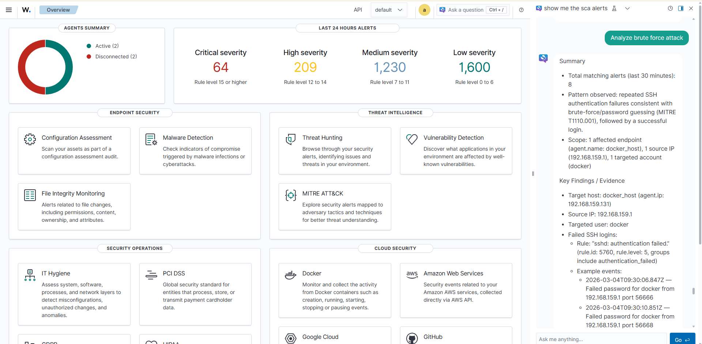
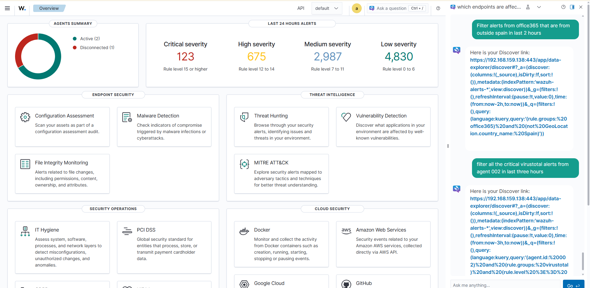
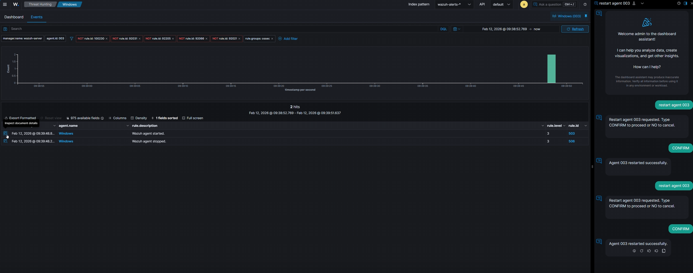
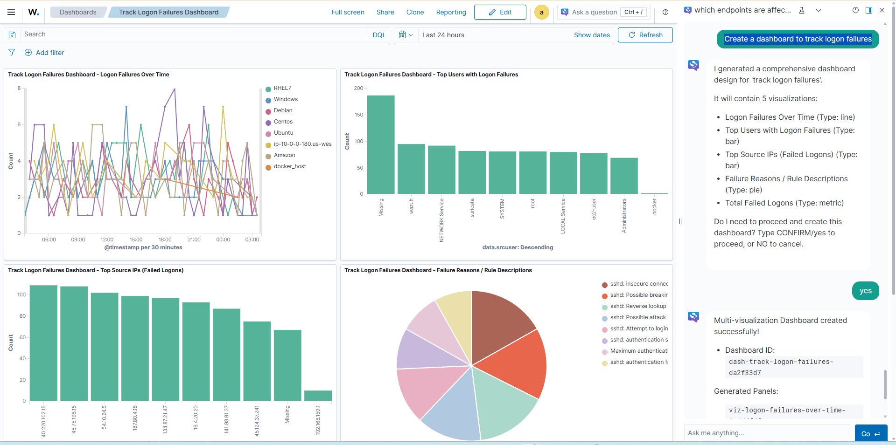
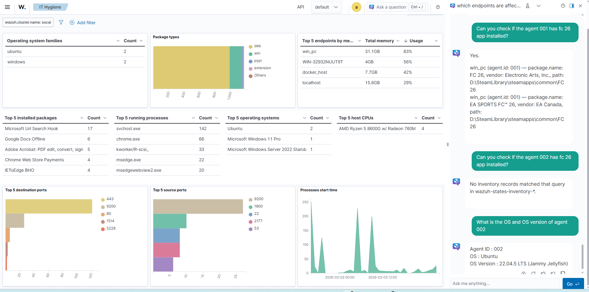
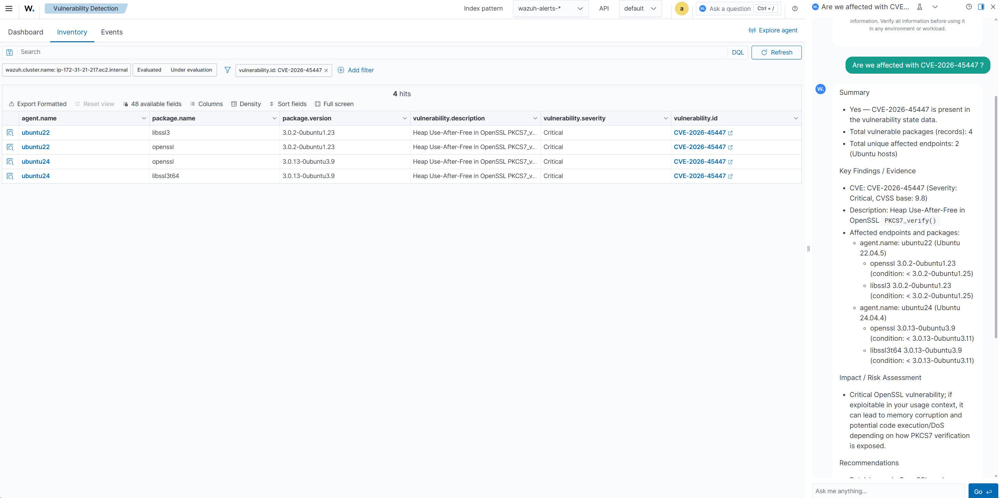
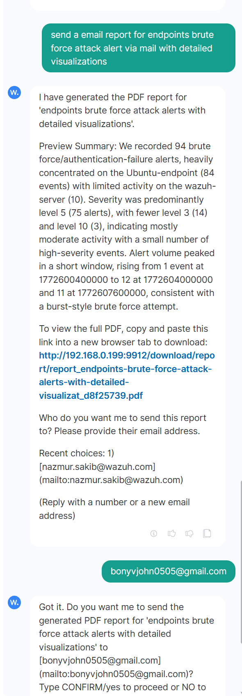
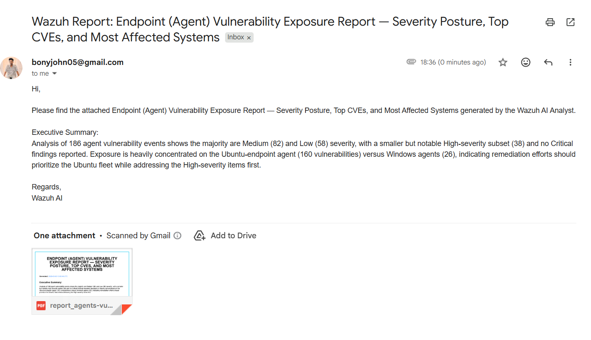
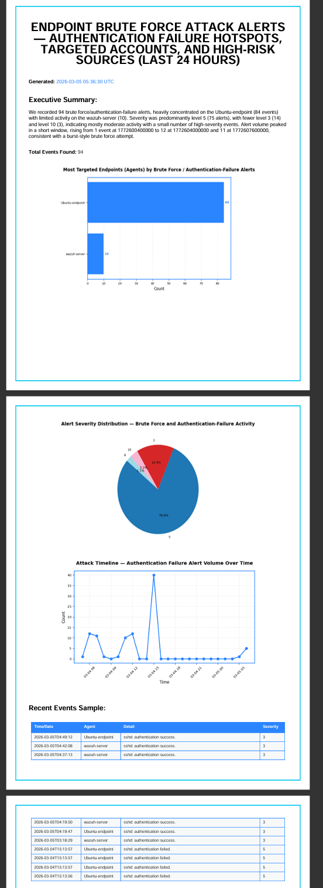

# AI Assistant-Wazuh Integration

## Table of Contents

* [Introduction](#introduction)
* [Prerequisites](#prerequisites)
* [Architecture](#architecture)
* [Installation and Configuration](#1-system-preparation)
    * [OpenSearch MCP Server](#2-opensearch-mcp-server-setup)
    * [MCP-LLM Gateway](#3-mcp-llm-gateway-setup)
    * [Wazuh environment](#4-wazuh--opensearch-plugin-installation)
* [Samples questions](#samples-questions)
* [Action Commands](#action-commands)
* [Recommendations & next steps](#recommendations--next-steps)
* [Important notes](#important-notes)
* [Sources](#sources)

---

### Introduction

A real-time chatbot for Wazuh environment management and alert analysis. Ask natural-language questions to investigate threats (Threat Hunting & DQL), perform IT Hygiene checks, retrieve SCA and Vulnerability details, manage agents (restart, remove, group assignment), automatically generate Custom Dashboards, and create downloadable PDF Reports and send via email.

The AI Assistant runs queries against Wazuh indices (e.g., `wazuh-alerts`, `wazuh-states-vulnerabilities`, `wazuh-states-inventory-*`) through an MCP Server and a Gateway, translating natural-language requests into structured OpenSearch queries or API actions, and returning concise, actionable insights directly within the Wazuh Dashboard.

---

### Architecture


The integration uses OpenSearch ML Commons with an external MCP server. Instead of calling a traditional ML model endpoint, the ML Commons HTTP Connector points to the MCP-LLM Gateway. The Gateway orchestrates the LLM, applies the system prompt, and proxies tool calls to the MCP server.

#### Components
* **Wazuh environment (4.14.3, built on OpenSearch 2.19.4)**: Includes OpenSearch Dashboards with Dashboard Assistant. ML Commons (HTTP connector) forwards Assistant requests to the Gateway. The environment collects, analyzes, and stores normalized security data.
* **MCP-LLM Gateway (FastAPI + LangChain)**: Runs the agent logic (Claude on Bedrock, OpenAI, or Gemini), evaluates intent for data querying, agent management, dashboard creation, or PDF report generation, and proxies tool calls as the MCP client.
* **OpenSearch MCP server**: Hosts MCP tools that securely query Wazuh indices.


#### Connection flow
1. The user asks a natural-language question in OpenSearch Dashboards (Assistant UI).
2. ML Commons (HTTP connector) forwards the request to the MCP-LLM Gateway (`/analyze`).
3. The Gateway (FastAPI + LangChain) evaluates the user's intent:
    * **Analysis/DQL/Hygiene Intent:** If requesting data analysis (Threat Hunting, SCA, Vulnerabilities, IT Hygiene), the Gateway selects and proxies MCP tool calls to the OpenSearch server.
    * **Action/Dashboard/Report Intent:** If requesting agent management (restart/remove/groups), a custom dashboard, or an email PDF report, the Gateway triggers the specific operational workflow directly.
4. The MCP server executes any proxied tool(s) against the Wazuh indices and returns structured results.
5. The Gateway evaluates tool outputs, generates a concise summary, or returns a `Pending Action` awaiting user `CONFIRM` (e.g., executing agent removal, group assignment, or OpenSearch dashboard publishing).
6. The Gateway returns the final answer to ML Commons, detailing insights, downloadable PDF report links, direct Dashboard links, or execution logs to the Assistant UI for the analyst to view.

---

### Prerequisites

- Wazuh v4.13 (built on OpenSearch 2.9.2)
- Deployment: single-host or distributed setup. The MCP-LLM Gateway and MCP Server can run on the same host or on separate hosts.
- Resources: minimum 2 vCPU / 4 GB RAM, recommended 4 vCPU / 16 GB RAM.
- Active subscription to an external LLM service (OpenAI or AWS Bedrock or GeminiAI)
- Network connectivity between all components (see **Required Ports**)

> **Tested on Amazon Linux 2023**

#### Required Ports
The following table lists the default ports required for this proof of concept. You can change these values if needed, but the ports must remain open between the listed components for the system to work.

| Component         | Port | Protocol | Purpose |
|-------------------|------|-----------|----------|
| MCP-LLM Gateway   | 9912 | TCP       | Receives HTTP requests from ML Commons (/analyze), runs agent logic, communicates with the LLM and the MCP server |
| MCP Server        | 9900 | TCP       | Exposes the MCP Server. It receives tool calls from the Gateway. The MCP server performs the corresponding queries against the Wazuh Indexer, and returns structured results back to the Gateway. |
| Wazuh Indexer     | 9200 | TCP       | Wazuh Indexer REST API |
| Wazuh Manager     | 55000 | TCP       | Wazuh Manager API |


---

### Installation and Configuration
---

## 1. System Preparation

Update the system and install necessary dependencies.

```bash
sudo dnf update -y
sudo dnf install -y python3.11 python3.11-devel python3.11-pip git tar acl gcc freetype-devel libpng-devel qpdf

# Clone the repository to get the files
cd /opt
sudo git clone https://github.com/bonyjohn05/wazuh-ai-analyst.git
```

---

## 2. OpenSearch MCP Server Setup

### 2.1 Create Directory Structure

```bash
sudo mkdir -p /opt/mcp_server-env
sudo mkdir -p /var/log/mcp_server
sudo mkdir -p /etc/mcp-server
```

### 2.2 Create Service Account

```bash
sudo useradd --system --no-create-home --shell /sbin/nologin mcpserver || true
```

### 2.3 Set Permissions

```bash
sudo chown -R root:root /etc/mcp-server
sudo chmod 750 /etc/mcp-server
sudo touch /etc/mcp-server/mcp-server.env
sudo chmod 640 /etc/mcp-server/mcp-server.env
sudo chown -R mcpserver:mcpserver /var/log/mcp_server
sudo chmod 750 /var/log/mcp_server
```

### 2.4 Setup Python Virtual Environment

```bash
python3.11 -m venv /opt/mcp_server-env
source /opt/mcp_server-env/bin/activate
pip install --upgrade pip
pip install opensearch-mcp-server-py
deactivate
```

### 2.5 Configure Environment Variables

Copy the sample environment file:

```bash
sudo cp /opt/AI_assistant/mcp-server/mcp-server.env /etc/mcp-server/
sudo chown root:root /etc/mcp-server/mcp-server.env
sudo chmod 640 /etc/mcp-server/mcp-server.env
```

Edit `/etc/mcp-server/mcp-server.env`:

```bash
sudo nano /etc/mcp-server/mcp-server.env
```

Add the following content (adjust values for your environment):

```bash
OPENSEARCH_URL="https://<WAZUH_INDEXER_IP>:9200"
OPENSEARCH_USERNAME="<WAZUH_INDEXER_USERNAME>"
OPENSEARCH_PASSWORD="<WAZUH_INDEXER_PASSWORD>"
OPENSEARCH_SSL_VERIFY="false"
```

### 2.6 Create Systemd Service

Create `/etc/systemd/system/mcp-server.service`:

```ini
[Unit]
Description=OpenSearch MCP Server
After=network.target

[Service]
User=mcpserver
Group=mcpserver
WorkingDirectory=/opt/mcp_server-env
EnvironmentFile=/etc/mcp-server/mcp-server.env
ExecStart=/opt/mcp_server-env/bin/python3.11 -m mcp_server_opensearch --transport stream --host 0.0.0.0 --port 9900
Restart=always
RestartSec=10
TimeoutStopSec=15
StandardOutput=append:/var/log/mcp_server/mcp-server.log
StandardError=append:/var/log/mcp_server/mcp-server.log

[Install]
WantedBy=multi-user.target
```

Enable and start the service:

```bash
sudo systemctl daemon-reload
sudo systemctl enable mcp-server
sudo systemctl start mcp-server
sudo systemctl status mcp-server
```

---

## 3. MCP-LLM Gateway Setup

### 3.1 Create Directory Structure

```bash
sudo mkdir -p /opt/mcp_llm_gateway-env
sudo mkdir -p /opt/mcp_llm_gateway-env/mcp_gateway
sudo mkdir -p /var/log/mcp_llm_gateway
sudo mkdir -p /etc/mcp-llm-gateway
```

### 3.2 Create Service Account

```bash
sudo useradd --system --no-create-home --shell /sbin/nologin mcpgateway || true
```

### 3.3 Set Permissions

```bash
sudo chown root:mcpgateway /etc/mcp-llm-gateway
sudo chmod 750 /etc/mcp-llm-gateway
sudo chmod 750 /etc/mcp-llm-gateway/mcp_gateway
sudo touch /etc/mcp-llm-gateway/mcp-llm-gateway.env
sudo touch /etc/mcp-llm-gateway/mcp-llm-gateway.prompt
sudo touch /etc/mcp-llm-gateway/decoder-builder.prompt
sudo touch /etc/mcp-llm-gateway/dql-builder.prompt
sudo touch /etc/mcp-llm-gateway/report-generator.prompt

sudo chown root:mcpgateway /etc/mcp-llm-gateway/mcp-llm-gateway.env
sudo chown root:mcpgateway /etc/mcp-llm-gateway/mcp-llm-gateway.prompt
sudo chown root:mcpgateway /etc/mcp-llm-gateway/decoder-builder.prompt
sudo chown root:mcpgateway /etc/mcp-llm-gateway/dql-builder.prompt
sudo chown root:mcpgateway /etc/mcp-llm-gateway/report-generator.prompt

sudo chmod 640 /etc/mcp-llm-gateway/mcp-llm-gateway.env
sudo chmod 640 /etc/mcp-llm-gateway/mcp-llm-gateway.prompt
sudo chmod 640 /etc/mcp-llm-gateway/decoder-builder.prompt
sudo chmod 640 /etc/mcp-llm-gateway/dql-builder.prompt
sudo chmod 640 /etc/mcp-llm-gateway/report-generator.prompt

sudo chown -R mcpgateway:mcpgateway /var/log/mcp_llm_gateway
sudo chmod 750 /var/log/mcp_llm_gateway
```

### 3.4 Setup Python Virtual Environment and Dependencies

```bash
python3.11 -m venv /opt/mcp_llm_gateway-env
source /opt/mcp_llm_gateway-env/bin/activate
pip install --upgrade pip

# Step 1: Install Core (to avoid resolution conflicts)
pip install "langchain==0.3.17" "langchain-core==0.3.33"

# Step 2: Install Providers (pinned to avoid auto-upgrade to 1.x)
pip install "langchain-openai<0.3.0" \
            "langchain-anthropic<0.3.0" \
            "langchain-google-genai>=2.0.0" \
            "langchain-aws>=0.2.0" \
            "langchain-mcp-adapters==0.1.0"

# Step 3: Install Web & Utils
pip install "fastapi>=0.110.0" \
            "uvicorn[standard]>=0.30.0" \
            "pydantic>=2.7.0" \
            "boto3>=1.34.0" \
            "httpx>=0.27.0"

# Step 4: Install PDF Reporting & Data Visualization
pip install "reportlab>=4.0.0" \
            "matplotlib>=3.8.0" \
            "pandas>=2.1.0" \
            "scipy>=1.11.0"

deactivate
```

### 3.5 Deploy Gateway Script

Copy the `mcp_llm_gateway.py` script to `/opt/mcp_llm_gateway-env/`.

```bash
sudo cp /opt/AI_assistant/mcp-llm-gateway/mcp_llm_gateway.py /opt/mcp_llm_gateway-env/
sudo chown root:root /opt/mcp_llm_gateway-env/mcp_llm_gateway.py
sudo chmod 644 /opt/mcp_llm_gateway-env/mcp_llm_gateway.py
sudo cp /opt/AI_assistant/mcp-llm-gateway/mcp_gateway/* /opt/mcp_llm_gateway-env/mcp_gateway/
sudo chown root:root /opt/mcp_llm_gateway-env/mcp_gateway/*
sudo chmod 644 /opt/mcp_llm_gateway-env/mcp_gateway/*
```

### 3.6 Configure Environment Variables

Copy the sample environment file:

```bash
sudo cp /opt/AI_assistant/mcp-llm-gateway/mcp-llm-gateway.env /etc/mcp-llm-gateway/
sudo chown root:mcpgateway /etc/mcp-llm-gateway/mcp-llm-gateway.env
sudo chmod 640 /etc/mcp-llm-gateway/mcp-llm-gateway.env
```

Edit `/etc/mcp-llm-gateway/mcp-llm-gateway.env` and add your configuration (API keys, Wazuh Manager IP, etc.).

### 3.7 Configure Prompts

Enable the prompt files:

```bash
# Copy your prompt files to /etc/mcp-llm-gateway/
sudo cp /opt/AI_assistant/mcp-llm-gateway/mcp-llm-gateway.prompt /etc/mcp-llm-gateway/
sudo cp /opt/AI_assistant/mcp-llm-gateway/decoder-builder.prompt /etc/mcp-llm-gateway/
sudo cp /opt/AI_assistant/mcp-llm-gateway/dql-builder.prompt /etc/mcp-llm-gateway/
sudo cp /opt/AI_assistant/mcp-llm-gateway/report-generator.prompt /etc/mcp-llm-gateway/
```

### 3.8 Create Systemd Service

Create `/etc/systemd/system/mcp-llm-gateway.service`:

```ini
[Unit]
Description=MCP LLM Gateway
After=network.target

[Service]
User=mcpgateway
Group=mcpgateway
WorkingDirectory=/opt/mcp_llm_gateway-env
EnvironmentFile=/etc/mcp-llm-gateway/mcp-llm-gateway.env
# Ensure the path matches where you put the script
ExecStart=/opt/mcp_llm_gateway-env/bin/python3.11 /opt/mcp_llm_gateway-env/mcp_llm_gateway.py
ReadOnlyPaths=
ReadWritePaths=/etc/mcp-llm-gateway /var/log/mcp_llm_gateway
Restart=always
RestartSec=10
TimeoutStopSec=15
StandardOutput=append:/var/log/mcp_llm_gateway/mcp-llm-gateway.log
StandardError=append:/var/log/mcp_llm_gateway/mcp-llm-gateway.log

[Install]
WantedBy=multi-user.target
```

Enable and start:

```bash
sudo systemctl daemon-reload
sudo systemctl enable mcp-llm-gateway
sudo systemctl start mcp-llm-gateway
sudo systemctl status mcp-llm-gateway
```

## 4. Wazuh / OpenSearch Plugin Installation

Perform these steps on the **Wazuh Dashboard** server.

### 4.1 Install Plugin (OpenSearch 2.19.4)

```bash
# Download OpenSearch Dashboards 2.19.4 linux-x64
curl https://artifacts.opensearch.org/releases/bundle/opensearch-dashboards/2.19.4/opensearch-dashboards-2.19.4-linux-x64.tar.gz -o opensearch-dashboards.tar.gz

tar -xvzf opensearch-dashboards.tar.gz

# Copy plugins
sudo cp -r opensearch-dashboards-2.19.4/plugins/assistantDashboards/ /usr/share/wazuh-dashboard/plugins/
sudo cp -r opensearch-dashboards-2.19.4/plugins/mlCommonsDashboards/ /usr/share/wazuh-dashboard/plugins/

# Set Permissions
sudo chown -R wazuh-dashboard:wazuh-dashboard /usr/share/wazuh-dashboard/plugins/mlCommonsDashboards/
sudo chown -R wazuh-dashboard:wazuh-dashboard /usr/share/wazuh-dashboard/plugins/assistantDashboards/
sudo chmod -R 750 /usr/share/wazuh-dashboard/plugins/mlCommonsDashboards/
sudo chmod -R 750 /usr/share/wazuh-dashboard/plugins/assistantDashboards/

# Enable Chat
echo "assistant.chat.enabled: true" | sudo tee -a /etc/wazuh-dashboard/opensearch_dashboards.yml

# Restart Dashboard
sudo systemctl restart wazuh-dashboard
```

### 4.2 Cluster Settings

In Wazuh Dashboard > Dev Tools, run:

```json
PUT /_cluster/settings
{
  "persistent": {
    "plugins.ml_commons.agent_framework_enabled": true,
    "plugins.ml_commons.only_run_on_ml_node": false,
    "plugins.ml_commons.connector.private_ip_enabled": true,
    "plugins.ml_commons.trusted_connector_endpoints_regex": [
      "^https://runtime\\.sagemaker\\..*[a-z0-9-]\\.amazonaws\\.com/.*$",
      "^https://api\\.openai\\.com/.*$",
      "^https://api\\.cohere\\.ai/.*$",
      "^https://bedrock-runtime\\..*[a-z0-9-]\\.amazonaws\\.com/.*$",
      "^http://10\\.128\\.0\\.10:9912/.*$"  // Replace with your Gateway IP
    ]
  }
}
```

### 4.3 Register Remote Model

In Wazuh Dashboard > Dev Tools, run the following to register the gateway as a model:

**Note**: Replace `http://<MCP_LLM_GATEWAY_HOST-IP>:9912` with your actual Gateway IP/Port.

```json
POST _plugins/_ml/models/_register
{
  "name": "mcp-llm-gateway-model",
  "function_name": "remote",
  "description": "Remote model: OpenSearch → MCP+LLM Gateway",
  "connector": {
    "name": "mcp-llm-gateway-connector",
    "version": 1,
    "protocol": "http",
    "parameters": {
     "endpoint": "http://<MCP_LLM_GATEWAY_HOST-IP>:9912/analyze"
    },
    "credential": {
     "api_key": "secret"
    },
    "actions": [
      {
        "action_type": "predict",
        "method": "POST",
        "url": "${parameters.endpoint}",
        "headers": {
          "Content-Type": "application/json",
          "X-API-Key": "${credential.api_key}"
        },
        "request_body": "{ \"parameters\": { \"prompt\": \"${parameters.prompt}\" } }",
       "request_timeout": "120s"
      }
    ]
  }
}
```

Copy the `model_id` from the response.

### 4.4 Deploy the Model

Replace `<model_id>` with the ID you received.

```json
POST _plugins/_ml/models/<model_id>/_deploy
```

### 4.5 Register the Agent

Replace `<model_id>` with your deployed model ID.

```json
POST _plugins/_ml/agents/_register
{
  "name": "mcp-os-agent",
  "type": "conversational",
  "app_type": "os_chat",
  "description": "Conversational agent that delegates to MCP+LLM gateway",
  "llm": {
   "model_id": "<model_id>",
    "parameters": {
      "prompt": "${parameters.question}",
      "response_filter": "$.output.message",
      "max_iteration": 1,
      "stop_when_no_tool_found": true,
      "message_history_limit": 10
    }
  },
  "memory": { "type": "conversation_index" },
  "tools": [
    { "type": "SearchIndexTool", "name": "placeholder_noop" }
  ]
}
```

Copy the `agent_id` from the response.

### 4.6 Set Agent as Root

This connects the UI chat interface to your new Agent.

**Note**: This command must be run from the **command line** of the Wazuh Indexer server (or a machine with curl access/certs to it), because the `_plugins/_ml/config` endpoint often requires admin certificate authentication or super-admin privileges.

Replace `<WAZUH_INDEXER_IP>` and `<agent_id>`.

```bash
# On the Wazuh Indexer node
DIR="/etc/wazuh-indexer/certs"
curl -k --cacert $DIR/root-ca.pem --cert $DIR/admin.pem --key $DIR/admin-key.pem -XPUT https://<WAZUH_INDEXER_IP>:9200/.plugins-ml-config/_doc/os_chat -H 'Content-Type: application/json' -d '{"type": "os_chat_root_agent","configuration": {"agent_id": "<agent_id>"}}'
```

---

## 5. Verification

1.  Open **Wazuh Dashboard**.
2.  Click the **Assistant** icon (bottom right).
3.  Ask: "Hi".
4.  Monitor logs on the gateway server: `tail -f /var/log/mcp_llm_gateway/mcp-llm-gateway.log`. 

---
### Samples questions & Actions

Use these to validate end-to-end behavior and the reporting format:

**Threat Hunting:**
- Show me the alerts summary of agent 002 for the last 30 min
- Give me a summary of the critical alerts from the last 30 min
- Analyze the most important alerts in my environment
- Analyze brute force attack alerts from last 1 hour


**DQL:**
- Filter alerts from office365 that are from outside spain in last 2 hours
- filter all the critical virustotal alerts from agent 002 in last three hours


**Agent Management:**
*(Administrative actions generate a `Pending Action` block. You must reply directly with `CONFIRM` or `NO`)*
- Please restart the agent 007
- Remove agent 005
- show agent groups
- Remove all disconnected agent from last 10 minutes
- add agent ID 001 to the agent group windows


**Dashboard:**
*(Dashboard creations generate a `Pending Action` block. You must reply directly with `CONFIRM` or `NO`)*
- create custom dashboard
- I need a dashboard for brute force attack alerts with geo location
- create dashboard with a pie chart top 10 rule id triggered


**IT Hygiene:**
- What is the OS and OS version of agent 002
- How many agents have edge software installed?
- Can you check if the agent 001 has Valorant software installed?


**SCA:**
- Share the SCA score of agent 002
- Share recent SCA Alerts.

**Vulnerability:**
- Are we affected by CVE-2025-61985?
- How many critical vulnerability endpoint 001 have?
- Which endpoint is affected by CVE-2025-61985?
- Make a summary of critical vulnerabilities.
- How to resolve this vulnerability CVE-2015-0287?
- Break down the critical vulnerability and affected packages for agent 001


**Generate PDF reports and send it via Email:**
- send a email report for endpoints brute force attack alert via mail with detailed visualizations
- send a email report for agents vulnerabilities via mail with detailed visualizations







---

### Recommendations & next steps

- Refine and test the system prompt to maximize token efficiency and response quality.
- Conduct testing with a variety of queries specific to defined use cases
- Monitor the gateway/service logs for tool-use errors, timeouts, or missing fields.

---

### Important notes

- Always cross-verify AI-generated advice before taking action in production.
- This AI Assistant, with conversational tooling, is a starting point and should be continuously improved as use cases and requirements evolve.


---

### Sources
- [Introducing MCP in OpenSearch](https://github.com/opensearch-project/project-website/blob/c896713b6e1e25add756d6e20583cb88fa05c558/_posts/2025-05-05-Introducing-MCP-in-OpenSearch.md#section-12-standalone-opensearch-mcp-server)
- [Build a Chatbot with OpenSearch](https://docs.opensearch.org/latest/tutorials/gen-ai/chatbots/build-chatbot/)
- [Model Context Protocol Documentation](https://modelcontextprotocol.io/docs/getting-started/intro)
