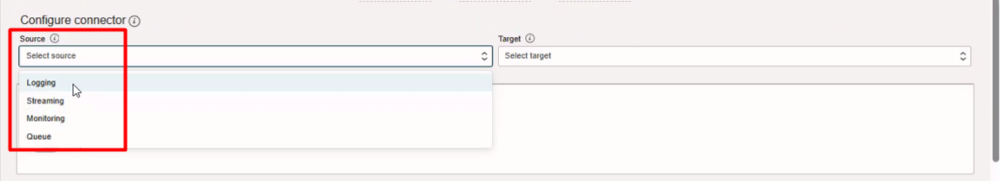
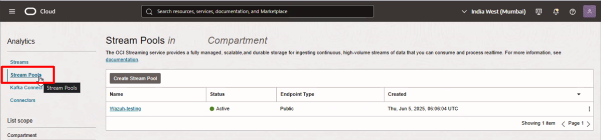
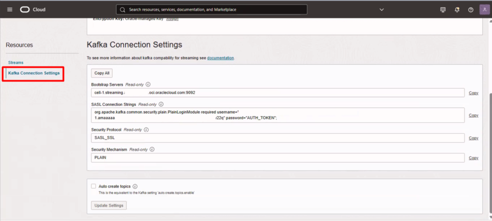
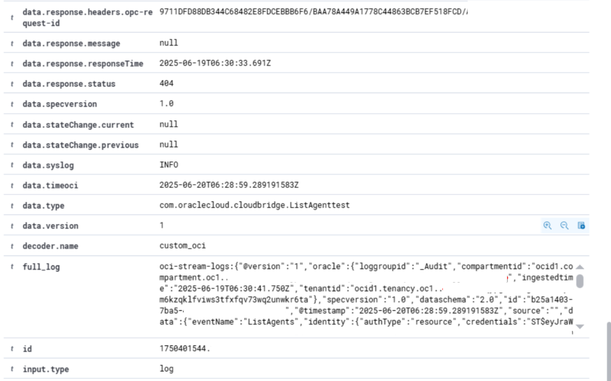
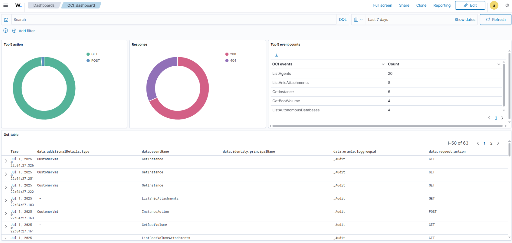

 # OCI Streaming-Wazuh Integration

 ## Table of Contents

 * [Introduction](#introduction)
 * [Prerequisites](#prerequisites)
 * [Installation and Configuration](#installation-and-configuration)
     * [Installing Logstash](#installing-logstash)
     * [Initial OCI Configuration](#initial-oci-configuration)
     * [Initial Logstash Configuration](#initial-logstash-configuration)
     * [Installing Wazuh (if applicable)](#installing-wazuh-if-applicable)
     * [Initial Wazuh Configuration (if applicable)](#initial-wazuh-configuration-if-applicable)
     * [Using the Integration Files](#using-the-integration-files)
 * [Integration Steps](#integration-steps)
 * [Integration Testing](#integration-testing)
 * [Sources](#sources)

 ---

 ### Introduction

 This integration provides the capability to monitor Oracle Cloud Infrastructure (OCI) events using Wazuh. It utilizes a Kafka connector via Logstash to forward OCI logs—such as Logging, Streaming, Monitoring, and Queue events—to the Wazuh agent or manager. This guide specifically focuses on monitoring Streaming events.

 By integrating OCI Streaming with Wazuh, organizations can gain visibility into their cloud infrastructure events, correlating them with other security data for comprehensive threat detection and compliance monitoring.

 ---

 ### Prerequisites

 List all necessary prerequisites for setting up this integration:
 * Wazuh: A working installation of Wazuh Manager and Agent (optional, if running Logstash on a separate node).
 * Oracle Cloud Infrastructure (OCI) Account: Access to OCI with permissions to configure Streaming and Connectors.
 * Logstash: Required to act as the intermediate collector between OCI Kafka and Wazuh.
 * Network: Connectivity between the OCI Kafka endpoint and the server running Logstash (Outbound TCP/9092).

 ---

 ### Installation and Configuration

 #### Installing Logstash

 Logstash is required to consume the Kafka stream from OCI and write the logs to a file that Wazuh can read.

 1. Install Logstash on the server where you intend to collect logs (this can be the Wazuh Manager or a Wazuh Agent).
 2. Follow the official installation guide: [Installing Logstash](https://www.elastic.co/docs/reference/logstash/installing-logstash).

 #### Initial OCI Configuration

 Before configuring Wazuh, you must configure OCI Streaming to extract the log source. This process will provide the Kafka endpoint required for the Logstash configuration.

 1. Select Source: Configure the connector source (e.g., Logging, Streaming).
    

 2. Stream Pool: Ensure your Stream Pool is active.
    

 3. Retrieve Kafka Settings: Navigate to Kafka Connection Settings in your OCI Console. Note down the Bootstrap Servers and the SASL Connection Strings.
    

 #### Initial Logstash Configuration

 You need to configure Logstash to authenticate with OCI and forward the data.

 1. Kafka Input: You will need to create a Logstash configuration file (provided in `config/logstash/oci_input.conf`) that points to your OCI Kafka endpoint.
 2. Authentication: You will need to create a JAAS configuration file (provided in `config/logstash/jaas.conf`) using your OCI credentials.

 #### Installing Wazuh (if applicable)

 A standard Wazuh installation is assumed. For details, refer to the [official Wazuh documentation](https://documentation.wazuh.com/current/installation-guide/index.html).

 #### Initial Wazuh Configuration (if applicable)

 No specific modules need to be enabled initially, but the Wazuh agent/manager must have read permissions on the output file generated by Logstash (default: `/var/lib/logstash/oci_debug.json`).

 #### Using the Integration Files

 Follow these steps to deploy the configuration files provided in this integration directory.

 1. Logstash Configuration:
 * Copy the input configuration:
   * Source: [config/logstash/oci_input.conf](config/logstash/oci_input.conf)
   * Destination: `/etc/logstash/conf.d/oci_input.conf`
 * Copy the JAAS configuration:
   * Source: [config/logstash/jaas.conf](config/logstash/jaas.conf)
   * Destination: `/etc/logstash/jaas.conf`
 * Edit both files to replace the placeholders (e.g., <<oci_kafka_endpoint>>, <<oci_stream_reader_username>>) with your actual OCI values.
 * Restart Logstash: `systemctl restart logstash`.

 2. Wazuh Agent/Manager Configuration:
 * Edit your `ossec.conf` (usually in `/var/ossec/etc/ossec.conf`).
 * Add the `<localfile>` block provided in [config/wazuh/ossec_snippet.xml](config/wazuh/ossec_snippet.xml).
 * This configuration reads the JSON file created by Logstash and applies a specific label `oci-stream-logs` to handle nested JSON parsing issues.

 3. Rules and Decoders:
 * Copy the decoders:
   * Source: [ruleset/decoders/oci_decoders.xml](ruleset/decoders/oci_decoders.xml)
   * Destination: `/var/ossec/etc/decoders/oci_decoders.xml`
 * Copy the rules:
   * Source: [ruleset/rules/oci_rules.xml](ruleset/rules/oci_rules.xml)
   * Destination: `/var/ossec/etc/rules/oci_rules.xml`

 4. Custom Dashboard:
 * Download the dashboard file: [dashboards/oci_dashboard.ndjson](dashboard/oci_dashboard.ndjson)
 * Import it into the Wazuh Dashboard (OpenSearch Dashboards).
 * Navigate to Stack Management > Saved Objects > Import.
 * Select the `.ndjson` file and complete the import.

 5. Restart Wazuh:
 * Apply the changes by restarting the Wazuh manager (or agent):
   ```bash
   systemctl restart wazuh-manager
   ```

 ---

 ### Integration Steps

 The data flow for this integration is as follows:
 1. OCI Events are generated in Oracle Cloud.
 2. OCI Connector pushes these events to an OCI Streaming (Kafka) topic.
 3. Logstash connects to the Kafka topic using SASL/SSL authentication.
 4. Logstash writes the events to a local file (`/var/lib/logstash/oci_debug.json`) in JSON format.
 5. Wazuh Collector reads this file, pre-pending the `oci-stream-logs:` prefix.
 6. Wazuh Decoders parse the prefixed log to extract fields.
 7. Wazuh Rules trigger alerts based on the parsed data.

 To trigger the integration, perform an action in your OCI console (e.g., view an instance, modify a bucket) that generates a log event captured by your OCI Connector filters.

 ---

 ### Integration Testing

 To verify the integration is working:

 1. Check Logstash Output:
    Ensure Logstash is successfully writing to the debug file:
    ```bash
    tail -f /var/lib/logstash/oci_debug.json
    ```
    You should see JSON objects appearing as events occur in OCI.

 2. Check Wazuh Alerts:
    Look for alerts in the Wazuh alerts log:
    ```bash
    grep "oci-stream" /var/ossec/logs/alerts/alerts.json
    ```

 3. Verify Dashboard:
    Navigate to the Wazuh Dashboard. You should see alerts with `rule.group` matching `oci-stream`.
    

    You can also build custom visualizations using the parsed fields.
    

 ---

 ### Sources

 * [Oracle Docs: OCI Log Shipper](https://docs.oracle.com/en/learn/ocilogs-log-shipper/index.html#introduction)
 * [Wazuh Integration with OCI Logs (Reddit Discussion)](https://www.reddit.com/r/Wazuh/comments/1coqxiz/wazuh_integeration_with_oci_logs/)
