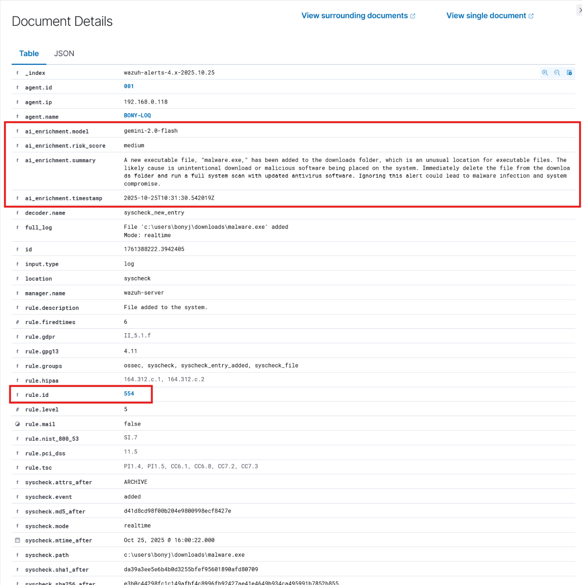
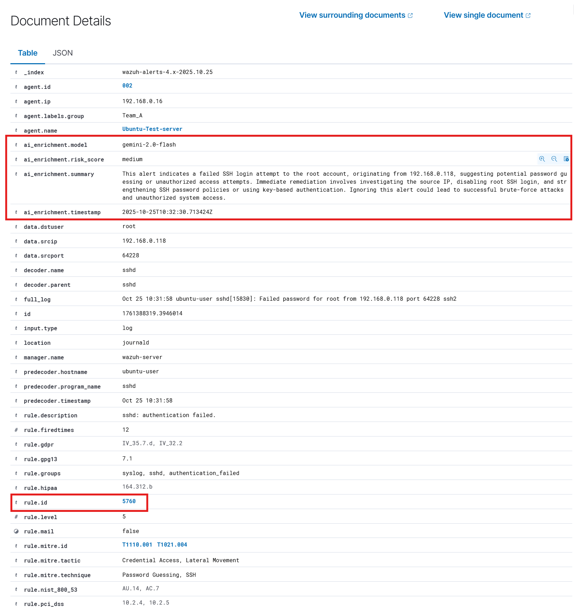
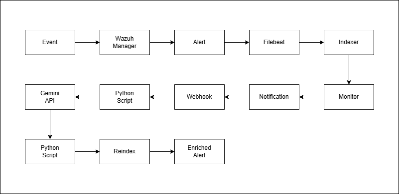
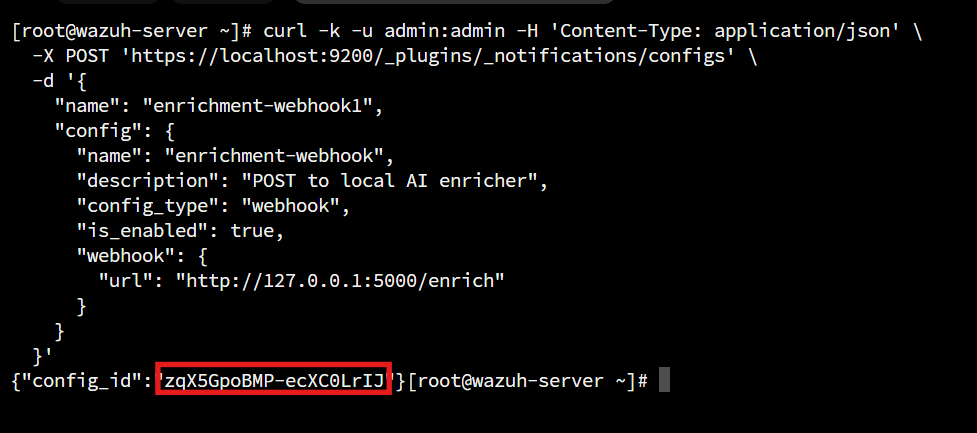

# Enrich Wazuh Alerts using Gemini AI

## Table of Contents
- [Tested Version](#tested-version)
- [Overview](#overview)
- [Integration Steps](#integration-steps)
  - [Step 1: Obtain a Gemini API Key](#step-1-obtain-a-gemini-api-key)
  - [Step 2: Configure Notification Channel](#step-2-configure-notification-channel)
  - [Step 3: Create a Monitor](#step-3-create-a-monitor)
  - [Step 4: Install Required Packages](#step-4-install-required-packages)
  - [Step 5: Add Custom Script](#step-5-add-custom-script)
  - [Step 6: Configure as a Service](#step-6-configure-as-a-service)
- [Conclusion](#conclusion)
- [Reference](#reference)

## Tested Version

| Wazuh version | Component | Deployment Type | OS |
|---|---|---|---|
| 4.14.0 | Wazuh Indexer | OVA | Amazon Linux | 

## Overview
This guide explains how to integrate Wazuh with Gemini AI to automatically enrich alerts with detailed explanations and suggested remediation steps in **same alert**.

In this integration, a Wazuh Monitor runs every minute to check for alerts triggered within the last five minutes that match specific rule IDs and do not already contain the field `ai_enrichment.summary`.
These alerts are sent to a Python Flask enrichment service via a webhook configured in the Wazuh Notification Channel.

The Flask service calls the Gemini API, retrieves enrichment details, and updates the same alert document in the Wazuh Indexer with the AI-generated summary and recommendations.
This process introduces a minor delay (approximately one minute) between the initial alert generation and enrichment.

### Enriched Alert Example





### 🔄 Flow Diagram



## Requirements
- **Gemini API Key** (from [Google AI Studio](https://aistudio.google.com/))  
- **Wazuh Indexer CLI access and Dashboard Admin Access** (To create notification channel and Monitor)  
- Model: **`gemini-2.0-flash`**

## Integration Steps

### Step 1: Obtain a Gemini API Key
1. Log in to [Google AI Studio](https://aistudio.google.com/).  
2. Generate a new API key for the **Gemini 2.0 Flash** model.  
3. Save the key securely for later configuration.

### Step 2: Configure Notification Channel 
Run the following command on your Wazuh Indexer server to create a Webhook Notification Channel:
```bash
curl -k -u admin:<password> -H 'Content-Type: application/json' \
  -X POST 'https://localhost:9200/_plugins/_notifications/configs' \
  -d '{
    "name": "enrichment-webhook",
    "config": {
      "name": "enrichment-webhook",
      "description": "POST to local AI enricher",
      "config_type": "webhook",
      "is_enabled": true,
      "webhook": {
        "url": "http://127.0.0.1:5000/enrich"
      }
    }
  }'
  ```

Replace <password> with your Wazuh Dashboard admin password.

Once executed successfully, this will return a config_id.
Copy and save this ID — you’ll need it when creating the monitor.

Example output:


### Step 3: Create a Monitor

Run the following command to create a query-level monitor that triggers every minute:
```bash
curl -sk -u admin:<password> -H 'Content-Type: application/json' \
  -X POST 'https://localhost:9200/_plugins/_alerting/monitors' \
  -d '{
    "name":"Wazuh Alert Enricher (query-level, 5m window)",
    "enabled": true,
    "monitor_type":"query_level_monitor",
    "schedule": { "period": { "interval": 1, "unit": "MINUTES" } },
    "inputs": [{
      "search": {
        "indices": ["wazuh-alerts-4.x-*"],
        "query": {
          "size": 400,
          "query": {
            "bool": {
              "filter": [
                { "terms": { "rule.id": ["554","5760","5715"] } },
                { "range": { "@timestamp": { "from": "now-5m", "to": "now" } } },
                { "bool": { "must_not": { "exists": { "field": "ai_enrichment.summary" } } } }
              ]
            }
          },
          "sort": [{ "@timestamp": { "order": "desc" } }]
        }
      }
    }],
    "triggers": [{
      "name":"Enrich last 5m",
      "severity":"1",
      "condition":{"script":{"source":"return ctx.results[0].hits.total.value > 0"}},
      "actions": [{
        "name":"POST to enrichment service",
        "destination_id":"<DEST_ID>",
        "message_template":{"source":"{\"hits\": {{#toJson}}ctx.results.0.hits.hits{{/toJson}} }"},
        "throttle_enabled": false
      }]
    }]
  }'
  ```
Replace:
- `<password>` — your Wazuh admin.
- `<DEST_ID>` — the config_id obtained in **Step 2**.
- Update `rule.id` values as needed for your use case

**Note**:
If you notice missing enrichments later, increase the time range from `now-5m` to `now-10m`.
Be cautious — larger time windows may increase Indexer load.

### Step 4: Install required packages
Install Python and pip package:

For Ubuntu/Debia:
```bash
apt update
apt install -y python3 python3-pip
```

For CentOS/RHEL/Rocky:
```bash
yum install -y python3 python3-pip
```
Verify Installation:
```bash
python3 --version
pip3 --version
```

Install Python Dependencies:
```bash
pip3 install flask requests
```

### Step 5: Add Custom Script

1. Create Environment File:
```bash
sudo nano /var/ossec/integrations/enrich_service
```
For distributed deployments, this directory might not exist on the Indexer node.
You can use a different path if needed.

2. Add the following content:
```bash
OPENSEARCH_URL="https://localhost:9200"
OS_USER="admin"
OS_PASS="admin"
OS_VERIFY_SSL="false"
GEMINI_API_KEY="<YOUR_REAL_KEY>"
GEMINI_MODEL="gemini-2.0-flash"
```
Replace:
- `OS_USER` and `OS_PASS` with your Wazuh Dashboard credentials
- `<YOUR_REAL_KEY>` with your Gemini API key

3. Set permissions:
```bash
sudo chmod 600 /var/ossec/integrations/enrich_service
```

4. Create the Python script:
```bash
nano /var/ossec/integrations/enrich_service.py
```

5. Paste the Python code (from `enrich_service.py`).
6. Set permissions:
```bash
chmod 750 /var/ossec/integrations/enrich_service.py
chown root:wazuh /var/ossec/integrations/enrich_service.py
```

### Step 6: Configure as a Service

1. Create a systemd unit file:
```bash
sudo nano /etc/systemd/system/enrich.service
```

2. Add the following configuration:
```bash
[Unit]
Description=Flask Enrichment Service (Wazuh + Gemini)
After=network.target

[Service]
Type=simple
WorkingDirectory=/root
ExecStart=/usr/bin/python3 /var/ossec/integrations/enrich_service.py
EnvironmentFile=/var/ossec/integrations/enrich_service
Restart=always
User=root
# If you want to run as wazuh user:
# User=wazuh
# Group=wazuh

[Install]
WantedBy=multi-user.target
```
> Adjust paths if using a distributed Wazuh setup.

3. Enable and start the service:
```bash
sudo systemctl daemon-reload
sudo systemctl enable enrich
sudo systemctl start enrich
```

4. Verify service status:
```bash
sudo systemctl status enrich
sudo journalctl -u enrich -f
```

Expected Output:
```bash
Sep 25 23:11:06 wazuh-server python3[23329]: * Running on http://127.0.0.1:5000
Sep 25 23:11:06 wazuh-server python3[23329]: * Running on http://192.168.0.15:5000
```

## Testing
Once configuration is complete:
- Trigger alerts matching any of the configured rule.id values (e.g., create a file to trigger rule 554 in FIM).
- Wait 1–2 minutes for enrichment.
- Open the Wazuh Dashboard and view the enriched alert.

It should now contain a new field: `ai_enrichment.summary`

## Conclusion
By integrating Wazuh with Gemini AI, you can automatically enrich alerts with intelligent insights, providing context and recommended actions without manual intervention.
This setup enhances SOC efficiency, speeds up triage, and creates a foundation for AI-assisted incident response.

## Reference
- [Opensearch Alerting](https://docs.opensearch.org/latest/observing-your-data/alerting/index/)
- [Opensearch Notifications](https://docs.opensearch.org/latest/observing-your-data/notifications/index/)
- [Gemini API Documentation](https://aistudio.google.com/welcome?utm_source=google&utm_medium=cpc&utm_campaign=FY25-global-DR-gsem-BKWS-1710442&utm_content=text-ad-none-any-DEV_c-CRE_726176536028-ADGP_Hybrid%20%7C%20BKWS%20-%20EXA%20%7C%20Txt-Gemini-Gemini%20API-KWID_927524447508-kwd-927524447508&utm_term=KW_gemini%20api-ST_gemini%20api&gclsrc=aw.ds&gad_source=1&gad_campaignid=20860602951&gbraid=0AAAAACn9t65i8KlWvyzBtFYqXPQ01Jdaf&gclid=CjwKCAjw6vHHBhBwEiwAq4zvA-P5nb9DwlG4_tQqVLZCPLoQJ388cUK6yJi46MYvwfQF5DqWCklEZxoCtRYQAvD_BwE)

