# Wazuh – MISP Integration

## Table of Contents
- [Introduction](#introduction)
- [Prerequisites](#prerequisites)
- [Installation and Configuration](#installation-and-configuration)
  - [Installing MISP](#installing-misp)
  - [Initial MISP Configuration](#initial-misp-configuration)
  - [Installing Wazuh](#installing-wazuh)
  - [Initial Wazuh Configuration](#initial-wazuh-configuration)
  - [Wazuh-Sysmon Integration](#wazuh-sysmon-integration)
- [MISP-Wazuh Integration](#misp-wazuh-integration)
  - [Integration Steps](#integration-steps)
  - [Integration Testing](#integration-testing)
- [Sources/Acknowledgements](#sourcesacknowledgements)

## Introduction

This project provides a detailed guide and necessary scripts to integrate MISP (Malware Information Sharing Platform) with Wazuh, a security monitoring solution. By combining these tools, security teams can automatically check Sysmon events against MISP's threat intelligence database, enabling real-time detection of known threats and indicators of compromise (IoCs).

It also implements a local queuing mechanism to buffer alerts when the MISP API is unreachable, and writes detailed logs to `/var/log/wazuh-misp/custom-misp.log` for auditing and troubleshooting.

<p align="center">
  
</p>

## Prerequisites

Before starting the integration, ensure you have the following:

- A machine with two Ubuntu Servers installed (for MISP and Wazuh installation)
- Docker installed for MISP. Optional as MISP can be installed without docker.
- Python 3 and `pip3` installed (for the integration script)
- Python `requests` library installed (`pip3 install requests`)

## Installation and Configuration

### Installing MISP

- MISP can be installed using three methods: automatic script, manual installation, or Docker. Choose the method that best suits your needs.
- In this guide, we will configure and run MISP using **Docker** For a faster and isolated deployment on an **Ubuntu Server** (virtual machine on OracleVM using vagrant).

#### Installing Docker

<details>
<summary>Click to expand Docker installation steps</summary>

You can install Docker on your Ubuntu Server by following [the official documentation](https://docs.docker.com/engine/install/ubuntu/)
</details>

#### Installing the MISP Docker Image

<details>
<summary>Click to expand MISP Docker installation steps</summary>

##### Clone the MISP Docker repository
```bash
git clone https://github.com/MISP/misp-docker
```

##### Configure files
```bash
cd misp-docker
cp template.env .env
vim .env
```

Modify the `MISP_BASEURL` variable in `.env` to reflect the machine's IP address.

<details>
<summary>Click to expand a test .env configuration</summary>

```bash
...
# Email/username for user #1, defaults to MISP's default (admin@admin.test)
ADMIN_EMAIL=admin@test.com
# name of org #1, default to MISP's default (ORGNAME)
ADMIN_ORG=test
# uuid of org #1, defaults to an automatically generated one
ADMIN_ORG_UUID=
# defaults to an automatically generated one
ADMIN_KEY=
# defaults to MISP's default (admin)
ADMIN_PASSWORD=
# defaults to 'passphrase'
GPG_PASSPHRASE=
# defaults to 1 (the admin user)
CRON_USER_ID=
# defaults to 'https://localhost'
# note: if you are exposing MISP on a non-standard port (i.e., the port is part of the URL you would use to access it, e.g., https://192.168.0.1:4433) you need to include the port in the BASE_URL variable
BASE_URL=https://192.168.56.101 # MY TEST IP
# store settings in db except those that must stay in config.php. true/false, defaults to false
ENABLE_DB_SETTINGS=
# encryption key. defaults to empty string
ENCRYPTION_KEY=
# enable background updates. defaults to false
ENABLE_BACKGROUND_UPDATES=
# use a different attachments_dir. defaults to /var/www/MISP/app/files
ATTACHMENTS_DIR=
...
```

</details>

##### Next, build the Docker containers
```bash
sudo docker compose build
```
</details>

#### Running MISP Using Docker

<details>
<summary>Click to expand MISP Docker running steps</summary>

##### Launch MISP containers
```bash
sudo docker compose up -d
```

##### To stop the Docker environment
```bash
sudo docker compose down
```
</details>


#### Running MISP Using Github
Alternatively, you can run MISP using the official MISP Docker image from GitHub. This method is straightforward and allows you to quickly set up a MISP instance.

```bash
sudo apt-get update -y && sudo apt-get upgrade -y
sudo apt-get install mysql-client -y
wget https://raw.githubusercontent.com/MISP/MISP/2.4/INSTALL/INSTALL.sh
chmod +x INSTALL.sh
./INSTALL.sh -A
sudo ufw allow 80/tcp
sudo ufw allow 443/tcp
```

### Initial MISP Configuration

#### Logging into MISP

You can access your MISP instance through ports 80 and 443 on the machine hosting MISP. Accept the security certificate, then log in as the default Administrator using the credentials:
- Username: `admin@admin.test`
- Password: `admin`

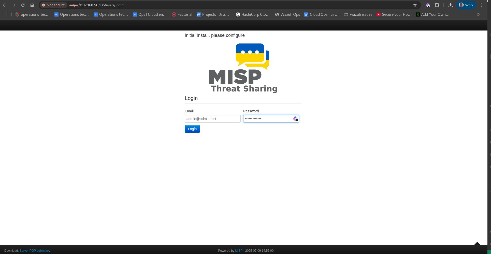

#### Adding feeds

<details>
<summary>Click to expand feed configuration steps</summary>

A MISP feed is a structured data source that automatically provides up-to-date information on cyber threats.

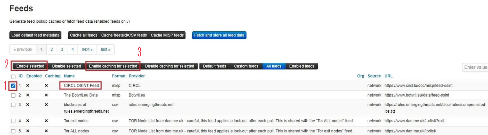
</details>

#### Generate an API key

<details>
<summary>Click to expand API key generation steps</summary>

- Click on administration >> list auth keys >>  Add authentication key

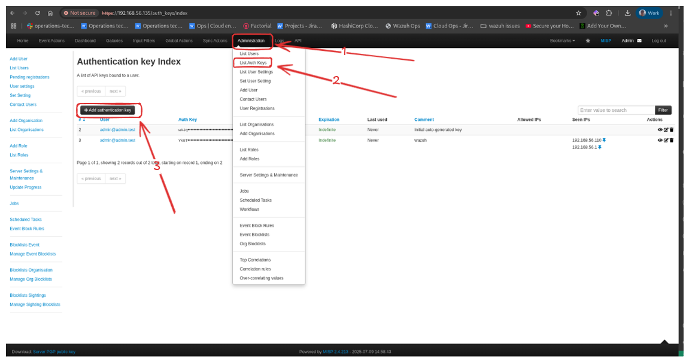
- We generate an authentication key to allow the API to recognize and authorize the user. Fields such as user, comment, and authorized IPs must be configured as needed before submitting.

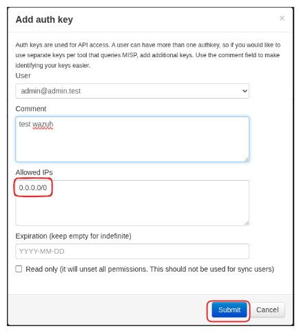
- Please make sure to write down the authentication key

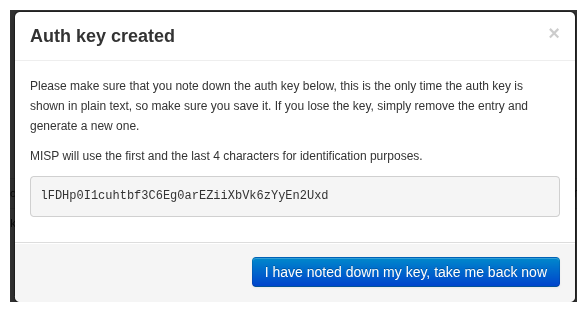
</details>

#### Set up a Cronjob to update feeds daily

```bash
0 1 * * * /usr/bin/curl -XPOST --insecure --header "Authorization: **YOUR_API_KEY**" --header "Accept: application/json" - header "Content-Type: application/json" https://**YOUR_MISP_ADDRESS**/feeds/fetchFromAllFeeds
```

### Installing Wazuh

- Wazuh offers an installation method called [Quick Start](https://documentation.wazuh.com/current/quickstart.html)
- You can download and run the [Wazuh installation assistant](https://documentation.wazuh.com/current/installation-guide/wazuh-indexer/installation-assistant.html)
- Once the installation is complete, the assistant will give us a username and password to connect to the indexer

#### Testing connection from Wazuh to MISP
To do this you can use the following command from a linux server, and you must replace the ip, and the authorization with the value of the key that you generated:
```bash
curl -k -X GET https://<IPFromMispServer>/attributes/restSearch/value:test -H 'Content-Type: application/json' -H 'Authorization: CbA....W4y' -H 'Accept: application/json'
```

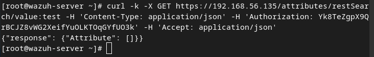

#### Wazuh-Sysmon Integration

##### Step 1: Installing and Configuring Sysmon

<details>
<summary>Click to expand Sysmon installation steps</summary>

- Download Sysmon from the Microsoft Sysinternals [page](https://learn.microsoft.com/en-us/sysinternals/downloads/sysmon).
- Download the Sysmon configuration file from this [link](https://github.com/SwiftOnSecurity/sysmon-config/blob/master/sysmonconfig-export.xml).
- Extract the Sysmon zip file and place the downloaded configuration file in the extracted folder.
- Install Sysmon with the configuration file using PowerShell (as administrator):
```powershell
.\sysmon64.exe -accepteula -i .\sysmonconfig-export.xml
```
</details>

##### Step 2: Configure the Wazuh agent

<details>
<summary>Click to expand Wazuh agent configuration steps</summary>

- Edit the Wazuh agent's `ossec.conf` file:
`C:\Program Files (x86)\ossec-agent\ossec.conf`
- Add the following configuration to collect Sysmon logs:
```xml
<localfile>
  <location>Microsoft-Windows-Sysmon/Operational</location>
  <log_format>eventchannel</log_format>
</localfile>
```
- Restart the Wazuh agent with the command:
```powershell
Restart-Service -Name wazuh
```
</details>

## MISP-Wazuh Integration

### Integration Steps

#### Step 1: Add the Python script

<details>
<summary>Click to expand integration script configuration steps</summary>

- Place [this Python script](custom-misp.py) at `/var/ossec/integrations/custom-misp.py`

- Make sure to set the permissions:
```bash
cp /var/ossec/integrations/shuffle /var/ossec/integrations/custom-misp
touch /var/ossec/integrations/custom-misp.py
# paste the content of custom-misp.py
chmod 750 /var/ossec/integrations/custom-misp*
chown root:wazuh /var/ossec/integrations/custom-misp*
mkdir -p /var/log/wazuh-misp
chown wazuh:wazuh /var/log/wazuh-misp
```

- Make sure wazuh is already alerting for the desired sysmon events. You will likely need to create a custom rule if it isn't already alerting.
- For example, in our test we will need DNS queries from sysmon event 22
- We will change the under rule level from `0` to `4` in the file `/var/ossec/ruleset/rules/0595-win-sysmon_rules.xml`
```xml
<rule id="61650" level="4">
   <if_sid>61600</if_sid>
   <field name="win.system.eventID">^22$</field>
   <description>Sysmon - Event 22: DNS Query event</description>
   <options>no_full_log</options>
   <group>sysmon_event_22,</group>
 </rule>
```

> **Note:** We found the rule for event `22` in `0595-win-sysmon_rules.xml` because it falls between `05`-`95`. Follow the same approach to find the desired event.

> **Note:** There are 16 levels of rules `0`-`15`. Check [this page](https://documentation.wazuh.com/current/user-manual/ruleset/rules/rules-classification.html) to recognize each one.
</details>

#### Step 2: Configure the integration in Wazuh

<details>
<summary>Click to expand Wazuh integration configuration steps</summary>

- Edit the Wazuh manager's `/var/ossec/etc/ossec.conf` file to add the integration block:
```xml
<integration>
  <name>custom-misp.py</name> <!-- You can remove .py if you copied the bash script -->
  <group>sysmon_event1,sysmon_event3,sysmon_event6,sysmon_event7,sysmon_event_15,sysmon_event_22,syscheck</group>
  <hook_url>https://YOUR_MISP_IP:PORT/</hook_url>
  <api_key>YOUR_API_KEY</api_key>
  <alert_format>json</alert_format>
</integration>
```

> **Note:** The manager will only run the script when one of the Sysmon groups is triggered

- Restart the Wazuh manager.
```bash
systemctl restart wazuh-manager
```
</details>

#### Step 3: Also add the following rule to the wazuh manager

<details>
<summary>Click to expand rule addition steps</summary>

- Go to `Server Management` > `Rules` > `Add New Rule file`. Name it `custom_misp_rules.xml`, add the [./ruleset/rules/custom_misp_rules.xml](custom_misp_rules.xml) and save.

</details>

#### Step 4: Restart Wazuh services

```bash
systemctl restart wazuh-manager
```

## Integration Testing

In the integration test, you can use any attribute from the feeds. However, we'll create our own event and add a domain attribute to it, allowing us to test with that domain later.

### Create our own event

<details>
<summary>Click to expand event creation steps</summary>

- Access the MISP interface via its URL (e.g.: https://<MISP_IP_address>).
- Navigate to `Home` > `Add Event`
- Create a new event with a title, distribution, and threat level, then submit.
- Add a domain attribute with a fictitious name, like `lolo.koko.co`, and save it.
- Publish the event by clicking on `Publish Event`

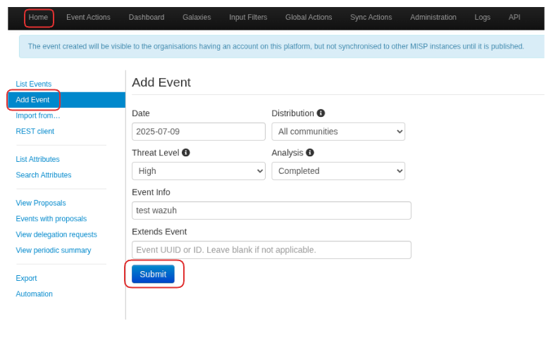

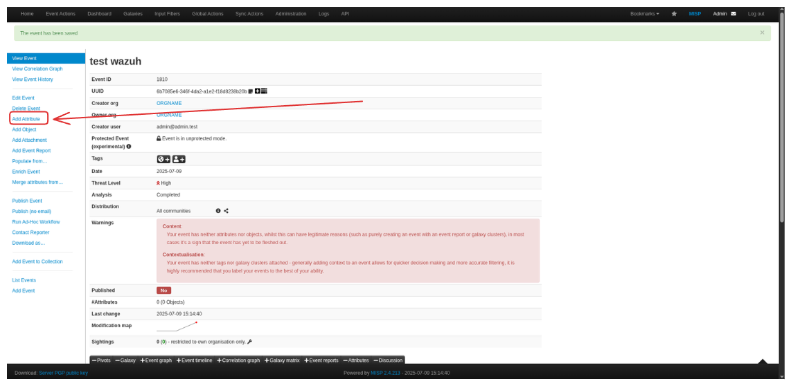

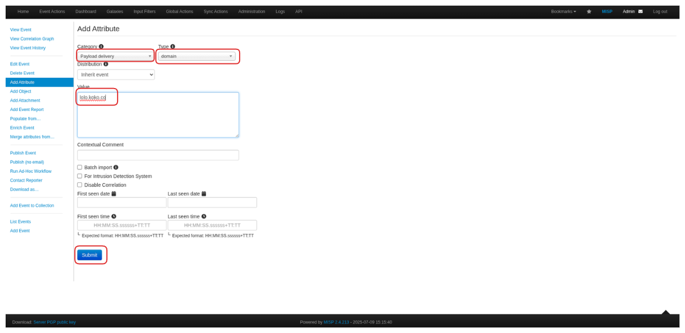

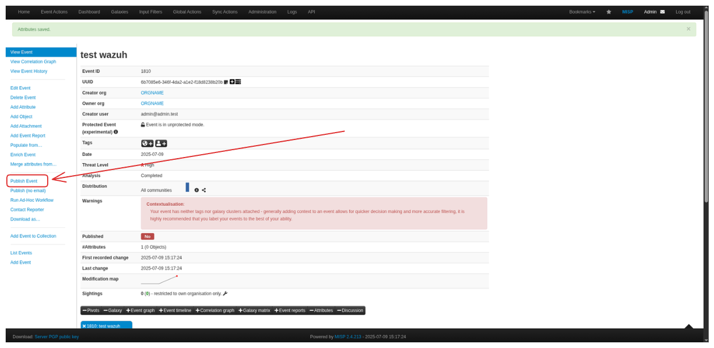

- On a Windows machine with the Wazuh agent installed, use PowerShell to interact with the added domain:

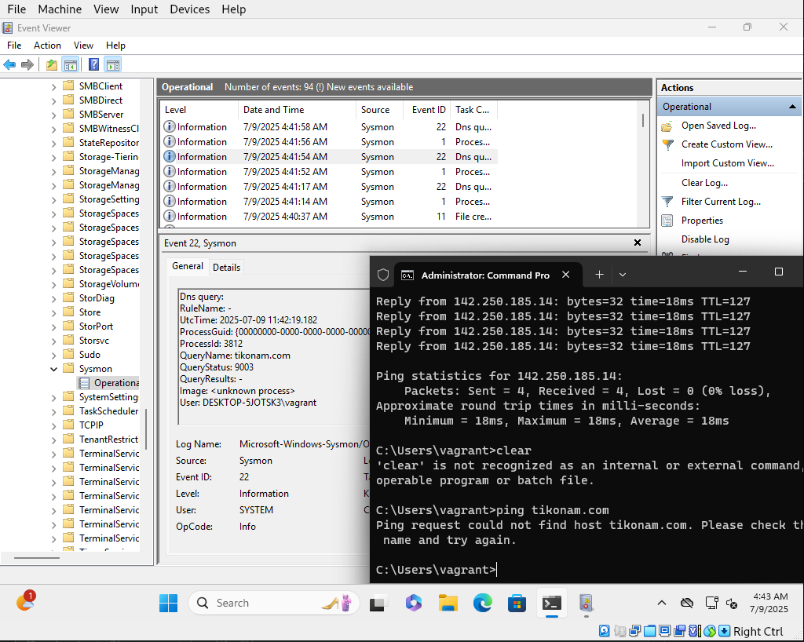

- Check if the malicious domain is detected and marked as a critical alert in the Sysmon logs transmitted to Wazuh.

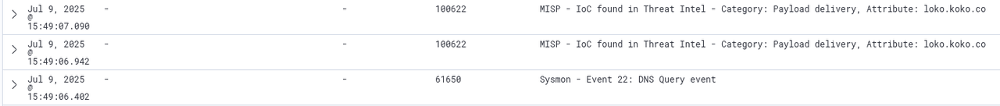

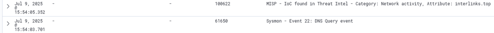
</details>

## Sources/Acknowledgements
This enhanced integration was forked from [Ratandeep18](https://github.com/Ratandeep18). Big thanks for the contribution!

<details>
<summary>Click to expand source references</summary>

- [MISP Project Documentation](https://www.misp-project.org/documentation/)
- [Wazuh Documentation](https://documentation.wazuh.com/)
- [Microsoft Sysmon Documentation](https://learn.microsoft.com/en-us/sysinternals/downloads/sysmon)
- [ MISP integration issues](https://www.reddit.com/r/Wazuh/comments/10hdd22/misp_integration_issues/)
- [wazuh sysmon logs forwarding issues](https://groups.google.com/g/wazuh/c/2FXD6wx0TDU)
- [youtube video](https://www.youtube.com/watch?v=-qRMDxZpnWg&t=1004s&ab_channel=TaylorWalton)
- [Additional guide](https://kravensecurity.com/threat-intelligence-with-misp-part-2-setting-up-misp/)
- [Recognition](https://github.com/aymenmarjan/MISP-Wazuh-Integration)

</details>

---

<div align="center">
  
## Workflow Diagram

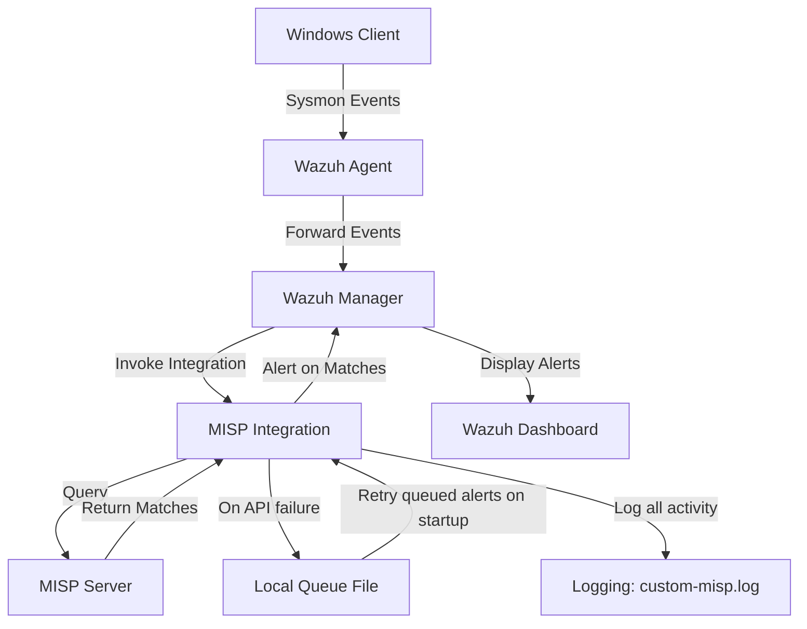

</div>