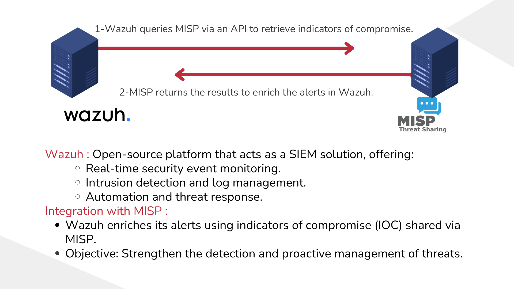
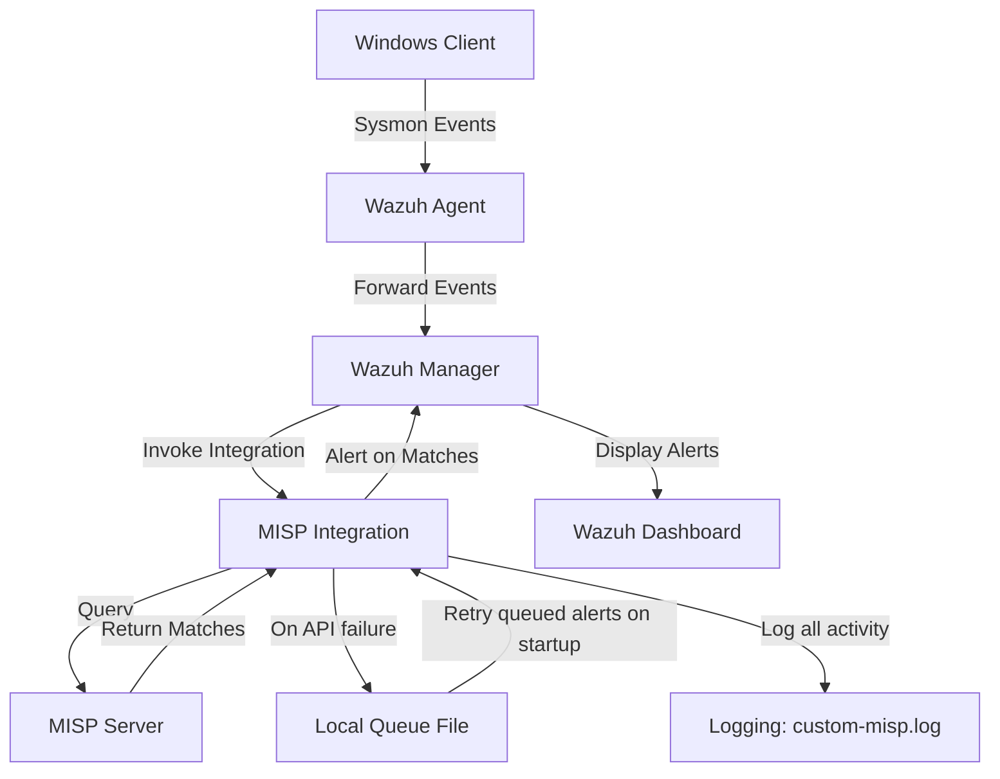

# MISP-Wazuh Integration

## Table of Contents
- [Introduction](#introduction)
- [Prerequisites](#prerequisites)
- [Installation and Configuration](#installation-and-configuration)
  - [Installing MISP](#installing-misp)
  - [Initial MISP Configuration](#initial-misp-configuration)
  - [Installing Wazuh](#installing-wazuh)
  - [Initial Wazuh Configuration](#initial-wazuh-configuration)
  - [Wazuh-Sysmon Integration](#wazuh-sysmon-integration)
- [MISP-Wazuh Integration](#misp-wazuh-integration)
  - [Integration Steps](#integration-steps)
  - [Integration Testing](#integration-testing)
- [Sources](#sources)

## Introduction

This project provides a detailed guide and necessary scripts to integrate MISP (Malware Information Sharing Platform) with Wazuh, a security monitoring solution. By combining these tools, security teams can automatically check Sysmon events against MISP's threat intelligence database, enabling real-time detection of known threats and indicators of compromise (IoCs).

It also implements a local queuing mechanism to buffer alerts when the MISP API is unreachable, and writes detailed logs to `/var/log/wazuh-misp/custom-misp.log` for auditing and troubleshooting.



## Prerequisites

Before starting the integration, ensure you have the following:

- A machine with Ubuntu Server installed (for MISP and Wazuh installation)
- VMware or another virtualization platform (if using a VM)
- Docker installed (We’ll show how to install it if it’s not already installed)
- Python 3 and `pip3` installed (for the integration script)
- Python `requests` library installed (`pip3 install requests`)

## Installation and Configuration

### Installing MISP

- MISP can be installed using three methods: automatic script, manual installation, or Docker. Choose the method that best suits your needs.
- In this guide, we will configure and run MISP using **Docker** For a faster and isolated deployment on an **Ubuntu Server** (virtual machine on VMware).

#### Installing Docker

<details>
<summary>Click to expand Docker installation steps</summary>

##### First, uninstall any old versions of Docker
```bash
for pkg in docker.io docker-doc docker-compose podman-docker containerd runc; do sudo apt-get remove $pkg; done
```

##### Add Docker's official GPG key
```bash
sudo apt-get update

sudo apt-get install ca-certificates curl gnupg

sudo install -m 0755 -d /etc/apt/keyrings

curl -fsSL https://download.docker.com/linux/ubuntu/gpg | sudo gpg --dearmor -o /etc/apt/keyrings/docker.gpg

sudo chmod a+r /etc/apt/keyrings/docker.gpg
```

##### Add the Docker repository
```bash
echo \
  "deb [arch="$(dpkg --print-architecture)" signed-by=/etc/apt/keyrings/docker.gpg] https://download.docker.com/linux/ubuntu \
  "$(. /etc/os-release && echo "$VERSION_CODENAME")" stable" | \
  sudo tee /etc/apt/sources.list.d/docker.list > /dev/null
```
```bash
sudo apt-get update
```

##### Install the Docker packages
```bash
sudo apt-get install docker-ce docker-ce-cli containerd.io docker-buildx-plugin docker-compose-plugin
```

##### Finally, verify Docker was installed successfully by executing
```bash
sudo docker run hello-world
```
</details>

#### Installing the MISP Docker Image

<details>
<summary>Click to expand MISP Docker installation steps</summary>

##### Clone the MISP Docker repository
```bash
git clone https://github.com/MISP/misp-docker
```

##### Configure files
```bash
cd misp-docker
cp template.env .env
vim .env
```

Modify the `MISP_BASEURL` variable in `.env` to reflect the machine's IP address.


##### Next, build the Docker containers
```bash
sudo docker compose build
```
</details>

#### Running MISP Using Docker

<details>
<summary>Click to expand MISP Docker running steps</summary>

##### Edit the docker-compose.yml file
This file holds the configuration settings for the Docker environment running MISP. In particular, you need to update the `MISP_BASEURL` variable to match the IP address of the machine hosting MISP.


##### Launch MISP containers
```bash
sudo docker compose up
```

##### To stop the Docker environment
```bash
sudo docker compose down
```
</details>


#### Running MISP Using Github
Alternatively, you can run MISP using the official MISP Docker image from GitHub. This method is straightforward and allows you to quickly set up a MISP instance.

```bash
sudo apt-get update -y && sudo apt-get upgrade -y
udo apt-get install mysql-client -y
wget https://raw.githubusercontent.com/MISP/MISP/2.4/INSTALL/INSTALL.sh
chmod +x INSTALL.sh
./INSTALL.sh -A
sudo ufw allow 80/tcp
sudo ufw allow 443/tcp
```

### Initial MISP Configuration

#### Logging into MISP

You can access your MISP instance through ports 80 and 443 on the machine hosting MISP. Accept the security certificate, then log in as the default Administrator using the credentials:
- Username: `admin@admin.test`
- Password: `admin`


#### Adding feeds

<details>
<summary>Click to expand feed configuration steps</summary>

A MISP feed is a structured data source that automatically provides up-to-date information on cyber threats.


</details>

#### Generate an API key

<details>
<summary>Click to expand API key generation steps</summary>

- Click on administration >> list auth keys >>  Add authentication key


- We generate an authentication key to allow the API to recognize and authorize the user. Fields such as user, comment, and authorized IPs must be configured as needed before submitting.


- Please make sure to write down the authentication key


</details>

#### Set up a Cronjob to update feeds daily

```bash
0 1 * * * /usr/bin/curl -XPOST --insecure --header "Authorization: **YOUR_API_KEY**" --header "Accept: application/json" - header "Content-Type: application/json" https://**YOUR_MISP_ADDRESS**/feeds/fetchFromAllFeeds
```

### Installing Wazuh

- Wazuh offers an installation method called `Quick Start`
- Download and run the Wazuh installation assistant
```bash
curl -sO https://packages.wazuh.com/4.11/wazuh-install.sh && sudo bash ./wazuh-install.sh -a
```
- Once the installation is complete, the assistant will give us a username and password to connect to the indexer

#### Testing connection from Wazuh to MISP
To do this you can use the following command from a linux server, and you must replace the ip, and the authorization with the value of the key that you generated:
```bash
curl -k -X GET https://<IPFromMispServer>/attributes/restSearch/value:test -H 'Content-Type: application/json' -H 'Authorization: CbA....W4y' -H 'Accept: application/json'
```


#### Wazuh-Sysmon Integration

##### Step 1: Installing and Configuring Sysmon

<details>
<summary>Click to expand Sysmon installation steps</summary>

- Download Sysmon from the Microsoft Sysinternals [page](https://learn.microsoft.com/en-us/sysinternals/downloads/sysmon).
- Download the Sysmon configuration file from this [link](https://github.com/SwiftOnSecurity/sysmon-config/blob/master/sysmonconfig-export.xml).
- Extract the Sysmon zip file and place the downloaded configuration file in the extracted folder.
- Install Sysmon with the configuration file using PowerShell (as administrator):
```powershell
.\sysmon64.exe -accepteula -i .\sysmonconfig-export.xml
```
</details>

##### Step 2: Configure the Wazuh agent

<details>
<summary>Click to expand Wazuh agent configuration steps</summary>

- Edit the Wazuh agent's `ossec.conf` file:
`C:\Program Files (x86)\ossec-agent\ossec.conf`
- Add the following configuration to collect Sysmon logs:
```xml
<localfile>
  <location>Microsoft-Windows-Sysmon/Operational</location>
  <log_format>eventchannel</log_format>
</localfile>
```
- Restart the Wazuh agent with the command:
```powershell
Restart-Service -Name wazuh
```
</details>

##### Step 3: Configure the Wazuh server

<details>
<summary>Click to expand Wazuh server configuration steps</summary>

- Add the following rules to the file `/var/ossec/etc/rules/custom_misp_rules.xml`:
```xml
<group name="windows,sysmon,">

  <rule id="61603" level="5" overwrite="yes">
    <if_sid>61600</if_sid>
    <field name="win.system.eventID">^1$</field>
    <description>Sysmon - Event 1: Process creation $(win.eventdata.description)</description>
    <options>no_full_log</options>
    <group>sysmon_event1,</group>
  </rule>

  <rule id="61604" level="5" overwrite="yes">
    <if_sid>61600</if_sid>
    <field name="win.system.eventID">^2$</field>
    <description>Sysmon - Event 2: $(win.eventdata.image) changed file $(win.eventdata.targetFilename) creation time </description>
    <options>no_full_log</options>
    <group>sysmon_event2,</group>
  </rule>

  <rule id="61605" level="5" overwrite="yes">
    <if_sid>61600</if_sid>
    <field name="win.system.eventID">^3$</field>
    <description>Sysmon - Event 3: Network connection to $(win.eventdata.destinationIp):$(win.eventdata.destinationPort) by $(win.eventdata.image)</description>
    <options>no_full_log</options>
    <group>sysmon_event3,</group>
  </rule>

  <rule id="61606" level="5" overwrite="yes">
    <if_sid>61600</if_sid>
    <field name="win.system.eventID">^4$</field>
    <description>Sysmon - Event 4: Sysmon service state changed to "$(win.eventdata.state)"</description>
    <options>no_full_log</options>
    <group>sysmon_event4,</group>
  </rule>

  <rule id="61607" level="5" overwrite="yes">
    <if_sid>61600</if_sid>
    <field name="win.system.eventID">^5$</field>
    <description>Sysmon - Event 5: Process terminated $(win.eventdata.image)</description>
    <options>no_full_log</options>
    <group>sysmon_event5,</group>
  </rule>

  <rule id="61608" level="5" overwrite="yes">
    <if_sid>61600</if_sid>
    <field name="win.system.eventID">^6$</field>
    <description>Sysmon - Event 6: Driver loaded $(win.eventdata.imageLoaded)</description>
    <options>no_full_log</options>
    <group>sysmon_event6,</group>
  </rule>

  <rule id="61609" level="5" overwrite="yes">
    <if_sid>61600</if_sid>
    <field name="win.system.eventID">^7$</field>
    <description>Sysmon - Event 7: Image $(win.eventdata.imageLoaded) loaded by $(win.eventdata.image)</description>
    <options>no_full_log</options>
    <group>sysmon_event7,</group>
  </rule>

  <rule id="61610" level="5" overwrite="yes">
    <if_sid>61600</if_sid>
    <field name="win.system.eventID">^8$</field>
    <description>Sysmon - Event 8: CreateRemoteThread by $(win.eventdata.sourceImage) on $(win.eventdata.targetImage), possible process injection</description>
    <options>no_full_log</options>
    <group>sysmon_event8,</group>
  </rule>

  <rule id="61611" level="5" overwrite="yes">
    <if_sid>61600</if_sid>
    <field name="win.system.eventID">^9$</field>
    <description>Sysmon - Event 9: RawAccessRead by $(win.eventdata.image)</description>
    <options>no_full_log</options>
    <group>sysmon_event9,</group>
  </rule>

  <rule id="61612" level="5" overwrite="yes">
    <if_sid>61600</if_sid>
    <field name="win.system.eventID">^10$</field>
    <description>Sysmon - Event 10: $(win.eventdata.targetImage) process accessed by $(win.eventdata.sourceImage)</description>
    <options>no_full_log</options>
    <group>sysmon_event_10,</group>
  </rule>

  <rule id="61613" level="5" overwrite="yes">
    <if_sid>61600</if_sid>
    <field name="win.system.eventID">^11$</field>
    <description>Sysmon - Event 11: FileCreate by $(win.eventdata.image)</description>
    <options>no_full_log</options>
    <group>sysmon_event_11,</group>
  </rule>

  <rule id="61614" level="5" overwrite="yes">
    <if_sid>61600</if_sid>
    <field name="win.system.eventID">^12$</field>
    <description>Sysmon - Event 12: RegistryEvent $(win.eventdata.eventType) on $(win.eventdata.targetObject) by $(win.eventdata.image)</description>
    <options>no_full_log</options>
    <group>sysmon_event_12,</group>
  </rule>

  <rule id="61615" level="5" overwrite="yes">
    <if_sid>61600</if_sid>
    <field name="win.system.eventID">^13$</field>
    <description>Sysmon - Event 13: RegistryEvent $(win.eventdata.eventType) on $(win.eventdata.targetObject) by $(win.eventdata.image)</description>
    <options>no_full_log</options>
    <group>sysmon_event_13,</group>
  </rule>

  <rule id="61616" level="5" overwrite="yes">
    <if_sid>61600</if_sid>
    <field name="win.system.eventID">^14$</field>
    <description>Sysmon - Event 14: RegistryEvent (Key and Value Rename) by $(win.eventdata.image)</description>
    <options>no_full_log</options>
    <group>sysmon_event_14,</group>
  </rule>

  <rule id="61617" level="5" overwrite="yes">
    <if_sid>61600</if_sid>
    <field name="win.system.eventID">^15$</field>
    <description>Sysmon - Event 15: $(win.eventdata.targetFilename) FileCreateStreamHash by process $(win.eventdata.image)</description>
    <options>no_full_log</options>
    <group>sysmon_event_15,</group>
  </rule>

  <rule id="61644" level="5" overwrite="yes">
    <if_sid>61600</if_sid>
    <field name="win.system.eventID">^16$</field>
    <description>Sysmon - Event 16: Sysmon configuration changed using file $(win.eventdata.configuration)</description>
    <group>sysmon_event_16,</group>
  </rule>

  <rule id="61645" level="5" overwrite="yes">
    <if_sid>61600</if_sid>
    <field name="win.system.eventID">^17$</field>
    <description>Sysmon - Event 17: Pipe created</description>
    <options>no_full_log</options>
    <group>sysmon_event_17,</group>
  </rule>

  <rule id="61646" level="5" overwrite="yes">
    <if_sid>61600</if_sid>
    <field name="win.system.eventID">^18$</field>
    <description>Sysmon - Event 18: Pipe connected</description>
    <options>no_full_log</options>
    <group>sysmon_event_18,</group>
  </rule>

  <rule id="61647" level="5" overwrite="yes">
    <if_sid>61600</if_sid>
    <field name="win.system.eventID">^19$</field>
    <description>Sysmon - Event 19: WmiEventFilter activity</description>
    <options>no_full_log</options>
    <group>sysmon_event_19,</group>
  </rule>

  <rule id="61648" level="5" overwrite="yes">
    <if_sid>61600</if_sid>
    <field name="win.system.eventID">^20$</field>
    <description>Sysmon - Event 20: WmiEventConsumer activity</description>
    <options>no_full_log</options>
    <group>sysmon_event_20,</group>
  </rule>

  <rule id="61649" level="5" overwrite="yes">
    <if_sid>61600</if_sid>
    <field name="win.system.eventID">^21$</field>
    <description>Sysmon - Event 21: WmiEventConsumerToFilter activity</description>
    <options>no_full_log</options>
    <group>sysmon_event_21,</group>
  </rule>

  <rule id="61650" level="5" overwrite="yes">
    <if_sid>61600</if_sid>
    <field name="win.system.eventID">^22$</field>
    <description>Sysmon - Event 22: DNS Query event</description>
    <options>no_full_log</options>
    <group>sysmon_event_22,</group>
  </rule>

  <rule id="61651" level="5" overwrite="yes">
    <if_sid>61600</if_sid>
    <field name="win.system.eventID">^23$</field>
    <description>Sysmon - Event 23: File deleted and archived</description>
    <options>no_full_log</options>
    <group>sysmon_event_23,</group>
  </rule>

  <rule id="61652" level="5" overwrite="yes">
    <if_sid>61600</if_sid>
    <field name="win.system.eventID">^24$</field>
    <description>Sysmon - Event 24: Clipboard change</description>
    <options>no_full_log</options>
    <group>sysmon_event_24,</group>
  </rule>

  <rule id="61653" level="5" overwrite="yes">
    <if_sid>61600</if_sid>
    <field name="win.system.eventID">^25$</field>
    <description>Sysmon - Event 25: Process tampering - Image change</description>
    <options>no_full_log</options>
    <group>sysmon_event_25,</group>
  </rule>

  <rule id="61654" level="5" overwrite="yes">
    <if_sid>61600</if_sid>
    <field name="win.system.eventID">^26$</field>
    <description>Sysmon - Event 26: File deleted</description>
    <options>no_full_log</options>
    <group>sysmon_event_26,</group>
  </rule>

  <rule id="61655" level="5" overwrite="yes">
    <if_sid>61600</if_sid>
    <field name="win.system.eventID">^255$</field>
    <description>Sysmon - Event 255: Sysmon error</description>
    <options>no_full_log</options>
    <group>sysmon_event_255,</group>
  </rule>
</group>

<group name="misp,">
    <rule id="100620" level="10">
        <decoded_as>json</decoded_as>
        <field name="integration">misp</field>
        <description>MISP Events</description>
        <options>no_full_log</options>
    </rule>
    <rule id="100621" level="5">
        <if_sid>100620</if_sid>
        <field name="misp.error">\.+</field>
        <description>MISP - Error connecting to API</description>
        <options>no_full_log</options>
        <group>misp_error,</group>
    </rule>
    <rule id="100622" level="12">
        <field name="misp.category">\.+</field>
        <description>MISP - IoC found in Threat Intel - Category: $(misp.category), Attribute: $(misp.value)</description>
        <options>no_full_log</options>
        <group>misp_alert,</group>
    </rule>
</group>
```
- Restart the Wazuh manager:
```bash
systemctl restart wazuh-manager
```
</details>

## MISP-Wazuh Integration

### Integration Steps

#### Step 1: Add the Python script

<details>
<summary>Click to expand integration script configuration steps</summary>

- Place [this Python script](https://github.com/leonfullxr/Wazuh/pull/4/commits/1073bb19dce7b296ba491531283e952020c1e7bc) at `/var/ossec/integrations/custom-misp`

- Make sure to set the permissions:
```bash
chmod +x /var/ossec/integrations/custom-misp*
mkdir -p /var/log/wazuh-misp
chown wazuh:wazuh /var/log/wazuh-misp
chmod 750 /var/log/wazuh-misp
cd /var/ossec/integrations/
sudo chown root:wazuh custom-misp && sudo chmod 750 custom-misp
```

- Make sure wazuh is already alerting for the desired sysmon events. You will likely need to create a custom rule if it isn't already alerting.
- For example, in our test we will need DNS queries from sysmon event 22
- We will change the under rule level from `0` to `4` in the file `/var/ossec/ruleset/rules/0595-win-sysmon_rules.xml`
```xml
<rule id="61650" level="4">
   <if_sid>61600</if_sid>
   <field name="win.system.eventID">^22$</field>
   <description>Sysmon - Event 22: DNS Query event</description>
   <options>no_full_log</options>
   <group>sysmon_event_22,</group>
 </rule>
```

> **Note:** We found the rule for event `22` in `0595-win-sysmon_rules.xml` because it falls between `05`-`95`. Follow the same approach to find the desired event.

> **Note:** There are 16 levels of rules `0`-`15`. Check [this page](https://documentation.wazuh.com/current/user-manual/ruleset/rules/rules-classification.html) to recognize each one.
</details>

#### Step 2: Configure the integration in Wazuh

<details>
<summary>Click to expand Wazuh integration configuration steps</summary>

- Edit the Wazuh manager's `/var/ossec/etc/ossec.conf` file to add the integration block:
```xml
<integration>
  <name>custom-misp</name>
  <group>sysmon_event1,sysmon_event3,sysmon_event6,sysmon_event7,sysmon_event_15,sysmon_event_22,syscheck</group>
  <hook_url>https://YOUR_MISP_IP/attributes/restSearch/</hook_url>
  <api_key>YOUR_API_KEY</api_key>
  <alert_format>json</alert_format>
</integration>
```


> **Note:** The manager will only run the script when one of the Sysmon groups is triggered

- Restart the Wazuh manager.
```bash
systemctl restart wazuh-manager
```
</details>

#### Step 3: Also add the following rule to the wazuh manager

<details>
<summary>Click to expand rule addition steps</summary>

- Go to `Server Management` > `Rules` > `Add New Rule file`. Name it `custom_misp_rules.xml`, add the `custom_misp_rules.xml` and save.

</details>

#### Step 4: Restart Wazuh services

```bash
systemctl restart wazuh-manager
systemctl restart wazuh-indexer
systemctl restart wazuh-dashboard
```

## Integration Testing

In the integration test, you can use any attribute from the feeds. However, we'll create our own event and add a domain attribute to it, allowing us to test with that domain later.

### Create our own event

<details>
<summary>Click to expand event creation steps</summary>

- Access the MISP interface via its URL (e.g.: http://<MISP_IP_address>).
- Navigate to `Home` > `Add Event`
- Create a new event with a title, distribution, and threat level, then submit.
- Add a domain attribute with a fictitious name, like `lolo.koko.co`, and save it.
- Publish the event by clicking on `Publish Event`


- On a Windows machine with the Wazuh agent installed, use PowerShell to interact with the added domain:


- Check if the malicious domain is detected and marked as a critical alert in the Sysmon logs transmitted to Wazuh.


</details>

## Sources

<details>
<summary>Click to expand source references</summary>

- [MISP Project Documentation](https://www.misp-project.org/documentation/)
- [Wazuh Documentation](https://documentation.wazuh.com/)
- [Microsoft Sysmon Documentation](https://learn.microsoft.com/en-us/sysinternals/downloads/sysmon)
- [ MISP integration issues](https://www.reddit.com/r/Wazuh/comments/10hdd22/misp_integration_issues/)
- [wazuh sysmon logs forwarding issues](https://groups.google.com/g/wazuh/c/2FXD6wx0TDU)
- [youtube video](https://www.youtube.com/watch?v=-qRMDxZpnWg&t=1004s&ab_channel=TaylorWalton)
- [Additional guide](https://kravensecurity.com/threat-intelligence-with-misp-part-2-setting-up-misp/)

</details>

---

<div align="center">
  
## 🔄 Workflow Diagram



</div>
