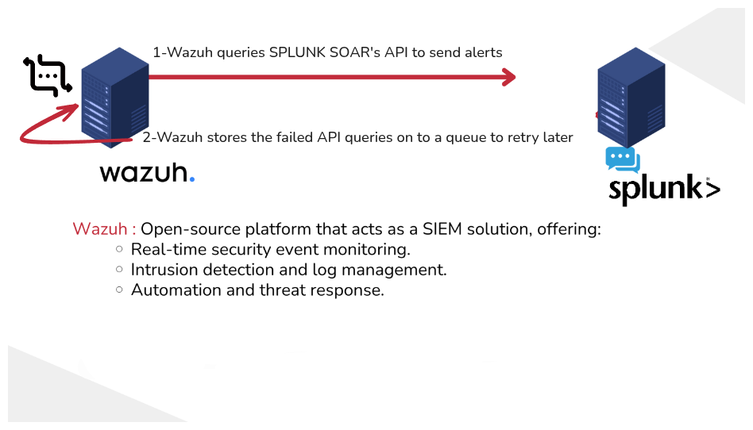
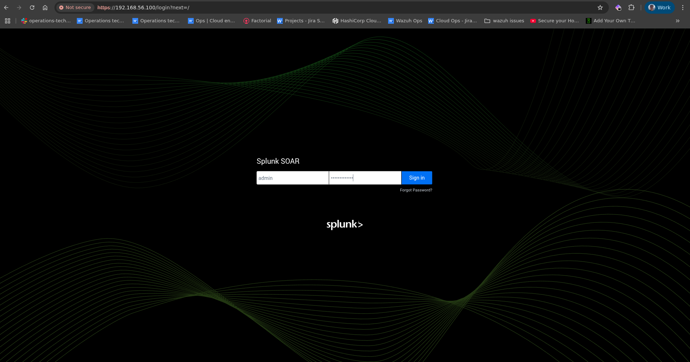
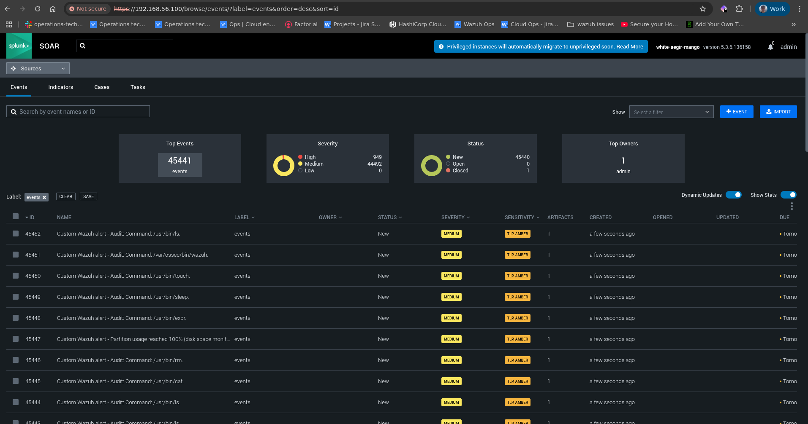
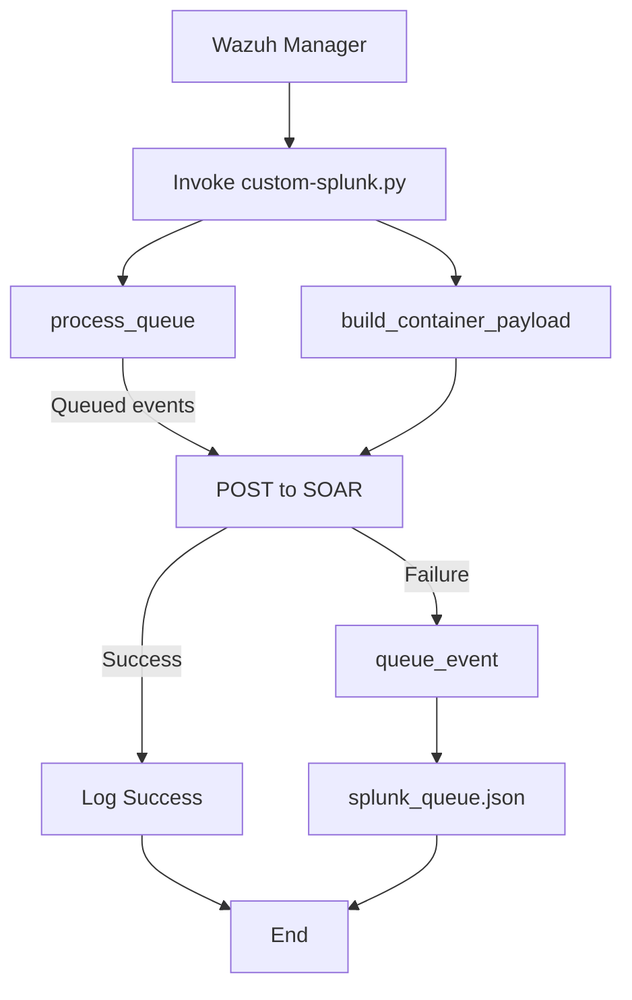

# Splunk SOAR Integration with Wazuh

* [Splunk SOAR Integration with Wazuh](#splunk-soar-integration-with-wazuh)
* [Prerequisites](#prerequisites)

  * [Installing Wazuh](#installing-wazuh)

    * [Testing connection from Wazuh to Splunk SOAR](#testing-connection-from-wazuh-to-splunk-soar)
* [Splunk‑Wazuh Integration](#splunk‑wazuh-integration)

  * [Integration Steps](#integration-steps)

    * [Step 1: Add the Python script](#step-1-add-the-python-script)
    * [Step 2: Configure the integration in Wazuh](#step-2-configure-the-integration-in-wazuh)
* [Integration Testing](#integration-testing)

  * [Check receiving events](#check-receiving-events)
* [Workflow](#workflow)
* [Queue & Retry Logic](#queue--retry-logic)
* [Logging](#logging)
* [Sources](#sources)


This integration forwards Wazuh alerts into Splunk SOAR via a Python hook script with built‑in queueing for reliable delivery.

> **Note:** Depending on your event volume, you may experience delays as events are queued and retried on failure.



## Prerequisites

* Wazuh Manager (v4.x+)
* Python 3.8+ on Wazuh Manager
* `urllib3` Python library installed
* Network connectivity from Wazuh Manager to Splunk SOAR (HTTPS)
* Splunk SOAR user with API access and token

### Installing Wazuh

- Wazuh offers an installation method called `Quick Start`
- Download and run the Wazuh installation assistant
```bash
curl -sO https://packages.wazuh.com/4.11/wazuh-install.sh && sudo bash ./wazuh-install.sh -a
```
- Once the installation is complete, the assistant will give us a username and password to connect to the indexer

#### Testing connection from Wazuh to Splunk SOAR
To do this you can use the following command from a linux server, and you must replace the ip, and the authorization with the value of the key that you generated:
```bash
curl -k -X GET https://<IPFromSplunkServer>:<PORT>/rest/system_info -H 'ph-auth-token: <YOUR_SPLUNK_SOAR_TOKEN>'
curl -k -u <username>:<password> https://<IPFromSplunkServer><PORT>/rest/system_info
```

<details>
<summary>Example output</summary>

```bash
[root@wazuh-server ~] curl -k -u admin:test123-* https://192.168.56.100:443/rest/system_info
{"base_url": "", "time_zone": "UTC", "machine_id": "70e3b96bdb12bf8633d3057cb5a77bcc1d36a535e50f070725f6de52ee57931d"}
[root@wazuh-server ~] curl -k -X GET https://192.168.56.100/rest/system_info -H 'ph-auth-token: 9Nf6Af2AXLGEg87KXCB6OLURtJrRnpSglO4qAU0wvjY='
{"base_url": "", "time_zone": "UTC", "machine_id": "70e3b96bdb12bf8633d3057cb5a77bcc1d36a535e50f070725f6de52ee57931d"}
[root@wazuh-server ~] curl -k -u admin:test123-* https://192.168.56.100/rest/about
{"success": true, "data": {"product_version": "5.3.6.136158", "server_name": ""}}
```
</details>

## Splunk-Wazuh Integration

### Integration Steps

#### Step 1: Add the Python script

<details>
<summary>Click to expand integration script configuration steps</summary>

- Place [this Python script](https://github.com/leonfullxr/Wazuh/blob/main/integrations/splunk/custom-splunk.py) at `/var/ossec/integrations/custom-splunk.py`
- Place [this bash script](https://github.com/leonfullxr/Wazuh/blob/main/integrations/splunk/custom-splunk) at `/var/ossec/integrations/custom-splunk`

- Make sure to set the permissions:
```bash
mkdir -p /var/log/custom_splunk
chown wazuh:wazuh /var/log/custom_splunk
chmod 750 /var/log/custom_splunk
cd /var/ossec/integrations/
sudo chown root:wazuh custom-splunk* && sudo chmod 750 custom-splunk*
```

</details>

#### Step 2: Configure the integration in Wazuh

<details>
<summary>Click to expand Wazuh integration configuration steps</summary>

- Edit the Wazuh manager's `/var/ossec/etc/ossec.conf` file to add the integration block:

```xml
<integration>
  <name>custom-splunk</name>
  <hook_url>https://<SOAR-HOST>:<PORT>/rest/container</hook_url>
  <api_key>Splunk:YOUR_PH_AUTH_TOKEN</api_key>
  <alert_format>json</alert_format>
</integration>
```

* **`hook_url`**: Splunk SOAR REST API endpoint (`/rest/container`), without trailing slash.
* **`api_key`**: Your SOAR Automation user token, prefixed with `Splunk:`.

- Restart the Wazuh manager.
```bash
systemctl restart wazuh-manager
```
</details>

## Integration Testing

In the integration test, you can use any attribute from the feeds. However, we'll create our own event and add a domain attribute to it, allowing us to test with that domain later.

### Check receiving events

<details>
<summary>Click to expand event checking steps</summary>

- Access the SPLUNK SOAR interface via its URL (e.g.: http://<SPLUNK_SOAR_IP_address>).
- Navigate to `Sources` > `Events`




</details>

<div align="center">

## Workflow



</div>

## Queue & Retry Logic

* **`splunk_queue.json`** stores failed containers (one JSON per line).
* On each run, the script calls `process_queue()` to retry deliveries.
* On success, queued entries are removed; failures are re‑queued.

## Logging

* Logs written to `/var/log/custom_splunk/custom_splunk.log`.
* INFO level by default; use `--debug` flag or set `DEBUG=True` in script for DEBUG logs.

## Sources

<details>
<summary>Click to expand source references</summary>

* Official Splunk SOAR install docs (RHEL 8 upgrade requirement) ([docs.splunk.com][1], [docs.splunk.com][2], [docs.splunk.com][3])
* Installer steps: `soar-prepare-system`, unprivileged install mode ([docs.splunk.com][4])

[1]: https://docs.splunk.com/Documentation/SOARonprem/6.4.0/Install/MigratetoRHEL8 "Migrate a Splunk SOAR (On-premises) install from RHEL 7 or ..."
[2]: https://docs.splunk.com/Documentation/SOARonprem/latest/Install/GetSplunkPhantom "Get Splunk SOAR (On-premises)"
[3]: https://docs.splunk.com/Documentation/UBA/5.4.3/Install/InstallSingleServer "Install Splunk UBA on a single Linux server"
[4]: https://docs.splunk.com/Documentation/SOARonprem/6.4.1/Install/InstallUnprivileged "Install Splunk SOAR (On-premises) as an unprivileged user"

</details>
