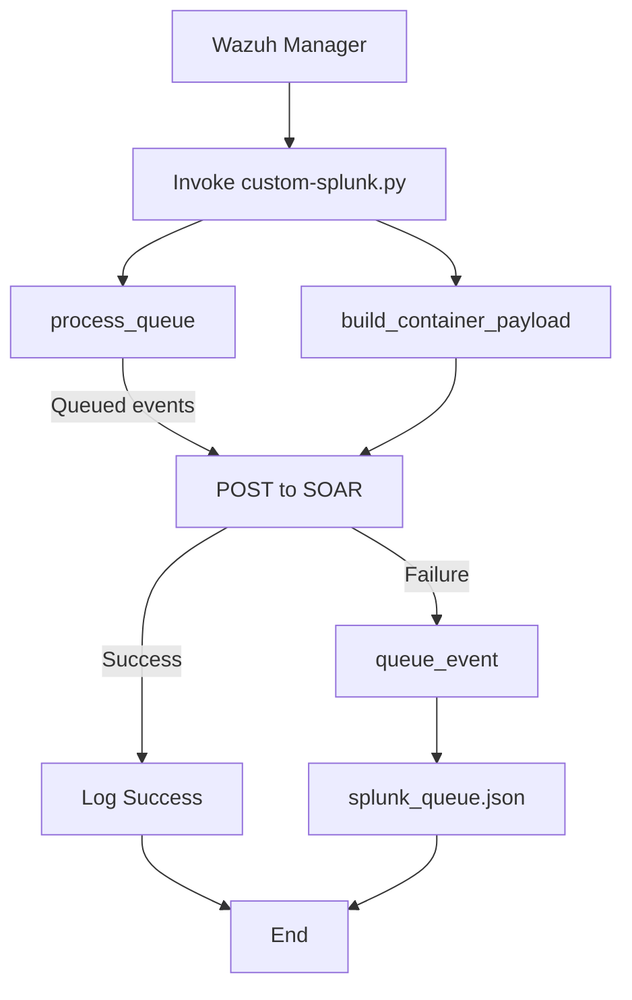

# Splunk SOAR Integration with Wazuh

* [Splunk SOAR Integration with Wazuh](#splunk-soar-integration-with-wazuh)
* [Prerequisites](#prerequisites)
  * [Installing Wazuh](#installing-wazuh)
    * [Testing connection from Wazuh to Splunk SOAR](#testing-connection-from-wazuh-to-splunk-soar)
* [Splunk‑Wazuh Integration](#splunk‑wazuh-integration)
  * [Integration Steps](#integration-steps)
    * [Step 1: Add the Python script](#step-1-add-the-python-script)
    * [Step 2: Configure the integration in Wazuh](#step-2-configure-the-integration-in-wazuh)
* [Integration Testing](#integration-testing)
  * [Check receiving events](#check-receiving-events)
* [Workflow](#workflow)
* [Queue & Retry Logic](#queue--retry-logic)
* [Logging](#logging)
* [Sources](#sources)


This integration forwards Wazuh alerts into Splunk SOAR via a Python script with built‑in queueing for reliable delivery.

> **Note:** Depending on your event volume, you may experience delays as events are queued and retried on failure.

<p align="center">
  
</p>


## Prerequisites

* Wazuh Manager
* Python 3.8+ on Wazuh Manager
* `urllib3` Python library installed
* Network connectivity from Wazuh Manager to Splunk SOAR (HTTPS)
* Splunk SOAR user with API access and token

### Installing Wazuh

- Wazuh offers an installation method called [Quickstart](https://documentation.wazuh.com/current/quickstart.html)
- Download and run the [Wazuh installation assistant](https://documentation.wazuh.com/current/installation-guide/wazuh-indexer/installation-assistant.html)
- Once the installation is complete, the assistant will give us a username and password to connect to the indexer

#### Testing connection from Wazuh to Splunk SOAR
To do this you can use the following command from a linux server, and you must replace the ip, and the authorization with the value of the key that you generated:
```bash
curl -k -X GET https://<IPFromSplunkServer>/services/search/jobs/export -H 'Content-Type: application/json' -H 'Authorization: Bearer <YOUR_SPLUNK_SOAR_TOKEN>' -H 'Accept: application/json'
```

## Splunk-Wazuh Integration

### Integration Steps

#### Step 1: Add the Python script

<details>
<summary>Click to expand integration script configuration steps</summary>

- Place [this Python script](custom-splunk.py) at `/var/ossec/integrations/custom-splunk.py`
- Place [this bash script](custom-splunk) at `/var/ossec/integrations/custom-splunk`

- Make sure to set the permissions:
```bash
mkdir -p /var/log/custom_splunk
chown wazuh:wazuh /var/log/custom_splunk
chmod 750 /var/log/custom_splunk
cd /var/ossec/integrations/
sudo chown root:wazuh custom-splunk* && sudo chmod 750 custom-splunk*
```

</details>

#### Step 2: Configure the integration in Wazuh

<details>
<summary>Click to expand Wazuh integration configuration steps</summary>

- Edit the Wazuh manager's `/var/ossec/etc/ossec.conf` file to add the integration block:

```xml
<integration>
  <name>custom-splunk</name>
  <hook_url>https://<SOAR-HOST>:<PORT>/rest/container</hook_url>
  <api_key>Splunk:YOUR_PH_AUTH_TOKEN</api_key>
  <alert_format>json</alert_format>
</integration>
```

* **`hook_url`**: Splunk SOAR REST API endpoint (`/rest/container`), without trailing slash.
* **`api_key`**: Your SOAR Automation user token, prefixed with `Splunk:`.

- Restart the Wazuh manager.
```bash
systemctl restart wazuh-manager
```
</details>

## Integration Testing

In the integration test, you can use any attribute from the feeds. However, we'll create our own event and add a domain attribute to it, allowing us to test with that domain later.

### Check receiving events

<details>
<summary>Click to expand event checking steps</summary>

- Access the SPLUNK SOAR interface via its URL (e.g.: https://<SPLUNK_SOAR_IP_address>).
- Navigate to `Sources` > `Events`


</details>

<div align="center">

## Workflow



</div>

## Queue & Retry Logic

* **`splunk_queue.json`** stores failed containers (one JSON per line).
* On each run, the script calls `process_queue()` to retry deliveries.
* On success, queued entries are removed; failures are re‑queued.

## Logging

* Logs written to `/var/log/custom_splunk/custom_splunk.log`.
* INFO level by default; use `--debug` flag or set `DEBUG=True` in script for DEBUG logs.

## Sources

<details>
<summary>Click to expand source references</summary>

* Official Splunk SOAR install docs (RHEL 8 upgrade requirement) ([Get Splunk SOAR (On-premises)][1])
* Installer steps: `soar-prepare-system`, unprivileged install mode ([Install Splunk SOAR (On-premises)][2])

[1]: https://docs.splunk.com/Documentation/SOARonprem/latest/Install/GetSplunkPhantom "Get Splunk SOAR (On-premises)"
[2]: https://docs.splunk.com/Documentation/SOARonprem/6.4.1/Install/InstallUnprivileged "Install Splunk SOAR (On-premises) as an unprivileged user"

</details>
