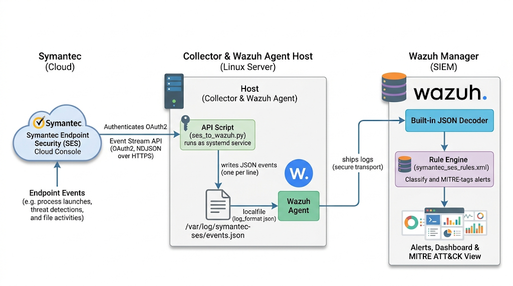

# Symantec Endpoint Security (SES) to Wazuh

Pull endpoint events from **Symantec Endpoint Security** (the cloud-managed SES / SEP 16 console) through the **Event Stream API**, write them to a local file as one JSON object per line, and let a **Wazuh agent** ship that file to the Wazuh manager, where Wazuh's **built-in JSON decoder** parses them and a dedicated rule set turns them into prioritised, MITRE-tagged alerts.

No custom decoder is required, and nothing has to be installed on the endpoints themselves.

---

## Contents

- [How it works](#how-it-works)
- [Repository layout](#repository-layout)
- [Requirements](#requirements)
- [Step 1: Prepare Symantec Endpoint Security](#step-1-prepare-symantec-endpoint-security)
- [Step 2: Install the collector](#step-2-install-the-collector)
- [Step 3: Configure the Wazuh agent](#step-3-configure-the-wazuh-agent)
- [Step 4: Install the rules on the Wazuh manager](#step-4-install-the-rules-on-the-wazuh-manager)
- [Step 5: Verify end to end](#step-5-verify-end-to-end)
- [How the collector behaves](#how-the-collector-behaves)
- [Detection rules](#detection-rules)
- [Sample events](#sample-events)
- [Testing with wazuh-logtest](#testing-with-wazuh-logtest)
- [Finding the alerts in the Wazuh dashboard](#finding-the-alerts-in-the-wazuh-dashboard)
- [Tuning](#tuning)
- [Troubleshooting](#troubleshooting)
- [References](#references)

---

## How it works



1. **Symantec side.** An *API*-type event stream is configured in the SES console. It selects which event types (`type_id`s) are exported and exposes them on one or more *channels*.
2. **Collector.** `ses_to_wazuh.py` authenticates with the client application's OAuth credentials, keeps a long-lived streaming connection open per channel, and appends every event it receives to `/var/log/symantec-ses/events.json`. Before writing, it adds one field, `"integration":"symantec_ses"`, which is what the Wazuh rules key on.
3. **Wazuh agent.** A `<localfile>` block with `<log_format>json</log_format>` tails that file and forwards each line to the manager.
4. **Wazuh manager.** The default `json` decoder extracts every key as a dynamic field. `symantec_ses_rules.xml` classifies each event (threat, worth a look, context, or ignored) and attaches MITRE ATT&CK technique IDs.

The collector and the agent can run on any Linux host that can reach the Symantec API on HTTPS, including the Wazuh manager itself (the manager has its own log collector, so the same `<localfile>` block works there).

---

## Repository layout

| File | Installed to | Purpose |
|---|---|---|
| `ses_to_wazuh.py` | `/opt/ses-to-wazuh/ses_to_wazuh.py` | Collector: reads the SES Event Stream API and writes `events.json`. |
| `ses-to-wazuh.service` | `/etc/systemd/system/ses-to-wazuh.service` | systemd unit that runs the collector and restarts it if it stops. |
| `ses-to-wazuh.logrotate` | `/etc/logrotate.d/ses-to-wazuh` | Rotates `events.json` daily and keeps 7 compressed days. |
| `symantec_ses_rules.xml` | `/var/ossec/etc/rules/symantec_ses_rules.xml` (manager) | Wazuh rules 110500 to 110560. |

> [!WARNING]
> Never commit real event exports to the repository. Raw SES events contain host names, user names, internal IPs, MAC addresses, SIDs and tenant identifiers. The samples in this README have been anonymised.

---

## Requirements

**Symantec**
- A Symantec Endpoint Security tenant whose subscription includes event streaming (SES Complete).
- Console rights to create a client application and an event stream.

**Collector host**
- Linux with systemd and logrotate.
- Python 3 and the [`requests`](https://pypi.org/project/requests/) library.
- Outbound HTTPS (443) to the Symantec API host:
  - US / global tenants: `https://api.sep.securitycloud.symantec.com`
  - EU tenants: `https://api.sep.eu.securitycloud.symantec.com`
- A Wazuh agent (or the Wazuh manager itself).

**Wazuh**
- Wazuh **4.3 or later** on the manager. The rules use `<match type="pcre2">`.

---

## Step 1: Prepare Symantec Endpoint Security

### 1.1 Create a client application

In the SES console, go to **Integration > Client Applications** and create an application. Give it read access to events (for example *View* on **Alerts & Events** and **Investigation**). Open the application and copy the value shown as **OAuth Credentials**. This is the value the collector sends in the `Authorization: Basic ...` header when it requests an access token, so paste it exactly as shown.

Broadcom guide: [Creating a client application](https://techdocs.broadcom.com/us/en/symantec-security-software/endpoint-security-and-management/endpoint-security/sescloud/Settings/creating-a-client-application-v132702110-d4152e4057.html)

### 1.2 Create an API event stream

Go to **Integration > Event Stream**, click **Add**, choose the **API** stream type, select the event type IDs you want in Wazuh, and enable it (the **API State** must be on). Then note:

- the stream's **GUID** (shown in the grid), which becomes `STREAM_ID`;
- the **number of channels**, which becomes `CHANNELS` (`[0]` for one channel, `[0, 1]` for two, and so on).

Things worth knowing:

- An event type can only belong to one stream at a time, so if a type is already used by another stream (a Data Bucket or Kafka stream, for example) it will not be available here.
- SES writes an audit event when an API stream falls more than 5 hours behind. If the collector is stopped for a long time, events can be lost, so monitor the service.
- The rules were written against these event types (see the [event type reference](https://techdocs.broadcom.com/us/en/symantec-security-software/endpoint-security-and-management/endpoint-security/sescloud/Alerts-and-Events/investigation-page-overview-v134374740-d38e87486/edr-event-detection-types-and-descriptions-v134600024-d38e88380.html#v134600024) for the full list):

| `type_id` | What it carries in the samples | Used by |
|---|---|---|
| 8001 | Process launch (`actor` starts `process`) | 110503, 110509 to 110511, 110522, 110523 |
| 8002 | Module (DLL) load (`module`) | MITRE rules |
| 8003 | File activity (`file`) | MITRE rules |
| 8006 | Registry activity (`reg_value`, `reg_value_result`) | MITRE rules, 110526 |
| 8015 | Windows event log and LDAP telemetry (`source`, `data`) | MITRE rules |
| 8025, 8026, 8027 | Threat detections | 110508 |
| 8043, 8044, 8046, 8047, 8048 | Remediation actions | 110521 |
| 8078 | Incident records (`INCIDENT_*`) | 110502, 110524 |

Broadcom guides: [Event Streaming](https://techdocs.broadcom.com/us/en/symantec-security-software/endpoint-security-and-management/endpoint-security/sescloud/Integrations/Event-streaming-using-EDR.html) and [Adding an Event Stream to Export using an API](https://techdocs.broadcom.com/us/en/symantec-security-software/endpoint-security-and-management/endpoint-security/sescloud/Integrations/Event-streaming-using-EDR/adding-an-event-stream-to-export-using-api.html). API reference: [SES Event Stream API](https://apidocs.security.com/#/doc?id=ses_event_stream).

---

## Step 2: Install the collector

```bash
# 1. Dependencies
sudo apt install -y python3 python3-requests      # Debian/Ubuntu
# sudo dnf install -y python3 python3-requests    # RHEL/Rocky/Alma
# or: sudo pip3 install requests

# 2. Copy the script
sudo mkdir -p /opt/ses-to-wazuh
sudo cp ses_to_wazuh.py /opt/ses-to-wazuh/
```

Edit the settings block at the top of `/opt/ses-to-wazuh/ses_to_wazuh.py`:

| Setting | Value |
|---|---|
| `OAUTH_CREDENTIAL` | The **OAuth Credentials** value from step 1.1 |
| `STREAM_ID` | The stream **GUID** from step 1.2 |
| `CHANNELS` | `[0]` for one channel, `[0, 1]` for two, ... |
| `API_HOST` | Leave the default for US/global tenants, or set the EU host |
| `LOG_FILE` | `/var/log/symantec-ses/events.json` (must match the Wazuh `<localfile>`) |
| `STATE_DIR` | `/var/lib/ses-to-wazuh` (where the stream position is saved) |

The script holds a secret, so lock it down:

```bash
sudo chown root:root /opt/ses-to-wazuh/ses_to_wazuh.py
sudo chmod 700 /opt/ses-to-wazuh/ses_to_wazuh.py
```

Test the credentials and the stream without writing anything:

```bash
sudo python3 /opt/ses-to-wazuh/ses_to_wazuh.py --check
```

Expected output:

```
Authentication: OK
Channel 0: OK
```

Install and start the service, then add log rotation:

```bash
sudo cp ses-to-wazuh.service /etc/systemd/system/
sudo systemctl daemon-reload
sudo systemctl enable --now ses-to-wazuh

sudo cp ses-to-wazuh.logrotate /etc/logrotate.d/ses-to-wazuh

# Watch it work
sudo journalctl -u ses-to-wazuh -f
```

A healthy start looks like:

```
INFO Collecting stream <your-stream-guid> -> /var/log/symantec-ses/events.json
INFO Got new access token
INFO Channel 0: wrote 87 events
```

> [!NOTE]
> The log rotation needs no `copytruncate` and no post-rotate signal. The collector opens `events.json` in append mode for every batch, so after logrotate renames the file the next batch simply creates a new one, and the Wazuh agent follows the new file.

---

## Step 3: Configure the Wazuh agent

On the host running the collector, add this block to `/var/ossec/etc/ossec.conf` (or to the `agent.conf` of the agent's group if you use [centralized configuration](https://documentation.wazuh.com/current/user-manual/reference/centralized-configuration.html)):

```xml
<localfile>
  <log_format>json</log_format>
  <location>/var/log/symantec-ses/events.json</location>
</localfile>
```

Restart the agent:

```bash
sudo systemctl restart wazuh-agent
```

If the collector runs on the Wazuh manager, put the block in the manager's `ossec.conf` and restart `wazuh-manager` instead.

No decoder needs to be added. Wazuh's built-in [JSON decoder](https://documentation.wazuh.com/current/user-manual/ruleset/decoders/json-decoder.html) recognises each line and extracts every key (`type_id`, `device_name`, `actor.file.name`, `attacks.technique_uid`, ...) as a field.

Reference: [`localfile` options](https://documentation.wazuh.com/current/user-manual/reference/ossec-conf/localfile.html).

---

## Step 4: Install the rules on the Wazuh manager

```bash
sudo cp symantec_ses_rules.xml /var/ossec/etc/rules/
sudo chown wazuh:wazuh /var/ossec/etc/rules/symantec_ses_rules.xml
sudo chmod 660 /var/ossec/etc/rules/symantec_ses_rules.xml

# Check the configuration and rules load cleanly, then restart
sudo /var/ossec/bin/wazuh-analysisd -t
sudo systemctl restart wazuh-manager
```

The rule IDs used are **110500 to 110560**. Make sure no other custom rule file uses the same IDs.

Reference: [Custom rules](https://documentation.wazuh.com/current/user-manual/ruleset/rules/custom.html).

---

## Step 5: Verify end to end

1. `events.json` grows: `sudo tail -n 1 /var/log/symantec-ses/events.json`
2. The agent is reading it: `sudo grep events.json /var/ossec/logs/ossec.log` should show the file being analysed.
3. A line is classified as expected: paste one of the [sample lines](#testing-with-wazuh-logtest) into `wazuh-logtest` on the manager.
4. Alerts arrive: in the dashboard, filter on `rule.groups: symantec_ses`.

---

## How the collector behaves

**Streaming.** For each channel the collector opens `POST {API_HOST}/v1/event-export/stream/{STREAM_ID}/{channel}` with `Accept: application/x-ndjson` and gzip, and reads the response line by line. Each line is a batch holding an `events` array and a `next` pointer to the following position in the stream. One thread runs per channel.

**Authentication.** An access token is requested from `{API_HOST}/v1/oauth2/tokens` using the OAuth credentials, cached, and renewed 60 seconds before it expires (or immediately if the API answers 401).

**Ordering of work.** Each batch is written to `events.json` first, and only then is the position saved. A crash between the two causes the batch to be re-read rather than lost.

**Duplicates.** The last 50,000 event `uuid`s are kept with the position in `STATE_DIR/channel_<n>.json` (written atomically through a temp file). Re-read events are recognised and skipped, also across restarts.

**What is added to each event.** Exactly one key: `"integration":"symantec_ses"`. Everything else is written as received, on a single line, with UTF-8 characters preserved.

**API responses**

| Response | What the collector does |
|---|---|
| 200 | Writes the events, saves the position, keeps reading. |
| 204 (nothing new) | Waits 30 seconds and asks again. |
| 401 | Drops the cached token and reconnects with a new one. |
| 404 | Logs *stream not found* and retries every 5 minutes. Check `STREAM_ID`, `CHANNELS` and that the API state is enabled. |
| 410 (position expired) | Logs a warning and continues from the current position. Events between the old position and now are not recovered. |
| Read timeout, closed connection | Normal end of a stream connection. Reconnects after 2 seconds. |
| Anything else | Logs the error and retries with back-off from 5 seconds up to 5 minutes. |

`SIGTERM` (`systemctl stop`) and `Ctrl+C` stop the collector cleanly.

---

## Detection rules

### How the rules read the event

Every condition is a `<match type="pcre2">` against the **raw JSON line** (`full_log`), not against decoded fields. That makes the rules independent of how the JSON decoder flattens nested objects and arrays, which matters for SES events:

- `attacks` and `edr_enriched_data` are arrays of objects, so techniques are matched as `"technique_uid":"T1547"` anywhere in the line, and `[".]` after the ID also catches sub-techniques such as `T1547.001`.
- `actor.file.name` and `process.file.name` are both just `"name"` in the raw text. The patterns walk into the `"actor":{...}` or `"process":{...}` object and stay inside it, so the parent process and the child process cannot be confused.
- Rules that need several conditions use look-aheads, `^(?=.*?A)(?=.*?B)`, in a single `<match>`.
- Windows paths are escaped in raw JSON (`C:\\Users\\...`), and the patterns account for it.

All rules are children of base rule 110500 (`decoded_as json` + `"integration":"symantec_ses"`), so they never touch non-Symantec JSON logs.

Wazuh evaluates sibling rules in order and keeps the **first** one that matches. The rules are therefore ordered from most to least important. Two consequences are intentional:

- The *ignore Symantec agent* rule (110530) sits **after** the threat tiers, so a real detection involving a Symantec process still alerts.
- An event tagged with several techniques gets the alert of the highest-priority rule it matches.

### Rule reference

**Tier 1: real threats (levels 10 to 13)**

| ID | Level | Fires when | MITRE |
|---|---|---|---|
| 110501 | 13 | `severity_id` is 5 (critical) or 6 (fatal) | |
| 110502 | 12 | `type` starts with `INCIDENT_CREAT` (new incident in the console) | |
| 110503 | 12 | Process launch (8001) where the actor is an Office app and the child is a shell, script host or LOLBin | T1204, T1566 |
| 110504 | 12 | Command line deletes shadow copies or backups (`vssadmin delete shadows`, `wmic shadowcopy delete`, `bcdedit ... recoveryenabled no`, `wbadmin delete ...`) | T1490 |
| 110505 | 12 | Command line dumps credentials (`sekurlsa`, `lsadump`, `comsvcs.dll MiniDump`, `procdump ... lsass`, `reg save hklm\sam/system/security`) | T1003 |
| 110506 | 12 | Symantec tagged T1003, T1486 or T1490 | T1003, T1486, T1490 |
| 110507 | 11 | `severity_id` is 4 (major) | |
| 110508 | 10 | Threat detection event (`type_id` 8025, 8026, 8027) | |
| 110509 | 10 | PowerShell with an encoded command or download-and-execute code | T1059, T1027 |
| 110510 | 10 | `certutil`, `bitsadmin`, `mshta`, `regsvr32` or `rundll32` used to download or run code | T1218, T1105 |
| 110511 | 10 | Windows event log cleared from the command line | T1070 |

**Tier 2: worth a look (levels 5 to 8)**

| ID | Level | Fires when | MITRE |
|---|---|---|---|
| 110520 | 8 | `severity_id` is 3 (minor) | |
| 110521 | 8 | Remediation action by Symantec (`type_id` 8043, 8044, 8046, 8047, 8048) | |
| 110522 | 7 | Process launch (8001) of an unsigned binary (`signature_level_id` 0) from Temp, Downloads, Desktop, AppData or Users\Public | T1204 |
| 110523 | 6 | Scheduled task or service created from the command line | T1053, T1543 |
| 110524 | 6 | Any other `INCIDENT*` record (incident updated or associated) | |
| 110525 | 5 | `severity_id` is 2 (warning) | |
| 110526 | 5 | EDR rule `WinEvntLogSetng` (Windows Event Log settings modified) | T1562 |

**Ignored (level 0)**

| ID | Level | Fires when |
|---|---|---|
| 110530 | 0 | The actor is the Symantec agent itself (`ccSvcHst.exe`, `sepWscSvc64.exe`, `sepWscSvc.exe`, `smc.exe`, `sesclu.exe`) |

**Tier 3: EDR telemetry with MITRE context (levels 3 to 5)**

Symantec tags a lot of normal activity with ATT&CK techniques. These rules keep that context searchable and feed Wazuh's MITRE ATT&CK view without paging anyone.

| ID | Level | Technique tagged by Symantec |
|---|---|---|
| 110540 | 5 | T1547 Boot or logon autostart |
| 110541 | 5 | T1555 Credentials from password stores |
| 110542 | 5 | T1055 Process injection |
| 110543 | 5 | T1036 Masquerading, T1564 Hide artifacts |
| 110544 | 4 | T1018, T1069, T1087, T1482 Domain and account discovery |
| 110545 | 4 | T1543, T1574, T1112 Service, DLL hijack, registry modification |
| 110546 | 3 | Any other technique |

**Correlation**

| ID | Level | Fires when |
|---|---|---|
| 110560 | 10 | 10 or more 110544 alerts from the **same `device_name`** within **600 seconds** (possible AD reconnaissance, BloodHound-style). Domain controllers are excluded by a `device_name` pattern; adapt it to your naming, see [Tuning](#tuning). |

### What a real stream looks like

On a 287-event sample from a production tenant (all `severity_id` 1, routine EDR telemetry), the rules produced:

| Rule | Events | Share |
|---|---:|---:|
| 110530 Symantec agent self-activity (level 0, dropped) | 109 | 38% |
| 110546 Generic MITRE technique (3) | 85 | 30% |
| 110500 Base event only (3) | 57 | 20% |
| 110541 Stored credentials accessed (5) | 12 | 4% |
| 110544 Domain or account discovery (4) | 7 | 2% |
| 110545 Service / DLL / registry modification (4) | 6 | 2% |
| 110526 Event Log settings modified (5) | 3 | 1% |
| 110542 Possible process injection (5) | 3 | 1% |
| 110543 Masquerading / hidden files (5) | 3 | 1% |
| 110540 Autostart modified (5) | 1 | <1% |
| 110524 Incident updated (6) | 1 | <1% |

No Tier 1 or Tier 2 threat rule fired, which is what you want from a quiet sample. Those rules are waiting for real detections, higher severities and attacker command lines. To see one fire on purpose, trigger a harmless detection on a test machine (for example the EICAR test file) and watch for 110508 or the severity rules.

---

## Sample events

Below is one event for every rule that fired in the sample above, each shown with the rule it lands on. They were taken from a real stream and then:

- **anonymised**: host names, user names, AD domain, internal and public IPs, SIDs, event, incident and reference IDs replaced with fictitious values;
- **trimmed** for readability: hashes, security descriptors, policy, tenant and device IDs and other bulky fields removed. Real events are 2 to 6 KB.

Each trimmed, anonymised line was re-checked against the rule patterns and still lands on the rule shown. Collapsed blocks show the event pretty-printed; the one-line versions for `wazuh-logtest` are in the [next section](#testing-with-wazuh-logtest).

#### 110500 (level 3) endpoint event received

A process launch (`type_id` 8001): the Task Scheduler-started Google Updater spawns its crash handler. No MITRE technique, no suspicious command line, no Symantec agent involved, so only the base rule matches.

<details>
<summary>Show event</summary>

```json
{
  "type": "event_query_results",
  "ref_uid": "d23f0824-128b-2f33-0c5c-7fd0a6a3a450",
  "feature_name": "DETECTION_RESPONSE",
  "product_name": "Endpoint Security Agent",
  "device_ip": "10.20.30.11",
  "device_domain": "example.local",
  "device_name": "WKS-0110",
  "category_id": 5,
  "device_os_name": "Windows 10 Enterprise Edition",
  "type_id": 8001,
  "actor": {
    "cmd_line": "\"C:\\Program Files (x86)\\Google\\GoogleUpdater\\151.0.7100.0\\updater.exe\" --wake --system",
    "pid": 12760,
    "file": {
      "signature_company_name": "Google LLC",
      "path": "C:\\Program Files (x86)\\Google\\GoogleUpdater\\151.0.7100.0\\updater.exe",
      "name": "updater.exe",
      "folder": "C:\\Program Files (x86)\\Google\\GoogleUpdater\\151.0.7100.0",
      "signature_level_id": 40
    },
    "user": {
      "name": "SYSTEM",
      "domain": "NT AUTHORITY"
    }
  },
  "severity_id": 1,
  "user_name": "SYSTEM",
  "process": {
    "cmd_line": "\"C:\\Program Files (x86)\\Google\\GoogleUpdater\\151.0.7100.0\\updater.exe\" --crash-handler --system \"--database=C:\\Program Files (x86)\\Google\\GoogleUpdater\\151.0.7100.0\\Crashpad\" --url=https://clients2.google.com/cr/report --annotation=prod=Update4 --annotation=ver=151.0.7100.0 \"--attachment=C:\\Program Files (x86)\\Google\\GoogleUpdater\\updater.log\" \"--attachment=C:\\Program Files (x86)\\Google\\GoogleUpdater\\updater_history.jsonl\" --initial-client-data=0x314,0x318,0x31c,0x310,0x320,0x7ff70000138,0x7ff70000148,0x7ff70000158",
    "pid": 28768,
    "file": {
      "signature_company_name": "Google LLC",
      "path": "C:\\Program Files (x86)\\Google\\GoogleUpdater\\151.0.7100.0\\updater.exe",
      "name": "updater.exe",
      "folder": "C:\\Program Files (x86)\\Google\\GoogleUpdater\\151.0.7100.0",
      "signature_level_id": 40
    },
    "user": {
      "name": "SYSTEM",
      "domain": "NT AUTHORITY"
    }
  },
  "edr_enriched_data": [
    {
      "rule_name": "IF.GenericProc!g1"
    }
  ],
  "time": "2026-01-14T07:24:52.779Z",
  "log_time": "2026-01-14T07:31:04.985Z",
  "uuid": "8001:6513270e-269e-0d37-f2a7-4de452e6b438",
  "integration": "symantec_ses"
}
```

</details>

#### 110524 (level 6) existing Symantec incident updated

An `INCIDENT_ASSOCIATE` record from Symantec's incident database (`type_id` 8078), emitted when an event is attached to an incident. Rule 110502 only matches `INCIDENT_CREAT...`, so this falls through to 110524.

<details>
<summary>Show event</summary>

```json
{
  "log_name": "incident_db",
  "user_name": "sam.lee",
  "type_id": 8078,
  "incident_uid": "6b0d549b-6f03-675a-1600-a35a099950d8",
  "incident_url": "https://sep.securitycloud.symantec.com/v2/incidents/incidentListing/6b0d549b-6f03-675a-1600-a35a099950d8/details",
  "type": "INCIDENT_ASSOCIATE",
  "uuid": "8078:9531985d-5d9d-c9f8-1818-e811892f902b",
  "product_name": "Symantec Integrated Cyber Defense Manager",
  "log_time": "2026-01-14T10:42:03.264Z",
  "ref_uid": "8027:36f675cc-81e7-4ef5-e8e2-5d940ed90475",
  "device_ip": "10.20.30.12",
  "device_name": "SRV-MON-01",
  "event_id": 8078004,
  "category_id": 1,
  "time": 1768387323264,
  "severity_id": 1,
  "integration": "symantec_ses"
}
```

</details>

#### 110526 (level 5) Windows Event Log settings modified

The Chrome installer re-registers its Event Log message DLL (`type_id` 8006, registry). Symantec's EDR enrichment names it `IF.WinEvntLogSetng!g1`. The event is also tagged T1112, which would match 110545, but 110526 is evaluated first.

<details>
<summary>Show event</summary>

```json
{
  "type": "event_query_results",
  "ref_uid": "90c192cf-d3ac-94af-0f21-ddb66cad4a26",
  "feature_name": "DETECTION_RESPONSE",
  "product_name": "Endpoint Security Agent",
  "device_ip": "10.20.30.13",
  "device_domain": "example.local",
  "device_name": "WKS-0142",
  "category_id": 5,
  "device_os_name": "Windows 10 Professional Edition",
  "type_id": 8006,
  "actor": {
    "cmd_line": "\"C:\\Windows\\SystemTemp\\GoogleUpdater_chrome_Unpacker_BeginUnzipping4410_1188203377\\CR_2A7C1.tmp\\setup.exe\" --uncompressed-archive=\"C:\\Windows\\SystemTemp\\GoogleUpdater_chrome_Unpacker_BeginUnzipping4410_1188203377\\CR_2A7C1.tmp\\CHROME.7Z\" --verbose-logging --do-not-launch-chrome --channel=stable",
    "pid": 12268,
    "file": {
      "signature_company_name": "Google LLC",
      "path": "C:\\Windows\\SystemTemp\\GoogleUpdater_chrome_Unpacker_BeginUnzipping4410_1188203377\\CR_2A7C1.tmp\\setup.exe",
      "name": "setup.exe",
      "folder": "C:\\Windows\\SystemTemp\\GoogleUpdater_chrome_Unpacker_BeginUnzipping4410_1188203377\\CR_2A7C1.tmp",
      "signature_level_id": 40
    },
    "user": {
      "name": "SYSTEM",
      "domain": "NT AUTHORITY"
    }
  },
  "severity_id": 1,
  "user_name": "SYSTEM",
  "reg_value": {
    "data": "C:\\Program Files\\Google\\Chrome\\Application\\150.0.7000.10\\eventlog_provider.dll",
    "name": "CategoryMessageFile",
    "path": "HKEY_LOCAL_MACHINE\\SYSTEM\\CurrentControlSet\\Services\\EventLog\\Application\\Chrome\\"
  },
  "reg_value_result": {
    "data": "C:\\Program Files\\Google\\Chrome\\Application\\150.0.7000.20\\eventlog_provider.dll"
  },
  "edr_enriched_data": [
    {
      "rule_name": "IF.ModRegNonCorr!g1",
      "rule_description": "Registry modification"
    },
    {
      "rule_name": "IF.WinEvntLogSetng!g1",
      "rule_description": "Windows Event Log settings modified"
    }
  ],
  "attacks": [
    {
      "technique_uid": "T1112",
      "technique_name": "Modify Registry"
    }
  ],
  "time": "2026-01-14T07:27:12.481Z",
  "log_time": "2026-01-14T07:31:15.635Z",
  "uuid": "8006:8d116ece-1738-f7d9-3d9c-172411e20b8f",
  "integration": "symantec_ses"
}
```

</details>

#### 110530 (level 0) Symantec agent self-activity (ignored)

The actor is `ccSvcHst.exe`, the Symantec agent itself, reading a shortcut's metadata and tagged T1106. Level 0 means Wazuh discards it. Without this rule it would raise a 110546 alert.

<details>
<summary>Show event</summary>

```json
{
  "type": "event_query_results",
  "ref_uid": "0fd630f1-f29d-0da9-953f-48f1a09f76b5",
  "feature_name": "DETECTION_RESPONSE",
  "product_name": "Endpoint Security Agent",
  "device_ip": "10.20.30.13",
  "device_domain": "example.local",
  "device_name": "WKS-0142",
  "category_id": 5,
  "device_os_name": "Windows 10 Professional Edition",
  "type_id": 8003,
  "actor": {
    "file": {
      "path": "ccSvcHst.exe",
      "name": "ccSvcHst.exe"
    }
  },
  "severity_id": 1,
  "file": {
    "path": "C:\\ProgramData\\Microsoft\\Windows\\Start Menu\\Programs\\Google Chrome.lnk",
    "name": "Google Chrome.lnk",
    "folder": "C:\\ProgramData\\Microsoft\\Windows\\Start Menu\\Programs"
  },
  "analysis": "{\"file_metadata\":{\"lnk\":{\"target_process\":[\"chrome.exe\"],\"target_commandline\":[\"\\\"C:\\\\Program Files\\\\Google\\\\Chrome\\\\Application\\\\chrome.exe\\\" \"]}}}",
  "edr_enriched_data": [
    {
      "rule_name": "IF.FileMetadata!g1",
      "rule_description": "File Metadata Activity"
    }
  ],
  "attacks": [
    {
      "technique_uid": "T1106",
      "technique_name": "Native API"
    }
  ],
  "time": "2026-01-14T07:27:15.861Z",
  "log_time": "2026-01-14T07:31:15.637Z",
  "uuid": "8003:a170b338-3926-3059-f28c-105d1fb17c23",
  "integration": "symantec_ses"
}
```

</details>

#### 110540 (level 5) autostart or persistence location modified

Microsoft Edge writes its own `...\CurrentVersion\Run` value (T1547 / T1547.001). Legitimate here, but exactly the same telemetry an attacker's persistence would produce.

<details>
<summary>Show event</summary>

```json
{
  "type": "event_query_results",
  "ref_uid": "8e81973e-0bec-d7b0-3898-d190f9ebdacc",
  "feature_name": "DETECTION_RESPONSE",
  "product_name": "Endpoint Security Agent",
  "device_ip": "10.20.30.14",
  "device_domain": "example.local",
  "device_name": "WKS-0233",
  "category_id": 5,
  "device_os_name": "Windows 11 Professional Edition",
  "type_id": 8006,
  "actor": {
    "cmd_line": "\"C:\\Program Files (x86)\\Microsoft\\Edge\\Application\\msedge.exe\" --no-startup-window /prefetch:5",
    "pid": 20780,
    "file": {
      "signature_company_name": "Microsoft Corporation",
      "path": "C:\\Program Files (x86)\\Microsoft\\Edge\\Application\\msedge.exe",
      "name": "msedge.exe",
      "folder": "C:\\Program Files (x86)\\Microsoft\\Edge\\Application",
      "signature_level_id": 60
    },
    "user": {
      "name": "alex.jones",
      "domain": "EXAMPLE"
    }
  },
  "severity_id": 1,
  "user_name": "alex.jones",
  "reg_value": {
    "name": "MicrosoftEdgeAutoLaunch_30877432D1026706D7E805DA846A32C3",
    "path": "HKEY_USERS\\S-1-5-21-1111111111-2222222222-3333333333-1105\\Software\\Microsoft\\Windows\\CurrentVersion\\Run\\"
  },
  "reg_value_result": {
    "data": "\"C:\\Program Files (x86)\\Microsoft\\Edge\\Application\\msedge.exe\" --no-startup-window --win-session-start"
  },
  "edr_enriched_data": [
    {
      "rule_name": "IF.RegRunKeys!g1",
      "rule_description": "Autostart execution through registry run keys"
    },
    {
      "rule_name": "IF.ModRegNonCorr!g1",
      "rule_description": "Registry modification"
    }
  ],
  "attacks": [
    {
      "technique_uid": "T1547",
      "technique_name": "Boot or Logon Autostart Execution",
      "sub_technique_name": "Registry Run Keys / Startup Folder",
      "sub_technique_uid": "T1547.001"
    },
    {
      "technique_uid": "T1112",
      "technique_name": "Modify Registry"
    }
  ],
  "time": "2026-01-14T07:31:13.779Z",
  "log_time": "2026-01-14T07:31:28.696Z",
  "uuid": "8006:0cb1e29c-658c-da14-95e6-0af593bd04cf",
  "integration": "symantec_ses"
}
```

</details>

#### 110541 (level 5) stored credentials accessed by a process

Adobe Acrobat reads an entry from Windows Credential Manager (Windows Security event 5379 relayed by Symantec, T1555.004).

<details>
<summary>Show event</summary>

```json
{
  "type": "event_query_results",
  "ref_uid": "92276658-1e27-a1c0-8a6a-63ec24ede6a4",
  "feature_name": "DETECTION_RESPONSE",
  "product_name": "Endpoint Security Agent",
  "device_ip": "10.20.30.15",
  "device_domain": "example.local",
  "device_name": "LT-0087",
  "category_id": 5,
  "device_os_name": "Windows 11 Professional Edition",
  "type_id": 8015,
  "actor": {
    "cmd_line": "\"C:\\Program Files\\Adobe\\Acrobat DC\\Acrobat\\AdobeCollabSync.exe\" --type=collab-renderer --proc=9664",
    "pid": 27444,
    "file": {
      "signature_company_name": "Adobe Inc.",
      "path": "C:\\Program Files\\Adobe\\Acrobat DC\\Acrobat\\AdobeCollabSync.exe",
      "name": "AdobeCollabSync.exe",
      "folder": "C:\\Program Files\\Adobe\\Acrobat DC\\Acrobat",
      "signature_level_id": 40
    },
    "user": {
      "name": "jane.smith",
      "domain": "EXAMPLE"
    }
  },
  "severity_id": 1,
  "user_name": "jane.smith",
  "source": {
    "facility": "Microsoft-Windows-Security-Auditing"
  },
  "data": "{\"ClientProcessId\":\"27444\",\"CountOfCredentialsReturned\":\"1\",\"ReadOperation\":\"%%8099\",\"ReturnCode\":\"3221226021\",\"SubjectDomainName\":\"EXAMPLE\",\"SubjectLogonId\":\"3e8f1c2\",\"SubjectUserName\":\"jane.smith\",\"SubjectUserSid\":\"EXAMPLE\\\\jane.smith\",\"TargetName\":\"Adobe Package Info ()(Part1)\",\"Type\":\"1\"}",
  "edr_enriched_data": [
    {
      "rule_name": "IF.StoredPwdAccess!g2",
      "rule_description": "Credentials Read from Vault"
    }
  ],
  "attacks": [
    {
      "technique_uid": "T1555",
      "technique_name": "Credentials from Password Stores",
      "sub_technique_name": "Windows Credential Manager",
      "sub_technique_uid": "T1555.004"
    }
  ],
  "time": "2026-01-14T07:25:55.075Z",
  "log_time": "2026-01-14T07:31:08.393Z",
  "uuid": "8015:6b4cb242-4a23-d596-2217-beaddbc496cb",
  "integration": "symantec_ses"
}
```

</details>

#### 110542 (level 5) possible process injection

`svchost.exe` (DcomLaunch) starts a COM surrogate `DllHost.exe`. Symantec tags the launch with T1055.

<details>
<summary>Show event</summary>

```json
{
  "type": "event_query_results",
  "ref_uid": "923a7369-94e3-bf91-1a61-dbe22e44158b",
  "feature_name": "DETECTION_RESPONSE",
  "product_name": "Endpoint Security Agent",
  "device_ip": "10.20.30.13",
  "user_name": "john.doe",
  "device_domain": "example.local",
  "device_name": "WKS-0142",
  "category_id": 5,
  "device_os_name": "Windows 10 Professional Edition",
  "type_id": 8001,
  "actor": {
    "cmd_line": "C:\\Windows\\system32\\svchost.exe -k DcomLaunch -p",
    "pid": 2420,
    "file": {
      "signature_company_name": "Microsoft Windows Publisher",
      "path": "C:\\Windows\\System32\\svchost.exe",
      "name": "svchost.exe",
      "folder": "C:\\Windows\\System32",
      "signature_level_id": 60
    },
    "user": {
      "name": "SYSTEM",
      "domain": "NT AUTHORITY"
    }
  },
  "severity_id": 1,
  "process": {
    "cmd_line": "C:\\Windows\\system32\\DllHost.exe /Processid:{AB8902B4-09CA-4BB6-B78D-A8F59079A8D5}",
    "pid": 24908,
    "file": {
      "signature_company_name": "Microsoft Windows",
      "path": "C:\\Windows\\System32\\dllhost.exe",
      "name": "dllhost.exe",
      "folder": "C:\\Windows\\System32",
      "signature_level_id": 60
    },
    "user": {
      "name": "john.doe",
      "domain": "EXAMPLE"
    }
  },
  "edr_enriched_data": [
    {
      "rule_name": "IF.GenericProc!g1"
    },
    {
      "rule_name": "IF.DllhostLaunch!g1",
      "rule_description": "DllHost.exe Launched"
    },
    {
      "rule_name": "IF.ServiceExecute!g2",
      "rule_description": "Launch detected for processes that interact with Windows services"
    }
  ],
  "attacks": [
    {
      "technique_uid": "T1055",
      "technique_name": "Process Injection"
    },
    {
      "technique_uid": "T1489",
      "technique_name": "Service Stop"
    }
  ],
  "time": "2026-01-14T07:27:13.530Z",
  "log_time": "2026-01-14T07:31:15.637Z",
  "uuid": "8001:ae97ba94-d0ed-a82f-8f6d-05584ef8aa38",
  "integration": "symantec_ses"
}
```

</details>

#### 110543 (level 5) masquerading or hidden file activity

A Windows Update scheduled task file is rewritten by the Task Scheduler service; Symantec's `IF.SchtaskMasq!g1` tags it T1036.004.

<details>
<summary>Show event</summary>

```json
{
  "type": "event_query_results",
  "ref_uid": "907a70c3-1012-f037-b64c-e4228c38fb29",
  "feature_name": "DETECTION_RESPONSE",
  "product_name": "Endpoint Security Agent",
  "device_ip": "10.20.30.13",
  "user_name": "SYSTEM",
  "device_domain": "example.local",
  "device_name": "WKS-0142",
  "category_id": 5,
  "device_os_name": "Windows 10 Professional Edition",
  "type_id": 8003,
  "actor": {
    "cmd_line": "C:\\Windows\\system32\\svchost.exe -k netsvcs -p -s Schedule",
    "pid": 16052,
    "file": {
      "signature_company_name": "Microsoft Windows Publisher",
      "path": "C:\\Windows\\System32\\svchost.exe",
      "name": "svchost.exe",
      "folder": "C:\\Windows\\System32",
      "signature_level_id": 60
    },
    "user": {
      "name": "SYSTEM",
      "domain": "NT AUTHORITY"
    }
  },
  "severity_id": 1,
  "file": {
    "path": "C:\\Windows\\System32\\Tasks\\Microsoft\\Windows\\WindowsUpdate\\RUXIM\\PLUGScheduler",
    "name": "PLUGScheduler",
    "folder": "C:\\Windows\\System32\\Tasks\\Microsoft\\Windows\\WindowsUpdate\\RUXIM"
  },
  "edr_enriched_data": [
    {
      "rule_name": "IF.SchtaskMasq!g1",
      "rule_description": "Masquerade Scheduled task"
    },
    {
      "rule_name": "IF.SchtasksChange!g1",
      "rule_description": "Scheduled task change detected"
    }
  ],
  "attacks": [
    {
      "technique_uid": "T1036",
      "technique_name": "Masquerading",
      "sub_technique_name": "Masquerade Task or Service",
      "sub_technique_uid": "T1036.004"
    },
    {
      "technique_uid": "T1053",
      "technique_name": "Scheduled Task/Job",
      "sub_technique_name": "Scheduled Task",
      "sub_technique_uid": "T1053.005"
    }
  ],
  "time": "2026-01-14T07:26:22.684Z",
  "log_time": "2026-01-14T07:31:15.630Z",
  "uuid": "8003:18f135d2-5f55-7203-3018-50c5a38fd547",
  "integration": "symantec_ses"
}
```

</details>

#### 110544 (level 4) domain or account discovery query

The Group Policy client on a laptop queries LDAP for policy objects (T1018). One of these is normal; ten from the same non-DC host within ten minutes fires correlation rule 110560.

<details>
<summary>Show event</summary>

```json
{
  "type": "event_query_results",
  "ref_uid": "c6f87718-6d76-b07e-881e-d162ae2eb154",
  "feature_name": "DETECTION_RESPONSE",
  "product_name": "Endpoint Security Agent",
  "device_ip": "10.20.30.15",
  "device_domain": "example.local",
  "device_name": "LT-0087",
  "category_id": 5,
  "device_os_name": "Windows 11 Professional Edition",
  "type_id": 8015,
  "actor": {
    "cmd_line": "C:\\WINDOWS\\system32\\svchost.exe -k GPSvcGroup",
    "pid": 18568,
    "file": {
      "signature_company_name": "Microsoft Windows Publisher",
      "path": "C:\\Windows\\System32\\svchost.exe",
      "name": "svchost.exe",
      "folder": "C:\\Windows\\System32",
      "signature_level_id": 60
    },
    "user": {
      "name": "SYSTEM",
      "domain": "NT AUTHORITY"
    }
  },
  "severity_id": 1,
  "user_name": "SYSTEM",
  "source": {
    "facility": "Microsoft-Windows-LDAP-Client"
  },
  "data": "{\"AttributeList\":\"nTSecurityDescriptor;gPCFileSysPath;cn;displayName;versionNumber;gPCFunctionalityVersion;flags;gPCMachineExtensionNames;gPCUserExtensionNames;objectClass;gPCWQLFilter\",\"DistinguishedName\":\"cn=policies,cn=system,DC=example,DC=local\",\"ProcessId\":\"1a4\",\"ScopeOfSearch\":\"2\",\"SearchFilter\":\"(&(!(flags:1.2.840.113556.1.4.803:=2))(gPCMachineExtensionNames=[*])((|(distinguishedName=CN={31B2F340-016D-11D2-945F-00C04FB984F9},CN=Policies,CN=System,DC=example,DC=local))))\"}",
  "edr_enriched_data": [
    {
      "rule_name": "IF.RemoteSysDscvry!g3",
      "rule_description": "Domain computers enumeration using LDAP"
    }
  ],
  "attacks": [
    {
      "technique_uid": "T1018",
      "technique_name": "Remote System Discovery"
    }
  ],
  "time": "2026-01-14T07:25:59.136Z",
  "log_time": "2026-01-14T07:31:08.395Z",
  "uuid": "8015:7f150524-34b9-b5df-9e77-69b10f4205b4",
  "integration": "symantec_ses"
}
```

</details>

#### 110545 (level 4) service, DLL search order or registry modification

`services.exe` updates the `ImagePath` of Chrome's elevation service after an update (T1543.003 and T1112).

<details>
<summary>Show event</summary>

```json
{
  "type": "event_query_results",
  "ref_uid": "3f98e277-4cbd-87ad-5c90-a9587403e430",
  "feature_name": "DETECTION_RESPONSE",
  "product_name": "Endpoint Security Agent",
  "device_ip": "10.20.30.13",
  "device_domain": "example.local",
  "device_name": "WKS-0142",
  "category_id": 5,
  "device_os_name": "Windows 10 Professional Edition",
  "type_id": 8006,
  "actor": {
    "cmd_line": "C:\\Windows\\system32\\services.exe",
    "pid": 5088,
    "file": {
      "signature_company_name": "Microsoft Windows Publisher",
      "path": "C:\\Windows\\System32\\services.exe",
      "name": "services.exe",
      "folder": "C:\\Windows\\System32",
      "signature_level_id": 60
    },
    "user": {
      "name": "SYSTEM",
      "domain": "NT AUTHORITY"
    }
  },
  "severity_id": 1,
  "user_name": "SYSTEM",
  "reg_value": {
    "data": "\"C:\\Program Files\\Google\\Chrome\\Application\\150.0.7000.10\\elevation_service.exe\"",
    "name": "ImagePath",
    "path": "HKEY_LOCAL_MACHINE\\SYSTEM\\CurrentControlSet\\Services\\GoogleChromeElevationService\\"
  },
  "reg_value_result": {
    "data": "\"C:\\Program Files\\Google\\Chrome\\Application\\150.0.7000.20\\elevation_service.exe\""
  },
  "edr_enriched_data": [
    {
      "rule_name": "IF.ModWinService!g3",
      "rule_description": "Modify Existing Service using registry"
    },
    {
      "rule_name": "IF.ModRegNonCorr!g1",
      "rule_description": "Registry modification"
    }
  ],
  "attacks": [
    {
      "technique_uid": "T1543",
      "technique_name": "Create or Modify System Process",
      "sub_technique_name": "Windows Service",
      "sub_technique_uid": "T1543.003"
    },
    {
      "technique_uid": "T1112",
      "technique_name": "Modify Registry"
    }
  ],
  "time": "2026-01-14T07:27:10.416Z",
  "log_time": "2026-01-14T07:31:15.633Z",
  "uuid": "8006:ec66a787-95e7-61d1-7731-af10506bf2ef",
  "integration": "symantec_ses"
}
```

</details>

#### 110546 (level 3) endpoint activity tagged with a MITRE ATTACK technique

Task Scheduler launches Google Updater, tagged T1053 and T1489. Neither technique has a dedicated rule, so the catch-all MITRE rule matches.

<details>
<summary>Show event</summary>

```json
{
  "type": "event_query_results",
  "ref_uid": "4cdd2055-930d-6eaf-14f4-733f3e7d1bfb",
  "feature_name": "DETECTION_RESPONSE",
  "product_name": "Endpoint Security Agent",
  "device_ip": "10.20.30.11",
  "device_domain": "example.local",
  "device_name": "WKS-0110",
  "category_id": 5,
  "device_os_name": "Windows 10 Enterprise Edition",
  "type_id": 8001,
  "actor": {
    "cmd_line": "C:\\WINDOWS\\system32\\svchost.exe -k netsvcs -p -s Schedule",
    "pid": 13400,
    "file": {
      "signature_company_name": "Microsoft Windows Publisher",
      "path": "C:\\Windows\\System32\\svchost.exe",
      "name": "svchost.exe",
      "folder": "C:\\Windows\\System32",
      "signature_level_id": 60
    },
    "user": {
      "name": "SYSTEM",
      "domain": "NT AUTHORITY"
    }
  },
  "severity_id": 1,
  "user_name": "SYSTEM",
  "process": {
    "cmd_line": "\"C:\\Program Files (x86)\\Google\\GoogleUpdater\\151.0.7100.0\\updater.exe\" --wake --system",
    "pid": 12760,
    "file": {
      "signature_company_name": "Google LLC",
      "path": "C:\\Program Files (x86)\\Google\\GoogleUpdater\\151.0.7100.0\\updater.exe",
      "name": "updater.exe",
      "folder": "C:\\Program Files (x86)\\Google\\GoogleUpdater\\151.0.7100.0",
      "signature_level_id": 40
    },
    "user": {
      "name": "SYSTEM",
      "domain": "NT AUTHORITY"
    }
  },
  "edr_enriched_data": [
    {
      "rule_name": "IF.SchtasksLaunch!g2",
      "rule_description": "Scheduled task launch"
    },
    {
      "rule_name": "IF.GenericProc!g1"
    },
    {
      "rule_name": "IF.ServiceExecute!g2",
      "rule_description": "Launch detected for processes that interact with Windows services"
    }
  ],
  "attacks": [
    {
      "technique_uid": "T1053",
      "technique_name": "Scheduled Task/Job"
    },
    {
      "technique_uid": "T1489",
      "technique_name": "Service Stop"
    }
  ],
  "time": "2026-01-14T07:24:52.708Z",
  "log_time": "2026-01-14T07:31:04.985Z",
  "uuid": "8001:c7a2ea20-b2f1-4c94-2e05-319acb5c7427",
  "integration": "symantec_ses"
}
```

</details>


---

## Testing with wazuh-logtest

On the manager, start [`wazuh-logtest`](https://documentation.wazuh.com/current/user-manual/reference/tools/wazuh-logtest.html) and paste **one line at a time**:

```bash
sudo /var/ossec/bin/wazuh-logtest
```

Phase 2 should report decoder `json` and phase 3 the rule in the table. For 110530 (level 0) logtest shows the matching rule but no alert is generated.

| Line | Expected rule | Level | Description |
|---:|---|---:|---|
| 1 | 110500 | 3 | Symantec SES: endpoint event received |
| 2 | 110524 | 6 | Symantec SES: existing Symantec incident updated |
| 3 | 110526 | 5 | Symantec SES: Windows Event Log settings modified |
| 4 | 110530 | 0 | Symantec SES: Symantec agent self-activity (ignored) |
| 5 | 110540 | 5 | Symantec SES: autostart or persistence location modified |
| 6 | 110541 | 5 | Symantec SES: stored credentials accessed by a process |
| 7 | 110542 | 5 | Symantec SES: possible process injection |
| 8 | 110543 | 5 | Symantec SES: masquerading or hidden file activity |
| 9 | 110544 | 4 | Symantec SES: domain or account discovery query |
| 10 | 110545 | 4 | Symantec SES: service, DLL search order or registry modification |
| 11 | 110546 | 3 | Symantec SES: endpoint activity tagged with a MITRE ATTACK technique |

```json
{"type":"event_query_results","ref_uid":"d23f0824-128b-2f33-0c5c-7fd0a6a3a450","feature_name":"DETECTION_RESPONSE","product_name":"Endpoint Security Agent","device_ip":"10.20.30.11","device_domain":"example.local","device_name":"WKS-0110","category_id":5,"device_os_name":"Windows 10 Enterprise Edition","type_id":8001,"actor":{"cmd_line":"\"C:\\Program Files (x86)\\Google\\GoogleUpdater\\151.0.7100.0\\updater.exe\" --wake --system","pid":12760,"file":{"signature_company_name":"Google LLC","path":"C:\\Program Files (x86)\\Google\\GoogleUpdater\\151.0.7100.0\\updater.exe","name":"updater.exe","folder":"C:\\Program Files (x86)\\Google\\GoogleUpdater\\151.0.7100.0","signature_level_id":40},"user":{"name":"SYSTEM","domain":"NT AUTHORITY"}},"severity_id":1,"user_name":"SYSTEM","process":{"cmd_line":"\"C:\\Program Files (x86)\\Google\\GoogleUpdater\\151.0.7100.0\\updater.exe\" --crash-handler --system \"--database=C:\\Program Files (x86)\\Google\\GoogleUpdater\\151.0.7100.0\\Crashpad\" --url=https://clients2.google.com/cr/report --annotation=prod=Update4 --annotation=ver=151.0.7100.0 \"--attachment=C:\\Program Files (x86)\\Google\\GoogleUpdater\\updater.log\" \"--attachment=C:\\Program Files (x86)\\Google\\GoogleUpdater\\updater_history.jsonl\" --initial-client-data=0x314,0x318,0x31c,0x310,0x320,0x7ff70000138,0x7ff70000148,0x7ff70000158","pid":28768,"file":{"signature_company_name":"Google LLC","path":"C:\\Program Files (x86)\\Google\\GoogleUpdater\\151.0.7100.0\\updater.exe","name":"updater.exe","folder":"C:\\Program Files (x86)\\Google\\GoogleUpdater\\151.0.7100.0","signature_level_id":40},"user":{"name":"SYSTEM","domain":"NT AUTHORITY"}},"edr_enriched_data":[{"rule_name":"IF.GenericProc!g1"}],"time":"2026-01-14T07:24:52.779Z","log_time":"2026-01-14T07:31:04.985Z","uuid":"8001:6513270e-269e-0d37-f2a7-4de452e6b438","integration":"symantec_ses"}
{"log_name":"incident_db","user_name":"sam.lee","type_id":8078,"incident_uid":"6b0d549b-6f03-675a-1600-a35a099950d8","incident_url":"https://sep.securitycloud.symantec.com/v2/incidents/incidentListing/6b0d549b-6f03-675a-1600-a35a099950d8/details","type":"INCIDENT_ASSOCIATE","uuid":"8078:9531985d-5d9d-c9f8-1818-e811892f902b","product_name":"Symantec Integrated Cyber Defense Manager","log_time":"2026-01-14T10:42:03.264Z","ref_uid":"8027:36f675cc-81e7-4ef5-e8e2-5d940ed90475","device_ip":"10.20.30.12","device_name":"SRV-MON-01","event_id":8078004,"category_id":1,"time":1768387323264,"severity_id":1,"integration":"symantec_ses"}
{"type":"event_query_results","ref_uid":"90c192cf-d3ac-94af-0f21-ddb66cad4a26","feature_name":"DETECTION_RESPONSE","product_name":"Endpoint Security Agent","device_ip":"10.20.30.13","device_domain":"example.local","device_name":"WKS-0142","category_id":5,"device_os_name":"Windows 10 Professional Edition","type_id":8006,"actor":{"cmd_line":"\"C:\\Windows\\SystemTemp\\GoogleUpdater_chrome_Unpacker_BeginUnzipping4410_1188203377\\CR_2A7C1.tmp\\setup.exe\" --uncompressed-archive=\"C:\\Windows\\SystemTemp\\GoogleUpdater_chrome_Unpacker_BeginUnzipping4410_1188203377\\CR_2A7C1.tmp\\CHROME.7Z\" --verbose-logging --do-not-launch-chrome --channel=stable","pid":12268,"file":{"signature_company_name":"Google LLC","path":"C:\\Windows\\SystemTemp\\GoogleUpdater_chrome_Unpacker_BeginUnzipping4410_1188203377\\CR_2A7C1.tmp\\setup.exe","name":"setup.exe","folder":"C:\\Windows\\SystemTemp\\GoogleUpdater_chrome_Unpacker_BeginUnzipping4410_1188203377\\CR_2A7C1.tmp","signature_level_id":40},"user":{"name":"SYSTEM","domain":"NT AUTHORITY"}},"severity_id":1,"user_name":"SYSTEM","reg_value":{"data":"C:\\Program Files\\Google\\Chrome\\Application\\150.0.7000.10\\eventlog_provider.dll","name":"CategoryMessageFile","path":"HKEY_LOCAL_MACHINE\\SYSTEM\\CurrentControlSet\\Services\\EventLog\\Application\\Chrome\\"},"reg_value_result":{"data":"C:\\Program Files\\Google\\Chrome\\Application\\150.0.7000.20\\eventlog_provider.dll"},"edr_enriched_data":[{"rule_name":"IF.ModRegNonCorr!g1","rule_description":"Registry modification"},{"rule_name":"IF.WinEvntLogSetng!g1","rule_description":"Windows Event Log settings modified"}],"attacks":[{"technique_uid":"T1112","technique_name":"Modify Registry"}],"time":"2026-01-14T07:27:12.481Z","log_time":"2026-01-14T07:31:15.635Z","uuid":"8006:8d116ece-1738-f7d9-3d9c-172411e20b8f","integration":"symantec_ses"}
{"type":"event_query_results","ref_uid":"0fd630f1-f29d-0da9-953f-48f1a09f76b5","feature_name":"DETECTION_RESPONSE","product_name":"Endpoint Security Agent","device_ip":"10.20.30.13","device_domain":"example.local","device_name":"WKS-0142","category_id":5,"device_os_name":"Windows 10 Professional Edition","type_id":8003,"actor":{"file":{"path":"ccSvcHst.exe","name":"ccSvcHst.exe"}},"severity_id":1,"file":{"path":"C:\\ProgramData\\Microsoft\\Windows\\Start Menu\\Programs\\Google Chrome.lnk","name":"Google Chrome.lnk","folder":"C:\\ProgramData\\Microsoft\\Windows\\Start Menu\\Programs"},"analysis":"{\"file_metadata\":{\"lnk\":{\"target_process\":[\"chrome.exe\"],\"target_commandline\":[\"\\\"C:\\\\Program Files\\\\Google\\\\Chrome\\\\Application\\\\chrome.exe\\\" \"]}}}","edr_enriched_data":[{"rule_name":"IF.FileMetadata!g1","rule_description":"File Metadata Activity"}],"attacks":[{"technique_uid":"T1106","technique_name":"Native API"}],"time":"2026-01-14T07:27:15.861Z","log_time":"2026-01-14T07:31:15.637Z","uuid":"8003:a170b338-3926-3059-f28c-105d1fb17c23","integration":"symantec_ses"}
{"type":"event_query_results","ref_uid":"8e81973e-0bec-d7b0-3898-d190f9ebdacc","feature_name":"DETECTION_RESPONSE","product_name":"Endpoint Security Agent","device_ip":"10.20.30.14","device_domain":"example.local","device_name":"WKS-0233","category_id":5,"device_os_name":"Windows 11 Professional Edition","type_id":8006,"actor":{"cmd_line":"\"C:\\Program Files (x86)\\Microsoft\\Edge\\Application\\msedge.exe\" --no-startup-window /prefetch:5","pid":20780,"file":{"signature_company_name":"Microsoft Corporation","path":"C:\\Program Files (x86)\\Microsoft\\Edge\\Application\\msedge.exe","name":"msedge.exe","folder":"C:\\Program Files (x86)\\Microsoft\\Edge\\Application","signature_level_id":60},"user":{"name":"alex.jones","domain":"EXAMPLE"}},"severity_id":1,"user_name":"alex.jones","reg_value":{"name":"MicrosoftEdgeAutoLaunch_30877432D1026706D7E805DA846A32C3","path":"HKEY_USERS\\S-1-5-21-1111111111-2222222222-3333333333-1105\\Software\\Microsoft\\Windows\\CurrentVersion\\Run\\"},"reg_value_result":{"data":"\"C:\\Program Files (x86)\\Microsoft\\Edge\\Application\\msedge.exe\" --no-startup-window --win-session-start"},"edr_enriched_data":[{"rule_name":"IF.RegRunKeys!g1","rule_description":"Autostart execution through registry run keys"},{"rule_name":"IF.ModRegNonCorr!g1","rule_description":"Registry modification"}],"attacks":[{"technique_uid":"T1547","technique_name":"Boot or Logon Autostart Execution","sub_technique_name":"Registry Run Keys / Startup Folder","sub_technique_uid":"T1547.001"},{"technique_uid":"T1112","technique_name":"Modify Registry"}],"time":"2026-01-14T07:31:13.779Z","log_time":"2026-01-14T07:31:28.696Z","uuid":"8006:0cb1e29c-658c-da14-95e6-0af593bd04cf","integration":"symantec_ses"}
{"type":"event_query_results","ref_uid":"92276658-1e27-a1c0-8a6a-63ec24ede6a4","feature_name":"DETECTION_RESPONSE","product_name":"Endpoint Security Agent","device_ip":"10.20.30.15","device_domain":"example.local","device_name":"LT-0087","category_id":5,"device_os_name":"Windows 11 Professional Edition","type_id":8015,"actor":{"cmd_line":"\"C:\\Program Files\\Adobe\\Acrobat DC\\Acrobat\\AdobeCollabSync.exe\" --type=collab-renderer --proc=9664","pid":27444,"file":{"signature_company_name":"Adobe Inc.","path":"C:\\Program Files\\Adobe\\Acrobat DC\\Acrobat\\AdobeCollabSync.exe","name":"AdobeCollabSync.exe","folder":"C:\\Program Files\\Adobe\\Acrobat DC\\Acrobat","signature_level_id":40},"user":{"name":"jane.smith","domain":"EXAMPLE"}},"severity_id":1,"user_name":"jane.smith","source":{"facility":"Microsoft-Windows-Security-Auditing"},"data":"{\"ClientProcessId\":\"27444\",\"CountOfCredentialsReturned\":\"1\",\"ReadOperation\":\"%%8099\",\"ReturnCode\":\"3221226021\",\"SubjectDomainName\":\"EXAMPLE\",\"SubjectLogonId\":\"3e8f1c2\",\"SubjectUserName\":\"jane.smith\",\"SubjectUserSid\":\"EXAMPLE\\\\jane.smith\",\"TargetName\":\"Adobe Package Info ()(Part1)\",\"Type\":\"1\"}","edr_enriched_data":[{"rule_name":"IF.StoredPwdAccess!g2","rule_description":"Credentials Read from Vault"}],"attacks":[{"technique_uid":"T1555","technique_name":"Credentials from Password Stores","sub_technique_name":"Windows Credential Manager","sub_technique_uid":"T1555.004"}],"time":"2026-01-14T07:25:55.075Z","log_time":"2026-01-14T07:31:08.393Z","uuid":"8015:6b4cb242-4a23-d596-2217-beaddbc496cb","integration":"symantec_ses"}
{"type":"event_query_results","ref_uid":"923a7369-94e3-bf91-1a61-dbe22e44158b","feature_name":"DETECTION_RESPONSE","product_name":"Endpoint Security Agent","device_ip":"10.20.30.13","user_name":"john.doe","device_domain":"example.local","device_name":"WKS-0142","category_id":5,"device_os_name":"Windows 10 Professional Edition","type_id":8001,"actor":{"cmd_line":"C:\\Windows\\system32\\svchost.exe -k DcomLaunch -p","pid":2420,"file":{"signature_company_name":"Microsoft Windows Publisher","path":"C:\\Windows\\System32\\svchost.exe","name":"svchost.exe","folder":"C:\\Windows\\System32","signature_level_id":60},"user":{"name":"SYSTEM","domain":"NT AUTHORITY"}},"severity_id":1,"process":{"cmd_line":"C:\\Windows\\system32\\DllHost.exe /Processid:{AB8902B4-09CA-4BB6-B78D-A8F59079A8D5}","pid":24908,"file":{"signature_company_name":"Microsoft Windows","path":"C:\\Windows\\System32\\dllhost.exe","name":"dllhost.exe","folder":"C:\\Windows\\System32","signature_level_id":60},"user":{"name":"john.doe","domain":"EXAMPLE"}},"edr_enriched_data":[{"rule_name":"IF.GenericProc!g1"},{"rule_name":"IF.DllhostLaunch!g1","rule_description":"DllHost.exe Launched"},{"rule_name":"IF.ServiceExecute!g2","rule_description":"Launch detected for processes that interact with Windows services"}],"attacks":[{"technique_uid":"T1055","technique_name":"Process Injection"},{"technique_uid":"T1489","technique_name":"Service Stop"}],"time":"2026-01-14T07:27:13.530Z","log_time":"2026-01-14T07:31:15.637Z","uuid":"8001:ae97ba94-d0ed-a82f-8f6d-05584ef8aa38","integration":"symantec_ses"}
{"type":"event_query_results","ref_uid":"907a70c3-1012-f037-b64c-e4228c38fb29","feature_name":"DETECTION_RESPONSE","product_name":"Endpoint Security Agent","device_ip":"10.20.30.13","user_name":"SYSTEM","device_domain":"example.local","device_name":"WKS-0142","category_id":5,"device_os_name":"Windows 10 Professional Edition","type_id":8003,"actor":{"cmd_line":"C:\\Windows\\system32\\svchost.exe -k netsvcs -p -s Schedule","pid":16052,"file":{"signature_company_name":"Microsoft Windows Publisher","path":"C:\\Windows\\System32\\svchost.exe","name":"svchost.exe","folder":"C:\\Windows\\System32","signature_level_id":60},"user":{"name":"SYSTEM","domain":"NT AUTHORITY"}},"severity_id":1,"file":{"path":"C:\\Windows\\System32\\Tasks\\Microsoft\\Windows\\WindowsUpdate\\RUXIM\\PLUGScheduler","name":"PLUGScheduler","folder":"C:\\Windows\\System32\\Tasks\\Microsoft\\Windows\\WindowsUpdate\\RUXIM"},"edr_enriched_data":[{"rule_name":"IF.SchtaskMasq!g1","rule_description":"Masquerade Scheduled task"},{"rule_name":"IF.SchtasksChange!g1","rule_description":"Scheduled task change detected"}],"attacks":[{"technique_uid":"T1036","technique_name":"Masquerading","sub_technique_name":"Masquerade Task or Service","sub_technique_uid":"T1036.004"},{"technique_uid":"T1053","technique_name":"Scheduled Task/Job","sub_technique_name":"Scheduled Task","sub_technique_uid":"T1053.005"}],"time":"2026-01-14T07:26:22.684Z","log_time":"2026-01-14T07:31:15.630Z","uuid":"8003:18f135d2-5f55-7203-3018-50c5a38fd547","integration":"symantec_ses"}
{"type":"event_query_results","ref_uid":"c6f87718-6d76-b07e-881e-d162ae2eb154","feature_name":"DETECTION_RESPONSE","product_name":"Endpoint Security Agent","device_ip":"10.20.30.15","device_domain":"example.local","device_name":"LT-0087","category_id":5,"device_os_name":"Windows 11 Professional Edition","type_id":8015,"actor":{"cmd_line":"C:\\WINDOWS\\system32\\svchost.exe -k GPSvcGroup","pid":18568,"file":{"signature_company_name":"Microsoft Windows Publisher","path":"C:\\Windows\\System32\\svchost.exe","name":"svchost.exe","folder":"C:\\Windows\\System32","signature_level_id":60},"user":{"name":"SYSTEM","domain":"NT AUTHORITY"}},"severity_id":1,"user_name":"SYSTEM","source":{"facility":"Microsoft-Windows-LDAP-Client"},"data":"{\"AttributeList\":\"nTSecurityDescriptor;gPCFileSysPath;cn;displayName;versionNumber;gPCFunctionalityVersion;flags;gPCMachineExtensionNames;gPCUserExtensionNames;objectClass;gPCWQLFilter\",\"DistinguishedName\":\"cn=policies,cn=system,DC=example,DC=local\",\"ProcessId\":\"1a4\",\"ScopeOfSearch\":\"2\",\"SearchFilter\":\"(&(!(flags:1.2.840.113556.1.4.803:=2))(gPCMachineExtensionNames=[*])((|(distinguishedName=CN={31B2F340-016D-11D2-945F-00C04FB984F9},CN=Policies,CN=System,DC=example,DC=local))))\"}","edr_enriched_data":[{"rule_name":"IF.RemoteSysDscvry!g3","rule_description":"Domain computers enumeration using LDAP"}],"attacks":[{"technique_uid":"T1018","technique_name":"Remote System Discovery"}],"time":"2026-01-14T07:25:59.136Z","log_time":"2026-01-14T07:31:08.395Z","uuid":"8015:7f150524-34b9-b5df-9e77-69b10f4205b4","integration":"symantec_ses"}
{"type":"event_query_results","ref_uid":"3f98e277-4cbd-87ad-5c90-a9587403e430","feature_name":"DETECTION_RESPONSE","product_name":"Endpoint Security Agent","device_ip":"10.20.30.13","device_domain":"example.local","device_name":"WKS-0142","category_id":5,"device_os_name":"Windows 10 Professional Edition","type_id":8006,"actor":{"cmd_line":"C:\\Windows\\system32\\services.exe","pid":5088,"file":{"signature_company_name":"Microsoft Windows Publisher","path":"C:\\Windows\\System32\\services.exe","name":"services.exe","folder":"C:\\Windows\\System32","signature_level_id":60},"user":{"name":"SYSTEM","domain":"NT AUTHORITY"}},"severity_id":1,"user_name":"SYSTEM","reg_value":{"data":"\"C:\\Program Files\\Google\\Chrome\\Application\\150.0.7000.10\\elevation_service.exe\"","name":"ImagePath","path":"HKEY_LOCAL_MACHINE\\SYSTEM\\CurrentControlSet\\Services\\GoogleChromeElevationService\\"},"reg_value_result":{"data":"\"C:\\Program Files\\Google\\Chrome\\Application\\150.0.7000.20\\elevation_service.exe\""},"edr_enriched_data":[{"rule_name":"IF.ModWinService!g3","rule_description":"Modify Existing Service using registry"},{"rule_name":"IF.ModRegNonCorr!g1","rule_description":"Registry modification"}],"attacks":[{"technique_uid":"T1543","technique_name":"Create or Modify System Process","sub_technique_name":"Windows Service","sub_technique_uid":"T1543.003"},{"technique_uid":"T1112","technique_name":"Modify Registry"}],"time":"2026-01-14T07:27:10.416Z","log_time":"2026-01-14T07:31:15.633Z","uuid":"8006:ec66a787-95e7-61d1-7731-af10506bf2ef","integration":"symantec_ses"}
{"type":"event_query_results","ref_uid":"4cdd2055-930d-6eaf-14f4-733f3e7d1bfb","feature_name":"DETECTION_RESPONSE","product_name":"Endpoint Security Agent","device_ip":"10.20.30.11","device_domain":"example.local","device_name":"WKS-0110","category_id":5,"device_os_name":"Windows 10 Enterprise Edition","type_id":8001,"actor":{"cmd_line":"C:\\WINDOWS\\system32\\svchost.exe -k netsvcs -p -s Schedule","pid":13400,"file":{"signature_company_name":"Microsoft Windows Publisher","path":"C:\\Windows\\System32\\svchost.exe","name":"svchost.exe","folder":"C:\\Windows\\System32","signature_level_id":60},"user":{"name":"SYSTEM","domain":"NT AUTHORITY"}},"severity_id":1,"user_name":"SYSTEM","process":{"cmd_line":"\"C:\\Program Files (x86)\\Google\\GoogleUpdater\\151.0.7100.0\\updater.exe\" --wake --system","pid":12760,"file":{"signature_company_name":"Google LLC","path":"C:\\Program Files (x86)\\Google\\GoogleUpdater\\151.0.7100.0\\updater.exe","name":"updater.exe","folder":"C:\\Program Files (x86)\\Google\\GoogleUpdater\\151.0.7100.0","signature_level_id":40},"user":{"name":"SYSTEM","domain":"NT AUTHORITY"}},"edr_enriched_data":[{"rule_name":"IF.SchtasksLaunch!g2","rule_description":"Scheduled task launch"},{"rule_name":"IF.GenericProc!g1"},{"rule_name":"IF.ServiceExecute!g2","rule_description":"Launch detected for processes that interact with Windows services"}],"attacks":[{"technique_uid":"T1053","technique_name":"Scheduled Task/Job"},{"technique_uid":"T1489","technique_name":"Service Stop"}],"time":"2026-01-14T07:24:52.708Z","log_time":"2026-01-14T07:31:04.985Z","uuid":"8001:c7a2ea20-b2f1-4c94-2e05-319acb5c7427","integration":"symantec_ses"}
```

To test the full path through the agent instead, append a line to the monitored file on the collector host:

```bash
echo '<one line from above>' | sudo tee -a /var/log/symantec-ses/events.json
```

Remember that every test line must contain `"integration":"symantec_ses"`, otherwise base rule 110500 does not match and none of the child rules are evaluated.

---

## Finding the alerts in the Wazuh dashboard

Decoded JSON fields appear under `data.` in alerts. Useful filters:

| Goal | Query |
|---|---|
| Everything from this integration | `rule.groups: symantec_ses` |
| Only real threats | `rule.groups: symantec_ses and rule.level >= 10` |
| One endpoint | `data.device_name: "WKS-0142"` |
| Process-based detections | `rule.groups: symantec_ses_process` |
| Incidents | `rule.groups: symantec_ses_incident` |
| AD reconnaissance correlation | `rule.id: 110560` |
| A given technique | `rule.mitre.id: T1547` |

Rule groups available: `symantec_ses`, `symantec_ses_severity`, `symantec_ses_incident`, `symantec_ses_process`, `symantec_ses_mitre`, `symantec_ses_detection`, `symantec_ses_response`, `symantec_ses_edr`, `symantec_ses_self`, `symantec_ses_ad_discovery`, `symantec_ses_correlation`.

Because the rules carry `<mitre>` tags, alerts also populate the [MITRE ATT&CK module](https://documentation.wazuh.com/current/user-manual/ruleset/mitre.html) of the dashboard.

---

## Tuning

Make these changes in `symantec_ses_rules.xml` on the manager, then run `wazuh-analysisd -t` and restart the manager.

- **Volume.** Base rule 110500 is level 3, so every event that matches no other rule still becomes an alert (20% of the sample). If you stream many event types, set it to level 0 to keep only events matched by the more specific rules.
- **Domain controllers in rule 110560.** The correlation rule skips hosts whose `device_name` matches the negated pattern in the rule. Replace that pattern with one that matches your own domain controllers' names, otherwise normal DC LDAP traffic can trigger it.
- **More self-activity to ignore.** If another trusted agent generates constant technique-tagged noise, add its executable name to the list in 110530, keeping in mind that the rule only applies to events that did not already match Tier 1 or Tier 2.
- **Rule order matters.** If you add a rule, place it in the file according to its priority, since the first matching sibling wins.
- **Pattern rules.** Keep a single `<match>` per rule. To AND conditions, use the look-ahead form already used in 110503, 110509 and 110522.

References: [Rules syntax](https://documentation.wazuh.com/current/user-manual/ruleset/ruleset-xml-syntax/rules.html), [PCRE2 in rules](https://documentation.wazuh.com/current/user-manual/ruleset/ruleset-xml-syntax/pcre2.html).

---

## Troubleshooting

| Symptom | Where to look / what to do |
|---|---|
| `Authentication: FAILED - ... HTTP 401` | The `OAUTH_CREDENTIAL` value is wrong, incomplete, or the client application was deleted. Copy the OAuth Credentials again from the console. |
| `Channel 0: HTTP 404` or *stream not found* in the journal | Wrong `STREAM_ID`, a channel number that does not exist in `CHANNELS`, or the stream's API state is disabled. |
| Wrong region | EU tenants must set `API_HOST = "https://api.sep.eu.securitycloud.symantec.com"`. |
| Service runs but `events.json` stays empty | The stream may have no event types selected, or no new events yet (the collector polls every 30 s on 204). Check `journalctl -u ses-to-wazuh`. |
| *saved position expired, continuing from current* | The collector was offline longer than Symantec keeps the stream position. The gap cannot be recovered; keep the service running and monitored. |
| Events in the file, no alerts | Confirm the `<localfile>` path matches `LOG_FILE`, restart the agent, and look for the file in `/var/ossec/logs/ossec.log` on the agent. Then test a line with `wazuh-logtest` on the manager. |
| `wazuh-logtest` shows decoder `json` but no Symantec rule | The rules file is not loaded (check `wazuh-analysisd -t` and the file permissions) or the line lacks `"integration":"symantec_ses"`. |
| Rule file fails to load | Wazuh older than 4.3 does not support `type="pcre2"` in these places. Upgrade the manager. |
| Start over from the current stream position | `sudo systemctl stop ses-to-wazuh && sudo rm /var/lib/ses-to-wazuh/channel_*.json && sudo systemctl start ses-to-wazuh` |

---

## References

**Symantec / Broadcom**
- [Event Streaming overview](https://techdocs.broadcom.com/us/en/symantec-security-software/endpoint-security-and-management/endpoint-security/sescloud/Integrations/Event-streaming-using-EDR.html)
- [Adding an Event Stream to Export using an API](https://techdocs.broadcom.com/us/en/symantec-security-software/endpoint-security-and-management/endpoint-security/sescloud/Integrations/Event-streaming-using-EDR/adding-an-event-stream-to-export-using-api.html)
- [Creating a client application](https://techdocs.broadcom.com/us/en/symantec-security-software/endpoint-security-and-management/endpoint-security/sescloud/Settings/creating-a-client-application-v132702110-d4152e4057.html)
- [EDR event detection types and descriptions](https://techdocs.broadcom.com/us/en/symantec-security-software/endpoint-security-and-management/endpoint-security/sescloud/Alerts-and-Events/investigation-page-overview-v134374740-d38e87486/edr-event-detection-types-and-descriptions-v134600024-d38e88380.html#v134600024)
- [SES Event Stream API reference](https://apidocs.security.com/#/doc?id=ses_event_stream)
- [SES documentation home](https://techdocs.broadcom.com/us/en/symantec-security-software/endpoint-security-and-management/endpoint-security/sescloud.html)

**Wazuh**
- [Localfile configuration](https://documentation.wazuh.com/current/user-manual/reference/ossec-conf/localfile.html)
- [Centralized configuration (agent.conf)](https://documentation.wazuh.com/current/user-manual/reference/centralized-configuration.html)
- [JSON decoder](https://documentation.wazuh.com/current/user-manual/ruleset/decoders/json-decoder.html)
- [Rules syntax](https://documentation.wazuh.com/current/user-manual/ruleset/ruleset-xml-syntax/rules.html)
- [Perl-compatible regular expressions (PCRE2)](https://documentation.wazuh.com/current/user-manual/ruleset/ruleset-xml-syntax/pcre2.html)
- [Custom rules](https://documentation.wazuh.com/current/user-manual/ruleset/rules/custom.html)
- [wazuh-logtest](https://documentation.wazuh.com/current/user-manual/reference/tools/wazuh-logtest.html)
- [MITRE ATT&CK in Wazuh](https://documentation.wazuh.com/current/user-manual/ruleset/mitre.html)

**Other**
- [MITRE ATT&CK Enterprise techniques](https://attack.mitre.org/techniques/enterprise/)
- [Python requests](https://requests.readthedocs.io/)