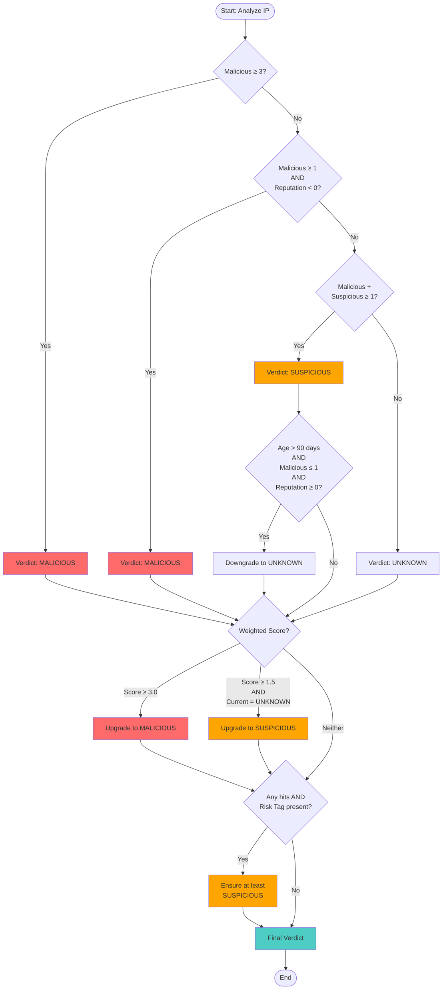

# Wazuh - VirusTotal IP Reputation Integration

## Table of Contents

- [Introduction](#introduction)
- [Heuristic (How the Verdict is Decided)](#heuristic-how-the-verdict-is-decided)
   - [Default Thresholds](#default-thresholds-from-custom-virustotal_ip_checkspy)
- [Installation and Configuration](#installation-and-configuration)
- [Wazuh Configuration](#wazuh-configuration)
   - [Integrator Config (manager `ossec.conf`)](#integrator-config-manager-ossecconf)
   - [Custom Rules](#custom-rules)
   - [Manual Tests](#manual-tests)
     - [Test 1: Malicious IP](#test-1-malicious-ip)
     - [Test 2: Valid IP](#test-2-valid-ip)
- [Workflow Diagram](#workflow-diagram)

## Introduction

This integration enriches Wazuh alerts with **VirusTotal IP reputation** and returns a clear verdict: **malicious**, **suspicious**, or **unknown**. It’s built on Wazuh’s Integrator framework and the VirusTotal **v3** API.

This integration can be broken down into the following steps:

* Extracts the **source IP** from matching Wazuh alerts.
* Queries VirusTotal’s **IP object** (`/api/v3/ip_addresses/{ip}`) and (optionally) pivots to **communicating files** for borderline cases.
* Computes a verdict using **engine consensus, freshness, community reputation, risk tags**, and **light engine-weighting**.
* Emits an enriched JSON block under `virustotal_ip` and a flat `verdict_line` string for easy rule matching.

## Heuristic (How the Verdict is Decided)

It seems that there are multiple sources and sometimes the IP might not get directly flagged as malicious. To add more functionality and security, I have come up with a heuristic that will flag the IP based on multiple factors:

* **M** = `last_analysis_stats.malicious`
* **S** = `last_analysis_stats.suspicious`
* **REP** = `reputation` (community score: neg=bad, pos=good)
* **AGE\_DAYS** = `now - last_analysis_date` (in days)
* **TAGS** = `attributes.tags` (vpn, tor, proxy)

Here is the decision flow:

1. **Start with engine counts**

      * If `malicious` ≥ 3 → **malicious**.
      * Else if `malicious` ≥ 1 and `reputation` < 0 → **malicious**.
      * Else if (`malicious` + `suspicious`) ≥ 1 → **suspicious** (unless weak due to date).
      * Else → **unknown**.

2. **Apply date (only affects weak hits as IPs can get refreshed):**

      * If `age_days` > 90, `malicious` ≤ 1, and `reputation` ≥ 0 → downgrade to **unknown**.

3. **Apply lightweight engine weighting**

      * If score ≥ 3.0 → **malicious** (consensus by score).
      * Else if score ≥ 1.5 and verdict was **unknown** → **suspicious**.

4. **Apply risk tags guardrail**

      * If there’s any hit (`malicious` or `suspicious` > 0) and tag in `RISK_TAGS`, make sure it’s at least **suspicious**.

For a better visual, please refer to [Workflow Diagram](#workflow-diagram)

### Default Thresholds (from `custom-virustotal_ip.py`)

Note that the values of the constants are at the top of the script. You can adjust them however you like.

```python
# Primary threshold: how many "malicious" engines to call it malicious outright
MAL_STRONG_MIN: int = 3

# If at least this many malicious (>=1) AND reputation < REP_BAD_LT -> malicious
REP_BAD_LT: int = 0  # negative reputation considered bad

# Lightweight engine weighting from last_analysis_results
# malicious = 1.0 point, suspicious = 0.5 point
WEIGHT_MAL_STRONG: float = 3.0   # upgrade to malicious if weighted >= this
WEIGHT_MAL_SUS: float    = 1.5   # upgrade unknown -> suspicious if weighted >= this

# If analysis is older than this (days) and hits are weak (<=1 malicious) with non-negative rep -> unknown
STALE_WEAK_DAYS: int = 90

# Risk tags that prevent downgrading below suspicious if there is any engine hit
RISK_TAGS = {"tor", "vpn", "proxy", "anonymizer", "anonymous"}
```

## Installation and Configuration

This integration uses two files: a shell script wrapper called by Wazuh and the Python script that performs the logic.

* Python Script: `/var/ossec/integrations/custom-virustotal_ip.py`
* Shell Wrapper: `/var/ossec/integrations/custom-virustotal_ip`

**Place & permissions:**
Place the [This python script](custom-virustotal_ip.py) and the [shell wrapper](custom-virustotal_ip) in /var/ossec/integrations/ and adjust permissions.

```bash

chmod 750 /var/ossec/integrations/custom-virustotal_ip*
chown root:wazuh /var/ossec/integrations/custom-virustotal_ip*
```

## Wazuh Configuration

### Integrator Config (manager `ossec.conf`)

Add the following block to `/var/ossec/etc/ossec.conf`. The `<name>` must match the shell script wrapper.

```xml
<integration>
  <name>custom-virustotal_ip</name>
  <api_key>YOUR_VT_KEY</api_key> <!-- replace this with your API key -->
  <group>sshd</group> <!-- you can use groups,rule_id or event_location-->
  <alert_format>json</alert_format>
</integration>
```

### Custom Rules

Add [the custom rules](./custom_virustotal.xml) to trigger alerts whenever the scans come back:

### Manual Tests

#### Test 1: Malicious IP

```bash
[root@wazuh-server ~]# python3 /var/ossec/integrations/custom-virustotal_ip.py /var/log/abuseipdb.json $VT_API_KEY sshd debug
# Running VirusTotal IP script
# Opening alert file at '/var/log/abuseipdb.json' with '{'timestamp': '2025-07-21T12:41:18.157+0000', 'rule': {'level': 5, 'description': 'sshd: Authentication succeeded from a public IP address 64.62.197.132.', 'id': '100003', 'firedtimes': 2, 'mail': False, 'groups': ['local', 'syslog', 'sshd', 'authentication_failed', 'authentication_success'], 'pci_dss': ['10.2.4', '10.2.5']}, 'agent': {'id': '000', 'name': 'rhel9.localdomain'}, 'manager': {'name': 'rhel9.localdomain'}, 'id': '1753101678.8211', 'full_log': 'Dec 10 01:02:02 host sshd[1234]: Accepted none for root from 64.62.197.132 port 1066 ssh2', 'predecoder': {'program_name': 'sshd', 'timestamp': 'Dec 10 01:02:02', 'hostname': 'host'}, 'decoder': {'parent': 'sshd', 'name': 'sshd'}, 'data': {'srcip': '64.62.197.132', 'srcport': '1066', 'dstuser': 'root'}, 'location': '/var/log/test.log'}'
# Request result from VT server: 1:virustotal_ip:{"virustotal_ip": {"found": 1, "verdict": "malicious", "source": {"alert_id": "1753101678.8211", "rule": "100003", "ip": "64.62.197.132"}, "counts": {"malicious": 11, "suspicious": 2}, "engine_counts": {"malicious": 11, "suspicious": 2}, "weighted_malicious": 12.0, "reputation": -3, "tags": [], "age_days": 0.7, "last_analysis_date": "2025-12-04T16:45:36+00:00", "country": "US", "as_owner": "HURRICANE", "network": "64.62.197.0/24", "permalink": "https://www.virustotal.com/gui/ip-address/64.62.197.132", "pivot": {"used": false}, "verdict_line": "vt_ip verdict=malicious ip=64.62.197.132 mal=11 sus=2 wmal=12.0 rep=-3 age_days=0.7 tags=- as_owner=\"HURRICANE\""}, "integration": "virustotal_ip", "original_full_log": "Dec 10 01:02:02 host sshd[1234]: Accepted none for root from 64.62.197.132 port 1066 ssh2"}

```

**JSON event from archives (Malicious):**

```json
{
  "_index": "wazuh-alerts-4.x-2025.12.05",
  "_id": "Vkv_7ZoBMYYtzkfpm7zp",
  "_version": 1,
  "_score": null,
  "_source": {
    "input": {
      "type": "log"
    },
    "agent": {
      "name": "wazuh-server",
      "id": "000"
    },
    "manager": {
      "name": "wazuh-server"
    },
    "data": {
      "virustotal_ip": {
        "age_days": "0.700000",
        "country": "US",
        "counts": {
          "malicious": "11",
          "suspicious": "2"
        },
        "as_owner": "HURRICANE",
        "reputation": "-3",
        "verdict_line": "vt_ip verdict=malicious ip=64.62.197.132 mal=11 sus=2 wmal=12.0 rep=-3 age_days=0.7 tags=- as_owner=\"HURRICANE\"",
        "source": {
          "alert_id": "1753101678.8211",
          "ip": "64.62.197.132",
          "rule": "100003"
        },
        "tags": [],
        "network": "64.62.197.0/24",
        "found": "1",
        "weighted_malicious": "12",
        "last_analysis_date": "2025-12-04T16:45:36+00:00",
        "verdict": "malicious",
        "pivot": {
          "used": "false"
        },
        "engine_counts": {
          "malicious": "11",
          "suspicious": "2"
        },
        "permalink": "https://www.virustotal.com/gui/ip-address/64.62.197.132"
      },
      "integration": "virustotal_ip",
      "original_full_log": "Dec 10 01:02:02 host sshd[1234]: Accepted none for root from 64.62.197.132 port 1066 ssh2"
    },
    "rule": {
      "firedtimes": 1,
      "mail": true,
      "level": 12,
      "description": "Source IP flagged malicious by VirusTotal",
      "groups": [
        "local",
        "virustotal",
        "vt_ip"
      ],
      "id": "199901"
    },
    "event_fingerprint": "ebdf2fcf472fcd45ff1e0b9ac9a526d39da4bb20ec574a467536b86b399e3092",
    "location": "virustotal_ip",
    "decoder": {
      "name": "json"
    },
    "id": "1764929536.7192965",
    "full_log": "{\"virustotal_ip\": {\"found\": 1, \"verdict\": \"malicious\", \"source\": {\"alert_id\": \"1753101678.8211\", \"rule\": \"100003\", \"ip\": \"64.62.197.132\"}, \"counts\": {\"malicious\": 11, \"suspicious\": 2}, \"engine_counts\": {\"malicious\": 11, \"suspicious\": 2}, \"weighted_malicious\": 12.0, \"reputation\": -3, \"tags\": [], \"age_days\": 0.7, \"last_analysis_date\": \"2025-12-04T16:45:36+00:00\", \"country\": \"US\", \"as_owner\": \"HURRICANE\", \"network\": \"64.62.197.0/24\", \"permalink\": \"https://www.virustotal.com/gui/ip-address/64.62.197.132\", \"pivot\": {\"used\": false}, \"verdict_line\": \"vt_ip verdict=malicious ip=64.62.197.132 mal=11 sus=2 wmal=12.0 rep=-3 age_days=0.7 tags=- as_owner=\\\"HURRICANE\\\"\"}, \"integration\": \"virustotal_ip\", \"original_full_log\": \"Dec 10 01:02:02 host sshd[1234]: Accepted none for root from 64.62.197.132 port 1066 ssh2\"}",
    "timestamp": "2025-12-05T11:12:16.827+0100"
  },
  "fields": {
    "timestamp": [
      "2025-12-05T10:12:16.827Z"
    ]
  },
  "highlight": {
    "rule.groups": [
      "@opensearch-dashboards-highlighted-field@virustotal@/opensearch-dashboards-highlighted-field@"
    ]
  },
  "sort": [
    1764929536827
  ]
}
```

#### Test 2: Valid IP

```bash
[root@wazuh-server integrations]# nslookup wazuh.com
Server:		10.0.2.3
Address:	10.0.2.3#53
Non-authoritative answer:
Name:	wazuh.com
Address: 108.157.98.17
Name:	wazuh.com
Address: 108.157.98.61
Name:	wazuh.com
Address: 108.157.98.96
Name:	wazuh.com
Address: 108.157.98.48
[root@wazuh-server ~]# nano /var/log/abuseipdb.json
[root@wazuh-server ~]# python3 /var/ossec/integrations/custom-virustotal_ip.py /var/log/abuseipdb.json $VT_API_KEY sshd debug
# Running VirusTotal IP script
# Opening alert file at '/var/log/abuseipdb.json' with '{'timestamp': '2025-07-21T12:41:18.157+0000', 'rule': {'level': 5, 'description': 'sshd: Authentication succeeded from a public IP address 108.157.98.17.', 'id': '100003', 'firedtimes': 2, 'mail': False, 'groups': ['local', 'syslog', 'sshd', 'authentication_failed', 'authentication_success'], 'pci_dss': ['10.2.4', '10.2.5']}, 'agent': {'id': '000', 'name': 'rhel9.localdomain'}, 'manager': {'name': 'rhel9.localdomain'}, 'id': '1753101678.8211', 'full_log': 'Dec 10 01:02:02 host sshd[1234]: Accepted none for root from 108.157.98.17 port 1066 ssh2', 'predecoder': {'program_name': 'sshd', 'timestamp': 'Dec 10 01:02:02', 'hostname': 'host'}, 'decoder': {'parent': 'sshd', 'name': 'sshd'}, 'data': {'srcip': '108.157.98.17', 'srcport': '1066', 'dstuser': 'root'}, 'location': '/var/log/test.log'}'
# Request result from VT server: 1:virustotal_ip:{"virustotal_ip": {"found": 1, "verdict": "unknown", "source": {"alert_id": "1753101678.8211", "rule": "100003", "ip": "108.157.98.17"}, "counts": {"malicious": 0, "suspicious": 0}, "engine_counts": {"malicious": 0, "suspicious": 0}, "weighted_malicious": 0.0, "reputation": 0, "tags": [], "age_days": 138.7, "last_analysis_date": "2025-07-19T18:14:19+00:00", "country": "US", "as_owner": "AMAZON-02", "network": "108.157.96.0/22", "permalink": "https://www.virustotal.com/gui/ip-address/108.157.98.17", "pivot": {"used": true, "total_files": 1, "strong_mal_files": 0}, "verdict_line": "vt_ip verdict=unknown ip=108.157.98.17 mal=0 sus=0 wmal=0.0 rep=0 age_days=138.7 tags=- as_owner=\"AMAZON-02\""}, "integration": "virustotal_ip", "original_full_log": "Dec 10 01:02:02 host sshd[1234]: Accepted none for root from 108.157.98.17 port 1066 ssh2"}

```

**JSON event from archives (Unknown):**

```json
{
  "_index": "wazuh-alerts-4.x-low22-2025.12.05",
  "_id": "nEsF7poBMYYtzkfpScCd",
  "_version": 1,
  "_score": null,
  "_source": {
    "input": {
      "type": "log"
    },
    "agent": {
      "name": "wazuh-server",
      "id": "000"
    },
    "manager": {
      "name": "wazuh-server"
    },
    "data": {
      "virustotal_ip": {
        "age_days": "138.700000",
        "country": "US",
        "counts": {
          "malicious": "0",
          "suspicious": "0"
        },
        "as_owner": "AMAZON-02",
        "reputation": "0",
        "verdict_line": "vt_ip verdict=unknown ip=108.157.98.17 mal=0 sus=0 wmal=0.0 rep=0 age_days=138.7 tags=- as_owner=\"AMAZON-02\"",
        "source": {
          "alert_id": "1753101678.8211",
          "ip": "108.157.98.17",
          "rule": "100003"
        },
        "tags": [],
        "network": "108.157.96.0/22",
        "found": "1",
        "weighted_malicious": "0",
        "last_analysis_date": "2025-07-19T18:14:19+00:00",
        "verdict": "unknown",
        "pivot": {
          "total_files": "1",
          "strong_mal_files": "0",
          "used": "true"
        },
        "engine_counts": {
          "malicious": "0",
          "suspicious": "0"
        },
        "permalink": "https://www.virustotal.com/gui/ip-address/108.157.98.17"
      },
      "integration": "virustotal_ip",
      "original_full_log": "Dec 10 01:02:02 host sshd[1234]: Accepted none for root from 108.157.98.17 port 1066 ssh2"
    },
    "rule": {
      "firedtimes": 1,
      "mail": false,
      "level": 3,
      "description": "Source IP unknown per VirusTotal",
      "groups": [
        "local",
        "virustotal",
        "vt_ip"
      ],
      "id": "199903"
    },
    "event_fingerprint": "d258b4bb2a9e554128a0e1485bb5ad8af9938bda2e184b6726319a258f561187",
    "location": "virustotal_ip",
    "decoder": {
      "name": "json"
    },
    "id": "1764929911.7366664",
    "full_log": "{\"virustotal_ip\": {\"found\": 1, \"verdict\": \"unknown\", \"source\": {\"alert_id\": \"1753101678.8211\", \"rule\": \"100003\", \"ip\": \"108.157.98.17\"}, \"counts\": {\"malicious\": 0, \"suspicious\": 0}, \"engine_counts\": {\"malicious\": 0, \"suspicious\": 0}, \"weighted_malicious\": 0.0, \"reputation\": 0, \"tags\": [], \"age_days\": 138.7, \"last_analysis_date\": \"2025-07-19T18:14:19+00:00\", \"country\": \"US\", \"as_owner\": \"AMAZON-02\", \"network\": \"108.157.96.0/22\", \"permalink\": \"https://www.virustotal.com/gui/ip-address/108.157.98.17\", \"pivot\": {\"used\": true, \"total_files\": 1, \"strong_mal_files\": 0}, \"verdict_line\": \"vt_ip verdict=unknown ip=108.157.98.17 mal=0 sus=0 wmal=0.0 rep=0 age_days=138.7 tags=- as_owner=\\\"AMAZON-02\\\"\"}, \"integration\": \"virustotal_ip\", \"original_full_log\": \"Dec 10 01:02:02 host sshd[1234]: Accepted none for root from 108.157.98.17 port 1066 ssh2\"}",
    "timestamp": "2025-12-05T11:18:31.597+0100"
  },
  "fields": {
    "timestamp": [
      "2025-12-05T10:18:31.597Z"
    ]
  },
  "highlight": {
    "rule.groups": [
      "@opensearch-dashboards-highlighted-field@virustotal@/opensearch-dashboards-highlighted-field@"
    ]
  },
  "sort": [
    1764929911597
  ]
}
```

## Workflow Diagram

