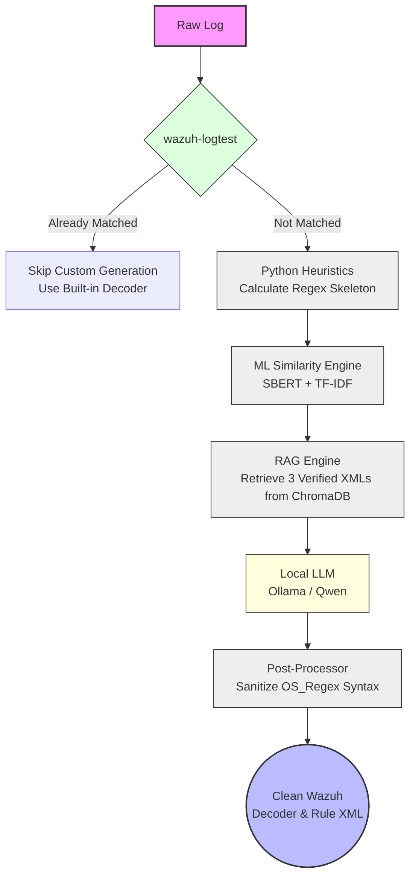

# Wazuh Decoder & Rule Creator

A FastAPI web application that intelligently generates custom Wazuh decoder and rule XML for any log format. It combines `wazuh-logtest` verification, machine learning similarity search, RAG (Retrieval-Augmented Generation), and a local LLM to produce accurate, ready-to-use Wazuh XML — without manual regex writing.

---

## How It Works



### Key Intelligence Rules
- If `wazuh-logtest` **pre-decodes a `program_name`** → parent decoder uses `<program_name>^value</program_name>`
- If **no program name** is pre-decoded → parent decoder uses `<prematch>` based on the log's actual prefix
- The LLM never guesses structure — it always copies from verified real examples injected via RAG

---

## What Is Included

| File / Directory | Purpose |
|---|---|
| `app/main.py` | FastAPI backend — all API endpoints and generation logic |
| `app/rag_engine.py` | RAG engine — ChromaDB vector store for real decoder retrieval |
| `app/decoder_ml.py` | ML similarity model (TF-IDF baseline) |
| `app/decoder_ml_enhanced.py` | Enhanced ensemble ML model (TF-IDF 30% + SBERT 70%) |
| `app/wazuh_logtest.py` | `wazuh-logtest` runner (local and SSH remote) |
| `app/templates/index.html` | Single-page frontend UI |
| `app/static/` | JavaScript and CSS |
| `Modelfile` | Custom Ollama model config (`wazuh-decoder` built on `qwen2.5:7b`) |
| `data/wazuh_repo/` | Cached clone of official Wazuh decoder XMLs |
| `data/rag_store/` | ChromaDB vector store (auto-built on first startup) |
| `data/models/decoder-sbert/` | Fine-tuned SBERT similarity model |
| `data/datasets/` | Feedback and training datasets |
| `requirements.txt` | Python dependencies |

---

## Quick Start

### 1. Set Up Python Environment

```bash
python3 -m venv .venv
source .venv/bin/activate
pip install -r requirements.txt
```

### 2. Generate SSL Certificates

The app runs over HTTPS. Generate a self-signed certificate for local use:

```bash
mkdir -p certs
openssl req -x509 -newkey rsa:4096 \
  -keyout certs/localhost.key \
  -out certs/localhost.crt \
  -days 365 -nodes -subj "/CN=localhost"
```

> **Note:** `certs/` is in `.gitignore` — your private keys will never be committed.

### 3. (Optional) Set Up the Ollama AI Model

The app uses a custom Ollama model called `wazuh-decoder` built on top of `qwen2.5:7b`. It has Wazuh OS_Regex rules baked into its system prompt.

```bash
# Install Ollama: https://ollama.com
ollama create wazuh-decoder -f Modelfile
```

Then set environment variables before starting:

```bash
export OLLAMA_BASE_URL=http://localhost:11434/v1
export OLLAMA_MODEL=wazuh-decoder
```

### 4. Start the Application

```bash
.venv/bin/uvicorn app.main:app \
  --host 0.0.0.0 --port 8443 \
  --ssl-certfile certs/localhost.crt \
  --ssl-keyfile certs/localhost.key
```

Open **`https://localhost:8443`** in your browser.

> On first startup, the RAG vector store is built automatically in the background (~1–2 min). The app is fully usable while it builds.

---

## AI Provider Configuration

The app supports three AI providers. Set **one** of the following before starting:

### Ollama (Recommended — Local, No Rate Limits)

```bash
export OLLAMA_BASE_URL=http://localhost:11434/v1
export OLLAMA_MODEL=wazuh-decoder        # custom model from Modelfile
# or use a generic model:
# export OLLAMA_MODEL=qwen2.5:7b
```

### DashScope (Alibaba Cloud — Qwen)

```bash
export DASHSCOPE_API_KEY=your_key_here
```

### OpenRouter

```bash
export OPENROUTER_API_KEY=your_key_here
```

**Priority:** Ollama → DashScope → OpenRouter. Ollama is always preferred when configured.

---

## Wazuh Integration

### Local `wazuh-logtest`

By default the app looks for the Wazuh logtest binary at:

```
/var/ossec/bin/wazuh-logtest
```

Override with:

```bash
export WAZUH_LOGTEST_PATH=/custom/path/to/wazuh-logtest
```

### Remote Wazuh VM (SSH Mode)

If your Wazuh instance runs in a VM or remote server, configure SSH access:

```bash
export WAZUH_SSH_HOST=192.168.56.10
export WAZUH_SSH_PORT=22
export WAZUH_SSH_USER=your_ssh_user
export WAZUH_SSH_PASSWORD=your_ssh_password
# optional — use key-based auth instead of password:
export WAZUH_SSH_KEY=/path/to/private_key
```

When SSH is configured, the app will:
- Run `wazuh-logtest` over SSH to validate logs against your live Wazuh instance
- Write generated decoder/rule XML directly to `/var/ossec/etc/decoders/` and `/var/ossec/etc/rules/` on the remote VM

---

## ML Similarity Model

The app uses an ensemble of **TF-IDF (30%) + SBERT (70%)** to find the closest official Wazuh decoder patterns for any new log.

### Configuration

```bash
export WAZUH_REPO_URL=https://github.com/wazuh/wazuh.git
export WAZUH_REPO_CACHE_DIR=/path/to/cache/wazuh_repo    # default: data/wazuh_repo
export WAZUH_REPO_DECODER_SUBPATH=ruleset/decoders
```

### API

| Endpoint | Description |
|---|---|
| `GET /api/ml/status` | Show model status, pattern count, cache location |
| `POST /api/ml/refresh` | Pull latest Wazuh decoders, rebuild ML model **and** RAG store |

### Training a Fine-Tuned SBERT Model

For best accuracy, train the SBERT model on official Wazuh decoders:

```bash
# 1. Make sure the Wazuh repo cache exists
#    (run the app once or POST /api/ml/refresh)

# 2. Build training dataset
python scripts/build_dataset.py
# Outputs: data/datasets/train.jsonl, val.jsonl

# 3. Train SBERT
python scripts/train_similarity.py
# Outputs: data/models/decoder-sbert/final/
```

The app automatically uses the fine-tuned model if `data/models/decoder-sbert/final/` exists, otherwise falls back to TF-IDF.

---

## RAG (Retrieval-Augmented Generation)

The RAG engine indexes **1,700+ real Wazuh decoder XMLs** into a local ChromaDB vector store. Before the LLM generates anything, the 3 most similar real decoder examples are retrieved and injected into the prompt.

This prevents the LLM from hallucinating incorrect OS_Regex syntax — it copies from proven, verified patterns instead.

### RAG Data Sources

| Source | Content |
|---|---|
| `data/wazuh_repo/ruleset/decoders/*.xml` | Official Wazuh decoder XMLs (~120 files, 1,500+ decoders) |
| `data/datasets/feedback.jsonl` | Your approved log→decoder pairs |
| `data/datasets/train.jsonl` | Generated training pairs |

### API

| Endpoint | Description |
|---|---|
| `GET /api/rag/status` | Show RAG store status and document count |
| `POST /api/ml/refresh` | Rebuilds both the ML model **and** the RAG store |

### RAG Store Location

The vector store is saved to `data/rag_store/` and persists across restarts. It is rebuilt automatically when you call `POST /api/ml/refresh`.

---

## API Reference

| Endpoint | Method | Description |
|---|---|---|
| `/` | GET | Web UI |
| `/api/analyze` | POST | Analyze a log — run logtest, extract fields, ML suggestions |
| `/api/generate` | POST | Generate decoder + rule XML (programmatic only) |
| `/api/ai/generate` | POST | Generate decoder + rule XML with AI (RAG + LLM) |
| `/api/test` | POST | Generate + install + test via `wazuh-logtest` |
| `/api/install` | POST | Install generated XML to Wazuh (local or remote) |
| `/api/uninstall` | POST | Remove installed XML files |
| `/api/ml/status` | GET | ML model status |
| `/api/ml/refresh` | POST | Rebuild ML model and RAG store |
| `/api/rag/status` | GET | RAG vector store status |
| `/api/logtest/raw` | POST | Run raw `wazuh-logtest` on a log line |
| `/api/feedback` | POST | Save an approved log→decoder pair to feedback dataset |
| `/health` | GET | Health check and connectivity status |

---

## Optional File Output

The `/api/test` endpoint supports `install_mode="write_files"` which writes generated XML to:

- `/var/ossec/etc/decoders/local_<appname>_decoder_<stamp>.xml`
- `/var/ossec/etc/rules/local_<appname>_rule_<stamp>.xml`

Override the output directories:

```bash
export WAZUH_DECODERS_DIR=/custom/decoders
export WAZUH_RULES_DIR=/custom/rules
```

---

## Environment Variable Reference

| Variable | Default | Description |
|---|---|---|
| `OLLAMA_BASE_URL` | *(none)* | Ollama API base URL |
| `OLLAMA_MODEL` | `wazuh-decoder` | Ollama model name |
| `DASHSCOPE_API_KEY` | *(none)* | DashScope API key |
| `OPENROUTER_API_KEY` | *(none)* | OpenRouter API key |
| `WAZUH_LOGTEST_PATH` | `/var/ossec/bin/wazuh-logtest` | Path to wazuh-logtest binary |
| `WAZUH_SSH_HOST` | *(none)* | SSH host for remote Wazuh VM |
| `WAZUH_SSH_PORT` | `22` | SSH port |
| `WAZUH_SSH_USER` | *(none)* | SSH username |
| `WAZUH_SSH_PASSWORD` | *(none)* | SSH password |
| `WAZUH_SSH_KEY` | *(none)* | Path to SSH private key |
| `WAZUH_REPO_URL` | `https://github.com/wazuh/wazuh.git` | Wazuh repo for ML training data |
| `WAZUH_REPO_CACHE_DIR` | `data/wazuh_repo` | Local cache for Wazuh repo |
| `WAZUH_DECODERS_DIR` | `/var/ossec/etc/decoders` | Output directory for decoder XML |
| `WAZUH_RULES_DIR` | `/var/ossec/etc/rules` | Output directory for rule XML |
